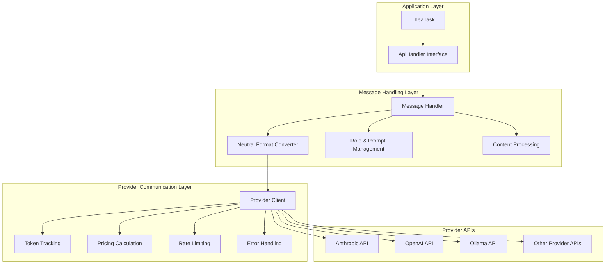
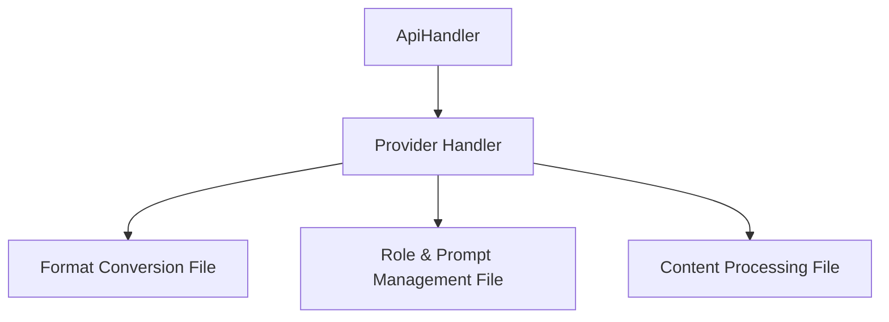

# Provider Handler Architecture Considerations

**Date:** 2025-05-04

## Current Challenges

The current API handler architecture faces several challenges related to provider fragmentation:

1. **Multiple Handlers for Same Models**: There are multiple handlers for essentially the same underlying models (e.g., VertexClaude, Claude, etc.)

2. **Provider Dependency Chains**: Some models like DeepSeek extend other handlers (like OpenAI), creating dependency chains that make changes complex and risky.

3. **Redundant Conversion Logic**: Each handler potentially reimplements similar conversion logic, leading to code duplication and maintenance challenges.

4. **Inconsistent Behavior**: Different handlers for the same underlying model might behave slightly differently due to implementation variations.

5. **Testing Complexity**: Each handler variant requires its own test suite, multiplying the testing effort.

## Neutral Format Transition Benefits

The transition to a neutral format is addressing some of these challenges by:

- Decoupling the core application from provider-specific message formats
- Centralizing conversion logic in dedicated transform files
- Providing a consistent interface for all handlers

## Future Architectural Improvements

Beyond the current neutral format transition, several architectural improvements could be considered:

### 1. Provider Composition Over Inheritance

Instead of having handlers extend each other (e.g., DeepSeek extending OpenAI), use composition where handlers use provider components internally:

```typescript
// Instead of:
class DeepSeekHandler extends OpenAiHandler { ... }

// Consider:
class DeepSeekHandler implements ApiHandler {
  private openAiProvider: OpenAiProvider;
  
  constructor(options) {
    this.openAiProvider = new OpenAiProvider(options);
  }
  
  // Use this.openAiProvider internally
}
```

### 2. Unified Handler Factory

Create a more sophisticated factory that can instantiate the appropriate handler based on both the model and the provider:

```typescript
function buildApiHandler(configuration: ApiConfiguration): ApiHandler {
  const { apiProvider, modelId, ...options } = configuration;
  
  // First determine the actual provider needed
  const actualProvider = determineActualProvider(apiProvider, modelId);
  
  // Then create the appropriate handler
  switch (actualProvider) {
    case "anthropic-direct":
      return new AnthropicHandler(options);
    case "anthropic-vertex":
      return new VertexHandler(options);
    // etc.
  }
}
```

### 3. Shared Transformation Layer

Implement a shared transformation layer that all handlers can leverage:

```typescript
// A shared transformation service
class TransformationService {
  static toOpenAI(neutralHistory: NeutralConversationHistory): OpenAIMessages { ... }
  static toAnthropicMessages(neutralHistory: NeutralConversationHistory): AnthropicMessages { ... }
  // etc.
}

// Handlers use the shared service
class SomeHandler implements ApiHandler {
  createMessage(systemPrompt: string, messages: NeutralConversationHistory): ApiStream {
    const providerMessages = TransformationService.toProviderX(messages);
    // Use providerMessages...
  }
}
```

### 4. Provider Capability Registry

Maintain a registry of provider capabilities that handlers can query:

```typescript
const providerCapabilities = {
  "anthropic": {
    supportsImages: true,
    supportsTools: true,
    maxTokens: 200000
  },
  "openai": {
    supportsImages: true,
    supportsTools: true,
    maxTokens: 128000
  },
  "ollama": {
    supportsImages: false,
    supportsTools: false,
    maxTokens: 32000
  }
};

class BaseHandler {
  protected getCapabilities(provider: string): ProviderCapabilities {
    return providerCapabilities[provider] || defaultCapabilities;
  }
}
```

## Proposed Communication Layer Abstraction

A key architectural improvement would be to separate the communication with the model from the handling of roles, prompts, and other message-related concerns. This would create a cleaner separation of concerns and make the system more maintainable.

### Architecture Diagram



### Component Responsibilities

#### Message Handling Layer
- **Message Handler**: Orchestrates the overall message processing flow
- **Neutral Format Converter**: Converts between neutral format and provider-specific formats
- **Role & Prompt Management**: Handles system prompts, user/assistant roles, and message history
- **Content Processing**: Processes different content types (text, images, tools)

#### Provider Communication Layer
- **Provider Client**: Manages the actual API communication with providers
- **Token Tracking**: Counts and tracks token usage across requests
- **Pricing Calculation**: Calculates costs based on token usage and provider rates
- **Rate Limiting**: Implements rate limiting to avoid API throttling
- **Error Handling**: Provides consistent error handling across providers

### Implementation Approach

```typescript
// Provider Communication Layer
interface ProviderClient {
  sendRequest(request: ProviderRequest): Promise<ProviderResponse>;
  countTokens(content: any): Promise<number>;
  getUsageMetrics(): UsageMetrics;
}

class AnthropicClient implements ProviderClient {
  private tokenTracker: TokenTracker;
  private pricingCalculator: PricingCalculator;
  
  constructor(options: ClientOptions) {
    this.tokenTracker = new TokenTracker(options.model);
    this.pricingCalculator = new PricingCalculator(options.model);
  }
  
  async sendRequest(request: ProviderRequest): Promise<ProviderResponse> {
    // Handle actual API communication
    // Track tokens and pricing
    // Handle rate limiting and errors
  }
}

// Message Handling Layer
class MessageHandler {
  private providerClient: ProviderClient;
  private formatConverter: FormatConverter;
  
  constructor(providerClient: ProviderClient, formatConverter: FormatConverter) {
    this.providerClient = providerClient;
    this.formatConverter = formatConverter;
  }
  
  async createMessage(systemPrompt: string, messages: NeutralConversationHistory): ApiStream {
    // Convert to provider format
    const providerMessages = this.formatConverter.toProviderFormat(messages);
    
    // Send request through provider client
    const response = await this.providerClient.sendRequest({
      systemPrompt,
      messages: providerMessages
    });
    
    // Process and return response
    return this.processResponse(response);
  }
}
```

## Benefits of This Architecture

1. **Clear Separation of Concerns**: Each layer has a specific responsibility
2. **Reduced Duplication**: Common functionality like token tracking is centralized
3. **Consistent Error Handling**: Errors are handled at the appropriate layer
4. **Easier Testing**: Each component can be tested in isolation
5. **Simplified Provider Integration**: Adding new providers only requires implementing the ProviderClient interface
6. **Unified Metrics**: Token usage and pricing are tracked consistently across providers

## Multiphase Implementation Approach

Rather than implementing the entire architecture at once, a pragmatic multiphase approach can be adopted:

### Phase 1: Separation of Concerns in Current Structure

Continue with the current patterns to a degree, but for each handler file, create separate files that handle specific aspects:



For example:
- `ollama.ts` (main handler)
- `ollama-format.ts` (format conversion)
- `ollama-prompt.ts` (role & prompt management)
- `ollama-content.ts` (content processing)

This maintains the same patterns but in separate files, which will make future refactoring easier.

### Phase 2: Standardize Interfaces

Define standard interfaces for each of the separated concerns:

```typescript
interface FormatConverter {
  toProviderFormat(neutralHistory: NeutralConversationHistory): ProviderSpecificFormat;
  fromProviderFormat(providerResponse: ProviderSpecificResponse): NeutralResponse;
}

interface PromptManager {
  prepareSystemPrompt(systemPrompt: string): ProviderSystemPrompt;
  prepareRoles(messages: NeutralConversationHistory): ProviderRoles;
}

interface ContentProcessor {
  processContent(content: NeutralMessageContent): ProviderContent;
  processResponse(response: ProviderResponse): ApiStream;
}
```

### Phase 3: Implement Provider Communication Layer

Once the separation of concerns is complete and interfaces are standardized, implement the Provider Communication Layer as described in the architecture diagram.

### Phase 4: Refactor Handlers to Use New Architecture

Finally, refactor the handlers to use the new architecture, leveraging the already separated components.

## Handling Provider-Specific Features

A key challenge in the neutral format approach is handling provider-specific features that don't map cleanly to the neutral format, especially for local models with unique capabilities. Here are several approaches to address this:

### 1. Extension Mechanism

The neutral format could include an extension mechanism that allows for provider-specific features:

```typescript
interface NeutralMessage {
  role: 'user' | 'assistant' | 'system' | 'tool';
  content: string | NeutralMessageContent;
  extensions?: {
    // Provider-specific extensions
    ollama?: {
      mirostat?: number;
      mirostatEta?: number;
      // Other Ollama-specific parameters
    };
    lmstudio?: {
      draftModel?: string;
      speculativeDecoding?: boolean;
      // Other LM Studio-specific parameters
    };
    // Other provider extensions
  };
}
```

This approach allows the neutral format to remain clean while accommodating provider-specific features. The handlers can check for and apply these extensions when present.

### 2. Capability-Based Mapping

Instead of trying to map features directly between providers, map them based on capabilities:

```typescript
// Define capability interfaces
interface TemperatureControl {
  setTemperature(value: number): void;
}

interface DraftModelSupport {
  setDraftModel(modelId: string): void;
}

// Implement capabilities for each provider
class OllamaHandler implements TemperatureControl {
  setTemperature(value: number) {
    this.options.temperature = value;
  }
}

class LmStudioHandler implements TemperatureControl, DraftModelSupport {
  setTemperature(value: number) {
    this.options.temperature = value;
  }
  
  setDraftModel(modelId: string) {
    this.options.draftModel = modelId;
  }
}

// Use capabilities when available
function configureHandler(handler: ApiHandler, config: any) {
  if ('temperature' in config && isTemperatureControl(handler)) {
    handler.setTemperature(config.temperature);
  }
  
  if ('draftModel' in config && isDraftModelSupport(handler)) {
    handler.setDraftModel(config.draftModel);
  }
}
```

This approach focuses on what features do rather than how they're implemented, making it easier to map between different providers.

### 3. Feature Negotiation

Implement a negotiation mechanism where the core application can query what features are supported:

```typescript
interface FeatureNegotiation {
  supportsFeature(feature: string): boolean;
  getFeatureOptions(feature: string): any;
}

class OllamaHandler implements FeatureNegotiation {
  supportsFeature(feature: string): boolean {
    switch (feature) {
      case 'temperature':
      case 'mirostat':
        return true;
      default:
        return false;
    }
  }
  
  getFeatureOptions(feature: string): any {
    switch (feature) {
      case 'temperature':
        return { min: 0, max: 1, default: 0.7 };
      case 'mirostat':
        return { values: [0, 1, 2] };
      default:
        return null;
    }
  }
}
```

This allows the application to adapt its behavior based on what features are available.

### 4. Graceful Degradation

Define fallback behaviors when specific features aren't available:

```typescript
function applyFeature(handler: ApiHandler, feature: string, value: any) {
  if (handler.supportsFeature(feature)) {
    handler.applyFeature(feature, value);
  } else {
    // Apply fallback behavior
    switch (feature) {
      case 'draftModel':
        // If draft model isn't supported, maybe increase temperature slightly
        if (handler.supportsFeature('temperature')) {
          handler.applyFeature('temperature', Math.min(handler.getFeature('temperature') * 1.1, 1.0));
        }
        break;
      // Other fallbacks
    }
  }
}
```

This ensures that the application can still function even when specific features aren't available.

### 5. Provider-Specific Sections in Configuration

Include provider-specific sections in the configuration:

```typescript
interface ApiConfiguration {
  apiProvider: string;
  apiModelId: string;
  // Common configuration
  modelTemperature?: number;
  modelMaxTokens?: number;
  
  // Provider-specific sections
  ollama?: {
    mirostat?: number;
    mirostatEta?: number;
  };
  lmstudio?: {
    draftModel?: string;
    speculativeDecoding?: boolean;
  };
  // Other provider-specific sections
}
```

This approach keeps the configuration clean while allowing for provider-specific options.

### Local Model Considerations

Local models like Ollama and LM Studio have unique considerations:

1. **Performance vs. Cloud Models**: Local models don't have the network latency of cloud models, so performance optimizations might be different.

2. **Resource Constraints**: Local models run on the user's hardware, so they might have resource constraints that cloud models don't.

3. **Unique Parameters**: Local models often expose parameters that cloud models don't, like context window size, mirostat settings, etc.

4. **Versioning Challenges**: Local models might have different versions with different capabilities, making it harder to maintain consistent behavior.

5. **Installation Requirements**: Local models require installation and setup, which might affect how the application interacts with them.

For local models, it might be beneficial to implement a "local model protocol" that standardizes how the application interacts with them, while still allowing for their unique capabilities.

## Conclusion

The neutral format transition is a significant step toward a more maintainable architecture. The proposed multiphase approach allows for incremental improvement without requiring a massive refactoring effort, making it more practical to implement while maintaining system stability. The approaches for handling provider-specific features ensure that the architecture can accommodate the unique capabilities of different providers, including local models.