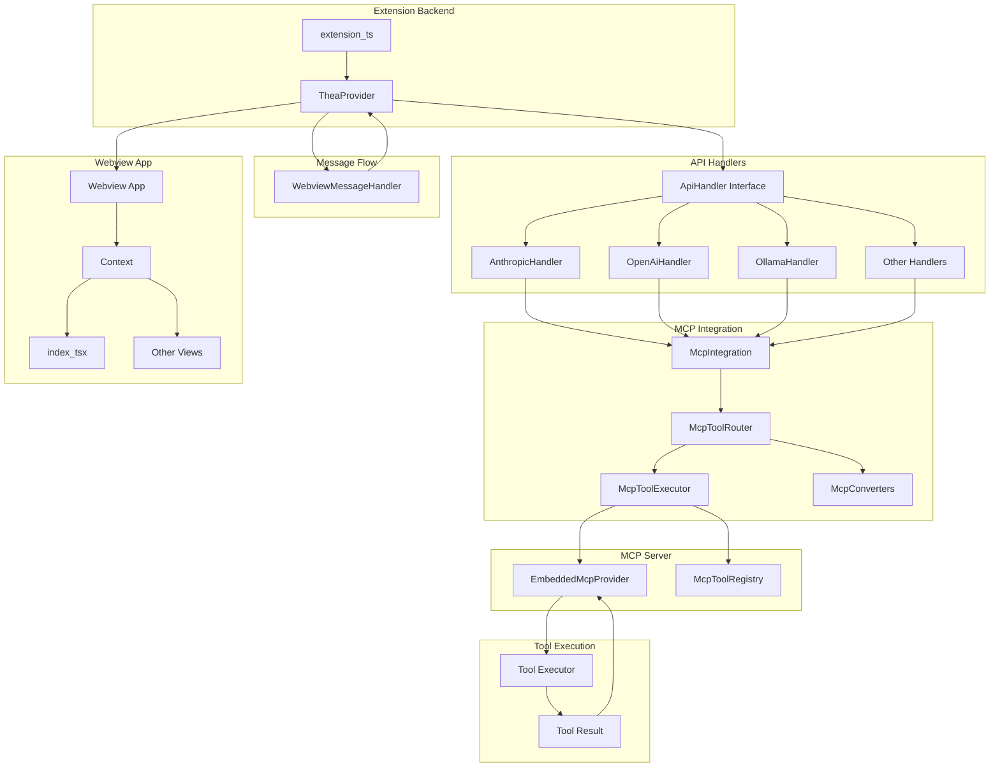
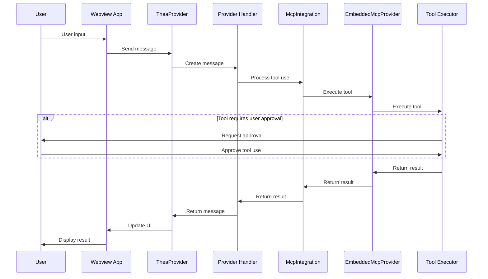

# MCP Integration Architecture Diagram

**Date:** 2025-05-04

This document illustrates how the MCP integration fits into the overall architecture of the project, showing the relationship between the original components and the new MCP components.

## 1. Original Architecture

The original architecture, as shown in the PNG file, has the following key components:

1. **Extension Backend (`extension_ts`)**: The main entry point for the extension
2. **TheaProvider**: Manages the lifecycle of the application
3. **Webview App**: The user interface for the application
4. **Services Integrations**: External services and APIs
5. **Managers State Task API MCP**: Manages state, tasks, and the MCP

## 2. MCP Integration Architecture

The MCP integration extends this architecture by adding a unified tool system for handling tool use across different AI models. Here's how it fits into the overall architecture:

## 3. Integration Points

The MCP integration connects to the original architecture at several key points:

### 3.1 Provider Handlers

The provider handlers (AnthropicHandler, OpenAiHandler, OllamaHandler, etc.) are updated to use the MCP integration for tool use. Each handler:

1. Initializes the MCP integration
2. Registers tools with the MCP tool registry
3. Routes tool use requests through the MCP integration
4. Processes tool results from the MCP integration

### 3.2 TheaProvider

The TheaProvider, which manages the lifecycle of the application, is extended to:

1. Initialize the MCP integration during startup
2. Shut down the MCP integration during cleanup
3. Register global tools with the MCP tool registry

### 3.3 Tool Execution

The tool execution flow is modified to:

1. Detect the format of tool use requests (XML, JSON, OpenAI)
2. Convert tool use requests to the MCP protocol format
3. Execute tools through the embedded MCP server
4. Convert tool results back to the original format

## 4. Data Flow

The data flow through the MCP integration is as follows:

## 5. Component Responsibilities

### 5.1 McpIntegration

- Provides a simple interface for the rest of the application
- Initializes and manages the MCP system
- Routes tool use requests to the appropriate handlers

### 5.2 McpToolRouter

- Detects the format of tool use requests
- Routes requests to the appropriate converter
- Executes tools through the McpToolExecutor

### 5.3 McpToolExecutor

- Provides a unified interface for tool use
- Manages the embedded MCP server
- Executes tools and processes results

### 5.4 EmbeddedMcpProvider

- Hosts tools from various sources
- Provides a standardized interface for tool execution
- Manages tool registration and execution

### 5.5 McpToolRegistry

- Serves as the central registry for all tools
- Provides a unified interface for tool registration
- Manages tool definitions and metadata

## 6. Benefits of the Integration

The MCP integration provides several benefits to the overall architecture:

1. **Unified Tool System**: A single system for tool definitions and execution
2. **Cleaner Architecture**: Clear separation of concerns
3. **Single Source of Truth**: Centralized tool registry
4. **Format Agnostic**: Support for XML, JSON, and OpenAI formats
5. **Extensible**: Easy to add support for new formats or tool types
6. **Improved Testability**: Each component can be tested in isolation
7. **Reduced Duplication**: Common logic is shared across handlers

## 7. Future Enhancements

The MCP integration architecture can be further enhanced in the future:

1. **Remote MCP Server**: Support for connecting to remote MCP servers
2. **Tool Discovery**: Automatic discovery of available tools
3. **Tool Versioning**: Support for versioning of tool definitions
4. **Tool Permissions**: Fine-grained control over tool access
5. **Tool Metrics**: Tracking of tool usage and performance
6. **Tool Marketplace**: A marketplace for sharing and discovering tools

These enhancements would build on the solid foundation provided by the current MCP integration architecture.