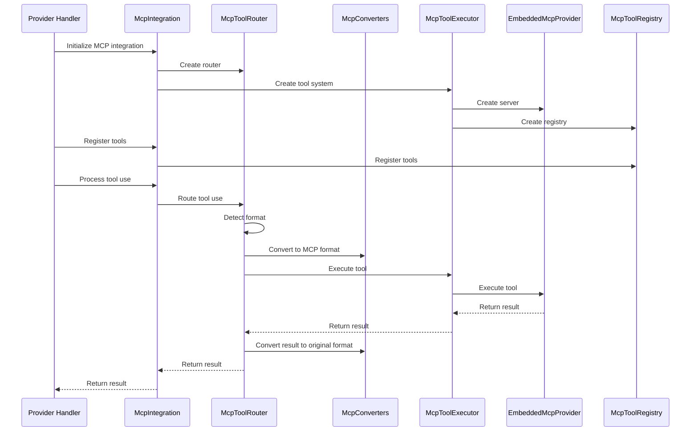

# MCP Integration Implementation Guide

**Date:** 2025-05-04

This document provides a detailed guide for implementing the MCP integration in provider handlers. It builds on the unified architecture described in `unified_architecture.md` and focuses specifically on how to update provider handlers to use the MCP system.

## 1. Overview

The MCP integration provides a unified tool system for handling tool use across different AI models. Instead of maintaining separate XML and JSON formats with a bridge between them, we use the MCP protocol as the central protocol for tool execution.

### 1.1 Key Components

1. **McpIntegration**: A facade that provides a simple interface for the rest of the application
2. **McpToolRouter**: Detects format and routes tool use requests to appropriate handlers
3. **McpToolExecutor**: Core component for tool use across different AI models
4. **McpConverters**: Utility functions for converting between different formats and MCP protocol
5. **EmbeddedMcpProvider**: Hosts tools from various sources
6. **McpToolRegistry**: Central registry for all tools in the system

### 1.2 Integration Flow



## 2. Implementation Steps

### 2.1 Update Provider Handler Base Class

First, update the `BaseProvider` class to include MCP integration:

```typescript
// src/api/providers/base-provider.ts

import { McpIntegration } from '../../services/mcp/McpIntegration';

export abstract class BaseProvider implements ApiHandler {
  protected mcpIntegration: McpIntegration;
  
  constructor(options: BaseProviderOptions) {
    // Initialize MCP integration
    this.mcpIntegration = new McpIntegration();
    this.mcpIntegration.initialize();
    
    // Register tools
    this.registerTools();
  }
  
  protected registerTools(): void {
    // Register common tools
    this.mcpIntegration.registerTool({
      name: 'read_file',
      description: 'Read the contents of a file',
      parameters: {
        type: 'object',
        properties: {
          path: {
            type: 'string',
            description: 'The path of the file to read'
          }
        },
        required: ['path']
      },
      execute: async (args: any) => {
        // Implementation
      }
    });
    
    // Register other tools
    // ...
  }
  
  protected async processToolUse(content: string, format: 'xml' | 'json' | 'openai'): Promise<string> {
    // Process tool use using MCP integration
    return this.mcpIntegration.routeToolUse(content, format);
  }
  
  // Other methods
}
```

### 2.2 Update Anthropic Handler

Update the `AnthropicHandler` to use the MCP integration:

```typescript
// src/api/providers/anthropic.ts

import { McpIntegration } from '../../services/mcp/McpIntegration';
import { convertToAnthropicHistory } from '../transform/neutral-anthropic-format';

export class AnthropicHandler extends BaseProvider {
  override async *createMessage(systemPrompt: string, messages: NeutralConversationHistory): ApiStream {
    // Convert neutral history to Anthropic format
    const anthropicMessages = convertToAnthropicHistory(messages);
    
    // Add system prompt if not already included
    if (systemPrompt && systemPrompt.trim() !== "") {
      // Add system prompt logic
    }
    
    // Create Anthropic client options
    const options = {
      // Options
    };
    
    // Create message stream
    const stream = await this.client.messages.create({
      // Parameters
    });
    
    // Process stream
    for await (const chunk of stream) {
      // Process chunk
      
      // Check for tool use
      if (chunk.type === 'tool_use') {
        // Process tool use using MCP integration
        const result = await this.processToolUse(chunk.content, 'json');
        
        // Yield tool result
        yield {
          type: 'tool_result',
          content: result
        };
      } else {
        // Yield regular content
        yield {
          type: chunk.type,
          text: chunk.content
        };
      }
    }
  }
  
  // Other methods
}
```

### 2.3 Update OpenAI Handler

Update the `OpenAiHandler` to use the MCP integration:

```typescript
// src/api/providers/openai.ts

import { McpIntegration } from '../../services/mcp/McpIntegration';
import { convertToOpenAiHistory } from '../transform/neutral-openai-format';

export class OpenAiHandler extends BaseProvider {
  override async *createMessage(systemPrompt: string, messages: NeutralConversationHistory): ApiStream {
    // Convert neutral history to OpenAI format
    const openAiMessages = convertToOpenAiHistory(messages);
    
    // Add system prompt if not already included
    if (systemPrompt && systemPrompt.trim() !== "") {
      // Add system prompt logic
    }
    
    // Create OpenAI client options
    const options = {
      // Options
    };
    
    // Create message stream
    const stream = await this.client.chat.completions.create({
      // Parameters
    });
    
    // Process stream
    for await (const chunk of stream) {
      // Process chunk
      
      // Check for tool use
      if (chunk.choices[0]?.delta?.tool_calls) {
        // Process tool use using MCP integration
        const result = await this.processToolUse(JSON.stringify(chunk.choices[0].delta.tool_calls), 'openai');
        
        // Yield tool result
        yield {
          type: 'tool_result',
          content: result
        };
      } else {
        // Yield regular content
        yield {
          type: 'text',
          text: chunk.choices[0]?.delta?.content || ''
        };
      }
    }
  }
  
  // Other methods
}
```

### 2.4 Update Ollama Handler

Update the `OllamaHandler` to use the MCP integration:

```typescript
// src/api/providers/ollama.ts

import { McpIntegration } from '../../services/mcp/McpIntegration';
import { convertToOllamaHistory } from '../transform/neutral-ollama-format';
import { HybridMatcher } from '../../utils/json-xml-bridge';

export class OllamaHandler extends BaseProvider {
  override async *createMessage(systemPrompt: string, messages: NeutralConversationHistory): ApiStream {
    // Convert neutral history to Ollama format
    const ollamaMessages = convertToOllamaHistory(messages);
    
    // Add system prompt if not already included
    if (systemPrompt && systemPrompt.trim() !== "") {
      // Add system prompt logic
    }
    
    // Create Ollama client options
    const options = {
      // Options
    };
    
    // Create message stream
    const stream = await this.client.chat.completions.create({
      // Parameters
    });
    
    // Create hybrid matcher for both XML and JSON formats
    const matcher = new HybridMatcher();
    
    // Process stream
    for await (const chunk of stream) {
      // Process chunk using matcher
      const results = matcher.update(chunk.choices[0]?.delta?.content || '');
      
      // Yield results
      for (const result of results) {
        if (result.type === 'tool_use') {
          // Process tool use using MCP integration
          const toolResult = await this.processToolUse(result.text, matcher.getDetectedFormat());
          
          // Yield tool result
          yield {
            type: 'tool_result',
            content: toolResult
          };
        } else {
          // Yield regular content
          yield result;
        }
      }
    }
    
    // Process any remaining content
    const finalResults = matcher.final();
    for (const result of finalResults) {
      yield result;
    }
  }
  
  // Other methods
}
```

## 3. MCP Components Implementation

### 3.1 McpIntegration

The `McpIntegration` class serves as a facade for the MCP system:

```typescript
// src/services/mcp/McpIntegration.ts

import { McpToolRouter } from './McpToolRouter';
import { McpToolExecutor } from './McpToolExecutor';
import { ToolDefinition } from './types';

export class McpIntegration {
  private mcpToolRouter: McpToolRouter;
  private mcpToolSystem: McpToolExecutor;
  private isInitialized: boolean = false;
  
  constructor() {
    this.mcpToolSystem = new McpToolExecutor();
    this.mcpToolRouter = new McpToolRouter(this.mcpToolSystem);
  }
  
  async initialize(): Promise<void> {
    if (!this.isInitialized) {
      await this.mcpToolSystem.initialize();
      this.isInitialized = true;
    }
  }
  
  async shutdown(): Promise<void> {
    if (this.isInitialized) {
      await this.mcpToolSystem.shutdown();
      this.isInitialized = false;
    }
  }
  
  registerTool(definition: ToolDefinition): void {
    this.mcpToolSystem.registerTool(definition);
  }
  
  unregisterTool(name: string): boolean {
    return this.mcpToolSystem.unregisterTool(name);
  }
  
  async routeToolUse(content: string, format: 'xml' | 'json' | 'openai'): Promise<string> {
    return this.mcpToolRouter.routeToolUse(content, format);
  }
}
```

### 3.2 McpToolRouter

The `McpToolRouter` class detects the format and routes tool use requests:

```typescript
// src/services/mcp/McpToolRouter.ts

import { McpToolExecutor } from './McpToolExecutor';
import { McpConverters } from './McpConverters';
import { FormatDetector } from '../../utils/json-xml-bridge';
import { NeutralToolUseRequest, NeutralToolResult } from './types';

export class McpToolRouter {
  private mcpToolSystem: McpToolExecutor;
  private formatDetector: FormatDetector;
  
  constructor(mcpToolSystem: McpToolExecutor) {
    this.mcpToolSystem = mcpToolSystem;
    this.formatDetector = new FormatDetector();
  }
  
  async routeToolUse(content: string, format?: 'xml' | 'json' | 'openai'): Promise<string> {
    // Detect format if not provided
    const detectedFormat = format || this.detectFormat(content);
    
    // Convert to MCP format
    const mcpRequest = this.convertToMcp(content, detectedFormat);
    
    // Execute tool
    const mcpResult = await this.executeTool(mcpRequest);
    
    // Convert result back to original format
    return this.convertFromMcp(mcpResult, detectedFormat);
  }
  
  private detectFormat(content: string): 'xml' | 'json' | 'openai' {
    const format = this.formatDetector.detectFormat(content);
    
    if (format === 'xml') {
      return 'xml';
    } else if (format === 'json') {
      // Check if it's OpenAI format
      if (content.includes('"tool_calls"') || content.includes('"function_call"')) {
        return 'openai';
      }
      return 'json';
    }
    
    // Default to XML
    return 'xml';
  }
  
  private convertToMcp(content: string, format: 'xml' | 'json' | 'openai'): NeutralToolUseRequest {
    switch (format) {
      case 'xml':
        return McpConverters.xmlToMcp(content);
      case 'json':
        return McpConverters.jsonToMcp(content);
      case 'openai':
        return McpConverters.openAiToMcp(content);
      default:
        throw new Error(`Unsupported format: ${format}`);
    }
  }
  
  private async executeTool(request: NeutralToolUseRequest): Promise<NeutralToolResult> {
    return this.mcpToolSystem.executeToolFromNeutralFormat(request);
  }
  
  private convertFromMcp(result: NeutralToolResult, format: 'xml' | 'json' | 'openai'): string {
    switch (format) {
      case 'xml':
        return McpConverters.mcpToXml(result);
      case 'json':
        return McpConverters.mcpToJson(result);
      case 'openai':
        return McpConverters.mcpToOpenAi(result);
      default:
        throw new Error(`Unsupported format: ${format}`);
    }
  }
}
```

### 3.3 McpToolExecutor

The `McpToolExecutor` class provides a unified interface for tool use:

```typescript
// src/services/mcp/McpToolExecutor.ts

import { EmbeddedMcpProvider } from './EmbeddedMcpProvider';
import { McpToolRegistry } from './McpToolRegistry';
import { ToolDefinition, NeutralToolUseRequest, NeutralToolResult } from './types';

export class McpToolExecutor {
  private mcpServer: EmbeddedMcpProvider;
  private toolRegistry: McpToolRegistry;
  private isInitialized: boolean = false;
  
  constructor() {
    this.toolRegistry = new McpToolRegistry();
    this.mcpServer = new EmbeddedMcpProvider(this.toolRegistry);
  }
  
  async initialize(): Promise<void> {
    if (!this.isInitialized) {
      await this.mcpServer.start();
      this.isInitialized = true;
    }
  }
  
  async shutdown(): Promise<void> {
    if (this.isInitialized) {
      await this.mcpServer.stop();
      this.isInitialized = false;
    }
  }
  
  registerTool(definition: ToolDefinition): void {
    this.toolRegistry.registerTool(definition);
    this.mcpServer.registerToolDefinition(definition);
  }
  
  unregisterTool(name: string): boolean {
    const result = this.toolRegistry.unregisterTool(name);
    this.mcpServer.unregisterTool(name);
    return result;
  }
  
  async executeToolFromNeutralFormat(request: NeutralToolUseRequest): Promise<NeutralToolResult> {
    try {
      // Execute tool
      const result = await this.mcpServer.executeTool(request.name, request.input);
      
      // Create neutral result
      return {
        tool_use_id: request.id,
        content: [{ type: 'text', text: result.content }],
        status: 'success'
      };
    } catch (error) {
      // Handle error
      return {
        tool_use_id: request.id,
        content: [{ type: 'text', text: error.message }],
        status: 'error',
        error: {
          message: error.message,
          details: error
        }
      };
    }
  }
}
```

### 3.4 McpConverters

The `McpConverters` class provides utility functions for converting between formats:

```typescript
// src/services/mcp/McpConverters.ts

import { NeutralToolUseRequest, NeutralToolResult } from './types';
import { xmlToolUseToJson, jsonToolUseToXml } from '../../utils/json-xml-bridge';

export class McpConverters {
  static xmlToMcp(xmlContent: string): NeutralToolUseRequest {
    // Extract tool name and parameters from XML
    const toolNameRegex = /<(\w+)>/;
    const toolNameMatch = toolNameRegex.exec(xmlContent);
    
    if (!toolNameMatch || !toolNameMatch[1]) {
      throw new Error('Invalid XML format: tool name not found');
    }
    
    const toolName = toolNameMatch[1];
    
    // Extract parameters
    const paramRegex = new RegExp(`<(\\w+)>(.*?)<\\/\\1>`, 'gs');
    const params: Record<string, any> = {};
    let match;
    
    while ((match = paramRegex.exec(xmlContent)) !== null) {
      const paramName = match[1];
      const paramValue = match[2];
      
      // Skip if the param name is the same as the tool name (outer tag)
      if (paramName !== toolName) {
        // Try to parse as JSON if possible
        try {
          params[paramName] = JSON.parse(paramValue);
        } catch (e) {
          // If not valid JSON, use as string
          params[paramName] = paramValue;
        }
      }
    }
    
    // Create neutral request
    return {
      id: `${toolName}-${Date.now()}`,
      name: toolName,
      input: params
    };
  }
  
  static jsonToMcp(jsonContent: string): NeutralToolUseRequest {
    try {
      const jsonObj = JSON.parse(jsonContent);
      
      if (jsonObj.type !== 'tool_use' || !jsonObj.name) {
        throw new Error('Invalid JSON format: not a tool use object');
      }
      
      // Create neutral request
      return {
        id: jsonObj.id || `${jsonObj.name}-${Date.now()}`,
        name: jsonObj.name,
        input: jsonObj.input || {}
      };
    } catch (e) {
      throw new Error(`Error parsing JSON: ${e.message}`);
    }
  }
  
  static openAiToMcp(openAiContent: string): NeutralToolUseRequest {
    try {
      const openAiObj = JSON.parse(openAiContent);
      
      // Handle OpenAI function call format
      if (openAiObj.tool_calls && openAiObj.tool_calls.length > 0) {
        const toolCall = openAiObj.tool_calls[0];
        
        // Create neutral request
        return {
          id: toolCall.id || `${toolCall.function.name}-${Date.now()}`,
          name: toolCall.function.name,
          input: JSON.parse(toolCall.function.arguments)
        };
      } else if (openAiObj.function_call) {
        // Handle older OpenAI function call format
        return {
          id: `${openAiObj.function_call.name}-${Date.now()}`,
          name: openAiObj.function_call.name,
          input: JSON.parse(openAiObj.function_call.arguments)
        };
      }
      
      throw new Error('Invalid OpenAI format: no tool calls found');
    } catch (e) {
      throw new Error(`Error parsing OpenAI format: ${e.message}`);
    }
  }
  
  static mcpToXml(result: NeutralToolResult): string {
    // Create XML result
    let xml = `<tool_result tool_use_id="${result.tool_use_id}" status="${result.status || 'success'}">\n`;
    
    // Add content
    for (const content of result.content) {
      if (content.type === 'text') {
        xml += `<content>${content.text}</content>\n`;
      } else if (content.type === 'image') {
        xml += `<image src="${content.url}" />\n`;
      }
    }
    
    // Add error if present
    if (result.error) {
      xml += `<error>${result.error.message}</error>\n`;
    }
    
    // Close tag
    xml += `</tool_result>`;
    
    return xml;
  }
  
  static mcpToJson(result: NeutralToolResult): string {
    // Create JSON result
    const jsonObj = {
      type: 'tool_result',
      tool_use_id: result.tool_use_id,
      content: result.content,
      status: result.status || 'success'
    };
    
    // Add error if present
    if (result.error) {
      jsonObj.error = result.error;
    }
    
    return JSON.stringify(jsonObj);
  }
  
  static mcpToOpenAi(result: NeutralToolResult): string {
    // Create OpenAI result
    const openAiObj = {
      role: 'tool',
      tool_call_id: result.tool_use_id,
      content: result.content.map(c => c.type === 'text' ? c.text : `[Image: ${c.url}]`).join('\n')
    };
    
    return JSON.stringify(openAiObj);
  }
}
```

## 4. Testing Strategy

### 4.1 Unit Tests

Create unit tests for each MCP component:

```typescript
// src/services/mcp/__tests__/McpIntegration.test.ts

import { McpIntegration } from '../McpIntegration';

describe('McpIntegration', () => {
  let mcpIntegration: McpIntegration;
  
  beforeEach(() => {
    mcpIntegration = new McpIntegration();
  });
  
  afterEach(async () => {
    await mcpIntegration.shutdown();
  });
  
  test('initialize should start the MCP system', async () => {
    await mcpIntegration.initialize();
    expect(mcpIntegration['isInitialized']).toBe(true);
  });
  
  test('registerTool should register a tool with the MCP system', async () => {
    await mcpIntegration.initialize();
    
    const toolDefinition = {
      name: 'test_tool',
      description: 'A test tool',
      parameters: {
        type: 'object',
        properties: {
          param: {
            type: 'string',
            description: 'A test parameter'
          }
        },
        required: ['param']
      },
      execute: async (args: any) => {
        return { content: `Executed test_tool with param: ${args.param}` };
      }
    };
    
    mcpIntegration.registerTool(toolDefinition);
    
    // Verify tool was registered
    expect(mcpIntegration['mcpToolSystem'].registerTool).toHaveBeenCalledWith(toolDefinition);
  });
  
  // Add more tests
});
```

### 4.2 Integration Tests

Create integration tests for the entire MCP stack:

```typescript
// src/services/mcp/__tests__/mcp-integration.test.ts

import { McpIntegration } from '../McpIntegration';

describe('MCP Integration', () => {
  let mcpIntegration: McpIntegration;
  
  beforeEach(async () => {
    mcpIntegration = new McpIntegration();
    await mcpIntegration.initialize();
    
    // Register test tool
    mcpIntegration.registerTool({
      name: 'test_tool',
      description: 'A test tool',
      parameters: {
        type: 'object',
        properties: {
          param: {
            type: 'string',
            description: 'A test parameter'
          }
        },
        required: ['param']
      },
      execute: async (args: any) => {
        return { content: `Executed test_tool with param: ${args.param}` };
      }
    });
  });
  
  afterEach(async () => {
    await mcpIntegration.shutdown();
  });
  
  test('should process XML tool use', async () => {
    const xmlContent = `<test_tool>
      <param>test value</param>
    </test_tool>`;
    
    const result = await mcpIntegration.routeToolUse(xmlContent, 'xml');
    
    expect(result).toContain('Executed test_tool with param: test value');
    expect(result).toContain('<tool_result');
    expect(result).toContain('status="success"');
  });
  
  test('should process JSON tool use', async () => {
    const jsonContent = JSON.stringify({
      type: 'tool_use',
      name: 'test_tool',
      input: {
        param: 'test value'
      }
    });
    
    const result = await mcpIntegration.routeToolUse(jsonContent, 'json');
    
    const resultObj = JSON.parse(result);
    expect(resultObj.type).toBe('tool_result');
    expect(resultObj.status).toBe('success');
    expect(resultObj.content[0].text).toContain('Executed test_tool with param: test value');
  });
  
  test('should process OpenAI tool use', async () => {
    const openAiContent = JSON.stringify({
      tool_calls: [
        {
          id: 'call_123',
          type: 'function',
          function: {
            name: 'test_tool',
            arguments: JSON.stringify({
              param: 'test value'
            })
          }
        }
      ]
    });
    
    const result = await mcpIntegration.routeToolUse(openAiContent, 'openai');
    
    const resultObj = JSON.parse(result);
    expect(resultObj.role).toBe('tool');
    expect(resultObj.tool_call_id).toBe('call_123');
    expect(resultObj.content).toContain('Executed test_tool with param: test value');
  });
  
  // Add more tests
});
```

### 4.3 Provider Handler Tests

Create tests for provider handlers using the MCP integration:

```typescript
// src/api/providers/__tests__/anthropic-mcp.test.ts

import { AnthropicHandler } from '../anthropic';
import { McpIntegration } from '../../../services/mcp/McpIntegration';

// Mock the McpIntegration
jest.mock('../../../services/mcp/McpIntegration', () => {
  return {
    McpIntegration: jest.fn().mockImplementation(() => ({
      initialize: jest.fn().mockResolvedValue(undefined),
      shutdown: jest.fn().mockResolvedValue(undefined),
      registerTool: jest.fn(),
      unregisterTool: jest.fn(),
      routeToolUse: jest.fn().mockImplementation((content, format) => {
        return Promise.resolve(`Processed tool use: ${content} (${format})`);
      })
    }))
  };
});

describe('AnthropicHandler with MCP Integration', () => {
  let handler: AnthropicHandler;
  
  beforeEach(() => {
    handler = new AnthropicHandler({
      // Options
    });
  });
  
  test('should initialize MCP integration', () => {
    expect(McpIntegration).toHaveBeenCalled();
    expect(handler['mcpIntegration'].initialize).toHaveBeenCalled();
  });
  
  test('should register tools', () => {
    expect(handler['mcpIntegration'].registerTool).toHaveBeenCalled();
  });
  
  test('should process tool use', async () => {
    const content = JSON.stringify({
      type: 'tool_use',
      name: 'test_tool',
      input: {
        param: 'test value'
      }
    });
    
    const result = await handler['processToolUse'](content, 'json');
    
    expect(handler['mcpIntegration'].routeToolUse).toHaveBeenCalledWith(content, 'json');
    expect(result).toContain('Processed tool use');
  });
  
  // Add more tests
});
```

## 5. Migration Strategy

### 5.1 Phased Approach

Implement the MCP integration in phases:

1. **Phase 1: Core MCP Components**
   - Implement the core MCP components
   - Create unit tests for each component
   - Create integration tests for the entire stack

2. **Phase 2: Update Base Provider**
   - Update the `BaseProvider` class to include MCP integration
   - Create a common tool registration mechanism
   - Implement the `processToolUse` method

3. **Phase 3: Update Provider Handlers**
   - Update each provider handler to use the MCP integration
   - Start with the most commonly used handlers (Anthropic, OpenAI)
   - Then update the remaining handlers

4. **Phase 4: Testing and Validation**
   - Create tests for each updated handler
   - Validate the integration with real models
   - Fix any issues that arise

### 5.2 Backward Compatibility

Ensure backward compatibility during the migration:

1. **Maintain Existing Interfaces**
   - Keep the existing `ApiHandler` interface unchanged
   - Ensure the updated handlers still implement the interface correctly

2. **Gradual Rollout**
   - Roll out the MCP integration gradually, one handler at a time
   - Monitor for any issues and roll back if necessary

3. **Feature Flags**
   - Use feature flags to enable/disable the MCP integration
   - Allow users to opt-in to the new functionality

## 6. Conclusion

The MCP integration provides a unified tool system for handling tool use across different AI models. By following this implementation guide, you can update provider handlers to use the MCP system and benefit from its advantages:

1. **Unified Tool System**: A single system for tool definitions and execution
2. **Cleaner Architecture**: Clear separation of concerns
3. **Single Source of Truth**: Centralized tool registry
4. **Format Agnostic**: Support for XML, JSON, and OpenAI formats
5. **Extensible**: Easy to add support for new formats or tool types

The phased approach and migration strategy ensure a smooth transition to the new architecture while maintaining backward compatibility.