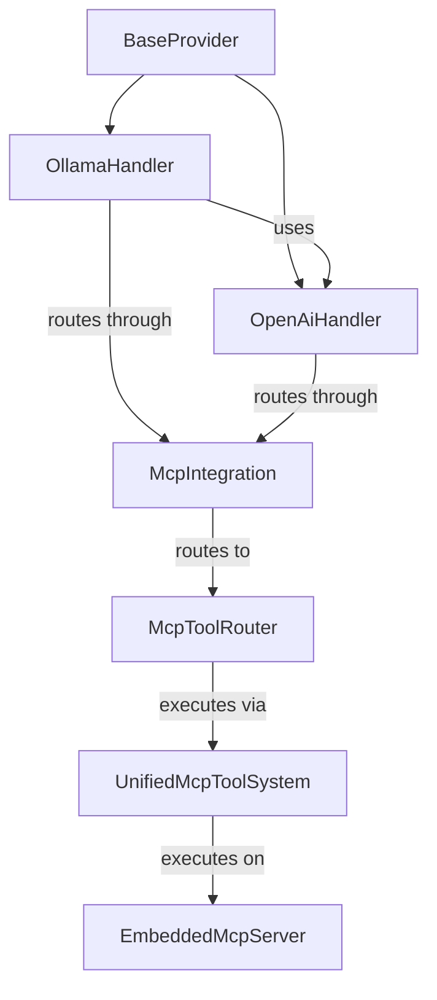
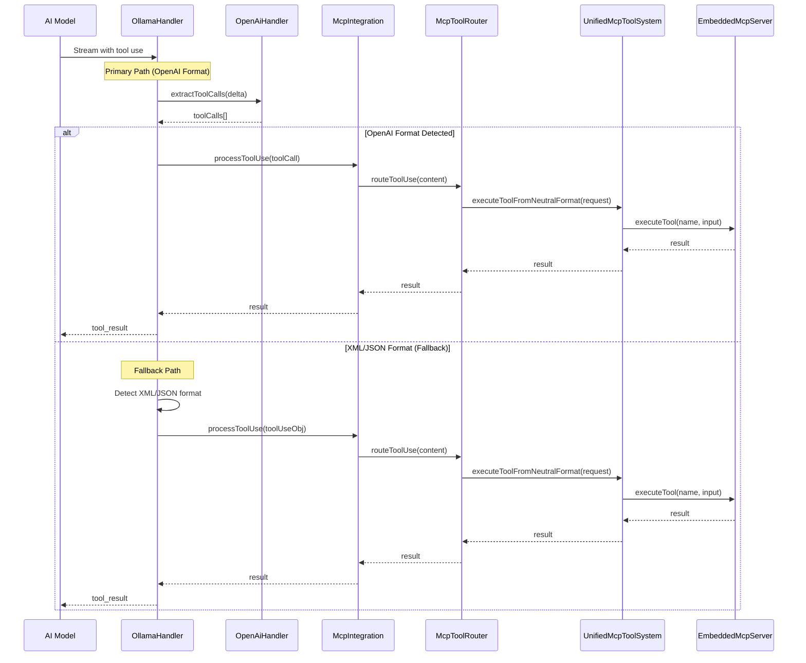

# Ollama-OpenAI-MCP Integration Architecture

**Date:** 2025-05-04

## 1. Overview

This document provides a detailed architectural overview of how the Ollama handler integrates with the OpenAI handler for tool use detection and processing, and how it routes tool use requests through the Model Context Protocol (MCP) system. This architecture addresses the design goal of centralizing tool use detection and processing logic, reducing code duplication, and ensuring consistent behavior across providers.

## 2. Architectural Components

### 2.1 Component Hierarchy



### 2.2 Key Components

1. **BaseProvider**: Abstract base class that implements common functionality for all providers, including MCP integration initialization and tool use processing.

2. **OllamaHandler**: Handles interactions with Ollama models, using the OpenAI protocol. It now leverages the OpenAI handler for tool use detection.

3. **OpenAiHandler**: Handles interactions with OpenAI models and provides tool use detection logic that can be used by other handlers.

4. **McpIntegration**: Facade for the MCP integration system, providing a simple interface for routing tool use requests.

5. **McpToolRouter**: Routes tool use requests to the appropriate handler based on their format.

6. **UnifiedMcpToolSystem**: Provides a unified interface for tool use across different AI models.

7. **EmbeddedMcpServer**: Executes tool use requests and returns results.

## 3. Tool Use Processing Flow



### 3.1 Primary Path (OpenAI Format)

1. The Ollama handler receives a stream chunk from the model.
2. The Ollama handler calls the OpenAI handler's `extractToolCalls` method to detect OpenAI format tool calls.
3. If tool calls are detected, the Ollama handler processes each tool call:
   a. It extracts the tool call information (ID, name, arguments).
   b. It calls the `processToolUse` method inherited from BaseProvider.
   c. The `processToolUse` method routes the tool call through McpIntegration's `routeToolUse` method.
   d. McpIntegration detects the format and routes to the appropriate handler in McpToolRouter.
   e. McpToolRouter converts the tool call to a neutral format and executes it via UnifiedMcpToolSystem.
   f. UnifiedMcpToolSystem executes the tool on the EmbeddedMcpServer.
   g. The result is returned back through the chain.
   h. The Ollama handler yields the tool result to the model.

### 3.2 Fallback Path (XML/JSON Format)

If the OpenAI format is not detected, the Ollama handler falls back to its own XML and JSON detection logic:

1. The Ollama handler checks for XML tool use patterns using regex.
2. If an XML tool use is detected, it extracts the tool use information and processes it through the same MCP chain.
3. If no XML tool use is detected, it checks for JSON tool use patterns.
4. If a JSON tool use is detected, it extracts the tool use information and processes it through the same MCP chain.
5. If no tool use is detected, it processes the content as regular text.

## 4. Integration Points

### 4.1 Ollama-OpenAI Integration

The Ollama handler integrates with the OpenAI handler in the following ways:

1. **Initialization**: The Ollama handler creates an OpenAI handler in its constructor, passing appropriate options.

2. **Tool Use Detection**: The Ollama handler uses the OpenAI handler's `extractToolCalls` method to detect OpenAI format tool calls.

### 4.2 Ollama-MCP Integration

The Ollama handler integrates with the MCP system in the following ways:

1. **Initialization**: The Ollama handler inherits from BaseProvider, which initializes the MCP integration in its constructor.

2. **Tool Use Processing**: The Ollama handler uses the `processToolUse` method inherited from BaseProvider to route tool use requests through the MCP system.

## 5. Test Strategy

### 5.1 Test Categories

1. **OpenAI Handler Integration Tests**
   - Verify that the Ollama handler creates and initializes an OpenAI handler
   - Verify that the correct options are passed to the OpenAI handler

2. **Tool Use Detection Integration Tests**
   - Verify that the Ollama handler uses the OpenAI handler's `extractToolCalls` method
   - Verify that OpenAI format tool calls are correctly processed
   - Verify fallback to XML detection when OpenAI format isn't detected
   - Verify fallback to JSON detection when neither OpenAI nor XML formats are detected
   - Verify error handling for tool use processing

### 5.2 Specific Test Cases

#### 5.2.1 OpenAI Handler Integration Tests

1. **Test: should create an OpenAI handler in constructor**
   - Verify that the OpenAI handler is created and accessible

2. **Test: should pass correct options to OpenAI handler**
   - Verify that the options passed to the OpenAI handler match the expected values

#### 5.2.2 Tool Use Detection Integration Tests

1. **Test: should use OpenAI handler for tool use detection**
   - Create a spy on the OpenAI handler's `extractToolCalls` method
   - Call `createMessage` with a neutral history
   - Verify that the spy was called

2. **Test: should process OpenAI format tool calls using OpenAI handler**
   - Mock the OpenAI client to return a tool call in OpenAI format
   - Create a spy on the `processToolUse` method
   - Call `createMessage` with a neutral history
   - Verify that `processToolUse` was called with the correct arguments
   - Verify that a tool result was yielded

3. **Test: should fall back to XML detection if OpenAI format is not detected**
   - Mock the OpenAI handler to not detect any tool calls
   - Mock the OpenAI client to return XML content
   - Create a spy on the `processToolUse` method
   - Call `createMessage` with a neutral history
   - Verify that `processToolUse` was called with the correct arguments
   - Verify that a tool result was yielded

4. **Test: should fall back to JSON detection if neither OpenAI nor XML formats are detected**
   - Mock the OpenAI handler to not detect any tool calls
   - Mock the OpenAI client to return JSON content
   - Create a spy on the `processToolUse` method
   - Call `createMessage` with a neutral history
   - Verify that `processToolUse` was called with the correct arguments
   - Verify that a tool result was yielded

5. **Test: should handle errors in OpenAI tool use processing**
   - Mock the OpenAI client to return a tool call in OpenAI format
   - Mock `processToolUse` to throw an error
   - Call `createMessage` with a neutral history
   - Verify that the error is handled correctly

## 6. Implementation Details

### 6.1 Ollama Handler Changes

The Ollama handler has been updated to use the OpenAI handler's tool use detection logic:

```typescript
// src/api/providers/ollama.ts
import { OpenAiHandler } from './openai';

export class OllamaHandler extends BaseProvider implements SingleCompletionHandler {
  protected options: ApiHandlerOptions;
  private client: OpenAI;
  private openAiHandler: OpenAiHandler;

  constructor(options: ApiHandlerOptions) {
    super();
    this.options = options;
    this.client = new OpenAI({
      baseURL: (this.options.ollamaBaseUrl || "http://localhost:10000") + "/v1",
      apiKey: "ollama", // Ollama uses a dummy key via OpenAI client
    });
    
    // Create an OpenAI handler for tool use detection and processing
    this.openAiHandler = new OpenAiHandler({
      ...options,
      // Override any OpenAI-specific options as needed
      openAiApiKey: "ollama", // Use the same dummy key
      openAiBaseUrl: (this.options.ollamaBaseUrl || "http://localhost:10000") + "/v1",
      openAiModelId: this.options.ollamaModelId || ""
    });
  }
  
  override async *createMessage(systemPrompt: string, messages: NeutralConversationHistory): ApiStream {
    // ... existing code ...
    
    for await (const chunk of stream) {
      const delta = chunk.choices[0]?.delta ?? {};

      if (delta.content) {
        // First, check for OpenAI-style tool calls using the OpenAI handler
        const toolCalls = this.openAiHandler.extractToolCalls(delta);
        
        if (toolCalls.length > 0) {
          // Process tool calls using OpenAI handler's logic
          for (const toolCall of toolCalls) {
            if (toolCall.function) {
              // Process tool use using MCP integration
              const toolResult = await this.processToolUse({
                id: toolCall.id,
                name: toolCall.function.name,
                input: JSON.parse(toolCall.function.arguments || '{}')
              });
              
              // Yield tool result
              yield {
                type: 'tool_result',
                id: toolCall.id,
                content: toolResult
              };
            }
          }
        } else {
          // Fallback to XML/JSON detection if OpenAI format isn't detected
          // ... existing fallback code ...
        }
      }
    }
  }
}
```

### 6.2 OpenAI Handler Changes

The OpenAI handler has been updated to expose its tool use detection logic:

```typescript
// src/api/providers/openai.ts

/**
 * Check if a delta contains tool calls
 * @param delta The OpenAI delta object
 * @returns True if the delta contains tool calls, false otherwise
 */
public hasToolCalls(delta: any): boolean {
  // Use extractToolCalls to maintain consistency and follow DRY principle
  return this.extractToolCalls(delta).length > 0;
}

/**
 * Extract tool calls from an OpenAI delta
 * @param delta The OpenAI delta object
 * @returns An array of tool calls
 */
public extractToolCalls(delta: any): any[] {
  // Extracts tool calls from a delta chunk.
  // Ensures it returns an array, even if tool_calls is null or undefined.
  return delta?.tool_calls ?? [];
}
```

## 7. Conclusion

This architecture provides a clean and maintainable way for the Ollama handler to leverage the OpenAI handler's tool use detection logic while still maintaining its own fallback mechanisms for different tool use formats. By centralizing the tool use detection and processing logic, we reduce code duplication and ensure consistent behavior across providers.

The integration with the MCP system provides a standardized way to route tool use requests and execute tools, making it easier to support a wide range of AI models and tool formats.