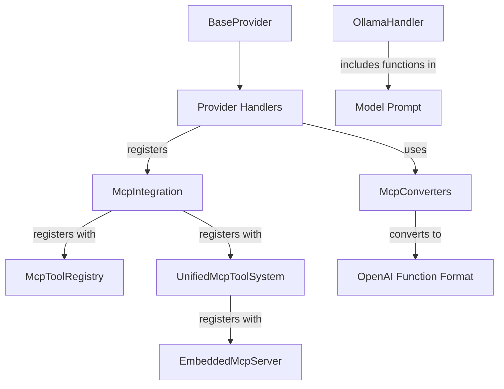
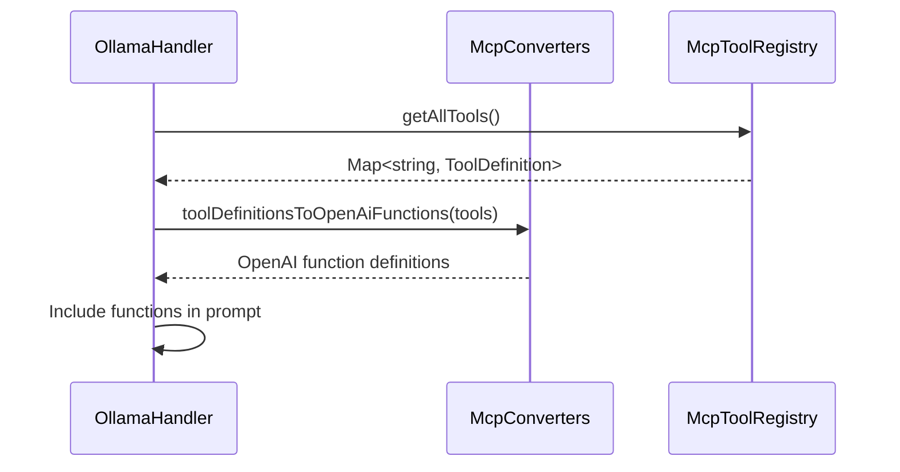
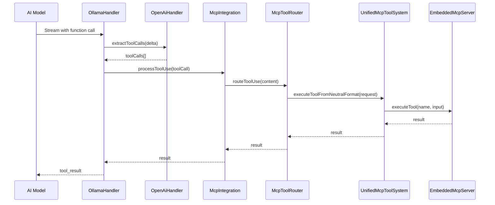

# OpenAI Function Format Integration with MCP

**Date:** 2025-05-05

## 1. Overview

This document provides a detailed guide for integrating the Model Context Protocol (MCP) tool system with OpenAI-compatible models like Ollama. It focuses on converting MCP tool definitions to OpenAI function format and exposing them to models that support function calling.

The integration enables:
- Exposing MCP-registered tools to OpenAI-compatible models
- Converting tool definitions to OpenAI function format
- Processing function calls from models and routing them through the MCP system
- Returning results in the appropriate format

## 2. Architecture

### 2.1 Component Relationships



### 2.2 OpenAI Function Format Conversion Flow



### 2.3 Function Call Processing Flow



## 3. Implementation Steps

### 3.1 Update McpConverters for OpenAI Function Format

The `McpConverters` class needs to be updated to convert MCP tool definitions to OpenAI function definitions:

```typescript
// src/services/mcp/McpConverters.ts

/**
 * Convert MCP tool definitions to OpenAI function definitions
 * @param tools Map of tool names to tool definitions
 * @returns Array of OpenAI function definitions
 */
public static toolDefinitionsToOpenAiFunctions(tools: Map<string, ToolDefinition>): any[] {
  const functions = [];
  
  for (const [name, definition] of tools.entries()) {
    functions.push({
      name: definition.name,
      description: definition.description || '',
      parameters: definition.paramSchema || {
        type: 'object',
        properties: {},
        required: []
      }
    });
  }
  
  return functions;
}
```

### 3.2 Update McpIntegration to Expose Tool Registry

The `McpIntegration` class should be updated to expose the tool registry:

```typescript
// src/services/mcp/McpIntegration.ts

/**
 * Get the tool registry
 * @returns The tool registry
 */
public getToolRegistry(): McpToolRegistry {
  return this.mcpToolSystem.getToolRegistry();
}
```

### 3.3 Update UnifiedMcpToolSystem to Expose Tool Registry

The `UnifiedMcpToolSystem` class should be updated to expose the tool registry:

```typescript
// src/services/mcp/UnifiedMcpToolSystem.ts

/**
 * Get the tool registry
 * @returns The tool registry
 */
public getToolRegistry(): McpToolRegistry {
  return this.toolRegistry;
}
```

### 3.4 Update OllamaHandler to Include Available Tools in Prompt

The `OllamaHandler` class should be updated to include available tools in the prompt to the model:

```typescript
// src/api/providers/ollama.ts

override async *createMessage(systemPrompt: string, messages: NeutralConversationHistory): ApiStream {
  // Get all available tools from the MCP registry
  const toolRegistry = this.mcpIntegration.getToolRegistry();
  const availableTools = toolRegistry.getAllTools();
  
  // Convert tool definitions to OpenAI function definitions
  const functions = McpConverters.toolDefinitionsToOpenAiFunctions(availableTools);
  
  // Convert neutral history to Ollama format
  const openAiMessages = convertToOllamaHistory(messages);
  
  // Add system prompt if not already included
  const hasSystemMessage = openAiMessages.some(msg => msg.role === 'system');
  if (systemPrompt && systemPrompt.trim() !== "" && !hasSystemMessage) {
    openAiMessages.unshift({ role: "system", content: systemPrompt });
  }
  
  // Create stream with functions included
  const stream = await this.client.chat.completions.create({
    model: this.getModel().id,
    messages: openAiMessages,
    temperature: this.options.modelTemperature ?? 0,
    stream: true,
    functions: functions,  // Include available functions
    function_call: 'auto'  // Allow the model to decide when to call functions
  });
  
  // Process stream
  for await (const chunk of stream) {
    const delta = chunk.choices[0]?.delta ?? {};
    
    // Check for function calls
    if (delta.function_call) {
      // Process function call
      const functionCall = {
        id: `function-${Date.now()}`,
        name: delta.function_call.name,
        arguments: delta.function_call.arguments
      };
      
      // Process tool use using MCP integration
      const result = await this.processToolUse(functionCall);
      
      // Yield tool result
      yield {
        type: 'tool_result',
        id: functionCall.id,
        content: result
      };
    } else if (delta.content) {
      // Yield regular content
      yield {
        type: 'text',
        text: delta.content
      };
    }
  }
}
```

### 3.5 Update BaseProvider to Register Common Tools

The `BaseProvider` class should be updated to register common tools with the MCP integration:

```typescript
// src/api/providers/base-provider.ts

protected registerTools(): void {
  // Register common tools
  
  // Register read_file tool
  this.mcpIntegration.registerTool({
    name: 'read_file',
    description: 'Request to read the contents of a file at the specified path',
    paramSchema: {
      type: 'object',
      properties: {
        path: {
          type: 'string',
          description: 'The path of the file to read (relative to the current workspace directory)'
        },
        start_line: {
          type: 'integer',
          description: 'The starting line number to read from (1-based)'
        },
        end_line: {
          type: 'integer',
          description: 'The ending line number to read to (1-based, inclusive)'
        }
      },
      required: ['path']
    },
    handler: async (args: Record<string, unknown>) => {
      // Implementation will be handled by the MCP server
      // This is just a registration of the tool definition
      return {
        content: [{ type: 'text', text: 'File content will be returned here' }]
      };
    }
  });
  
  // Register write_to_file tool
  this.mcpIntegration.registerTool({
    name: 'write_to_file',
    description: 'Request to write full content to a file at the specified path',
    paramSchema: {
      type: 'object',
      properties: {
        path: {
          type: 'string',
          description: 'The path of the file to write to (relative to the current workspace directory)'
        },
        content: {
          type: 'string',
          description: 'The content to write to the file'
        },
        line_count: {
          type: 'integer',
          description: 'The number of lines in the file'
        }
      },
      required: ['path', 'content', 'line_count']
    },
    handler: async (args: Record<string, unknown>) => {
      // Implementation will be handled by the MCP server
      return {
        content: [{ type: 'text', text: 'File written successfully' }]
      };
    }
  });
  
  // Register other common tools...
}
```

## 4. Testing Strategy

### 4.1 Unit Tests for OpenAI Function Format Conversion

Create unit tests for OpenAI function format conversion:

```typescript
// src/services/mcp/__tests__/McpConverters.test.ts

test('should convert tool definitions to OpenAI function definitions', () => {
  const tools = new Map();
  
  tools.set('test_tool', {
    name: 'test_tool',
    description: 'A test tool',
    paramSchema: {
      type: 'object',
      properties: {
        param: {
          type: 'string',
          description: 'A test parameter'
        }
      },
      required: ['param']
    },
    handler: async () => ({ content: [] })
  });
  
  const functions = McpConverters.toolDefinitionsToOpenAiFunctions(tools);
  
  expect(functions).toHaveLength(1);
  expect(functions[0]).toEqual({
    name: 'test_tool',
    description: 'A test tool',
    parameters: {
      type: 'object',
      properties: {
        param: {
          type: 'string',
          description: 'A test parameter'
        }
      },
      required: ['param']
    }
  });
});

test('should handle tool definitions without schemas', () => {
  const tools = new Map();
  
  tools.set('simple_tool', {
    name: 'simple_tool',
    description: 'A simple tool without schema',
    handler: async () => ({ content: [] })
  });
  
  const functions = McpConverters.toolDefinitionsToOpenAiFunctions(tools);
  
  expect(functions).toHaveLength(1);
  expect(functions[0]).toEqual({
    name: 'simple_tool',
    description: 'A simple tool without schema',
    parameters: {
      type: 'object',
      properties: {},
      required: []
    }
  });
});
```

### 4.2 Integration Tests for Ollama Handler

Create integration tests for the Ollama handler:

```typescript
// src/api/providers/__tests__/ollama-mcp-integration.test.ts

test('should include available tools in the prompt', async () => {
  // Mock the tool registry
  const mockTools = new Map();
  mockTools.set('test_tool', {
    name: 'test_tool',
    description: 'A test tool',
    paramSchema: {
      type: 'object',
      properties: {
        param: {
          type: 'string',
          description: 'A test parameter'
        }
      },
      required: ['param']
    },
    handler: async () => ({ content: [] })
  });
  
  // Mock the McpIntegration to return the mock tool registry
  handler['mcpIntegration'].getToolRegistry = jest.fn().mockReturnValue({
    getAllTools: jest.fn().mockReturnValue(mockTools)
  });
  
  // Create a spy on the client.chat.completions.create method
  const createSpy = jest.spyOn(handler['client'].chat.completions, 'create');
  
  // Create neutral history
  const neutralHistory: NeutralConversationHistory = [
    { role: 'user', content: [{ type: 'text', text: 'Use a tool' }] }
  ];
  
  // Call createMessage
  const stream = handler.createMessage('You are helpful.', neutralHistory);
  
  // Collect stream chunks
  const chunks = [];
  for await (const chunk of stream) {
    chunks.push(chunk);
  }
  
  // Verify that the client.chat.completions.create method was called with functions
  expect(createSpy).toHaveBeenCalledWith(expect.objectContaining({
    functions: expect.arrayContaining([
      expect.objectContaining({
        name: 'test_tool',
        description: 'A test tool',
        parameters: expect.objectContaining({
          type: 'object',
          properties: expect.objectContaining({
            param: expect.objectContaining({
              type: 'string',
              description: 'A test parameter'
            })
          }),
          required: ['param']
        })
      })
    ]),
    function_call: 'auto'
  }));
});

test('should process function calls from the model', async () => {
  // Mock the client to return a function call
  const mockClient = {
    chat: {
      completions: {
        create: jest.fn().mockReturnValue({
          [Symbol.asyncIterator]: async function* () {
            yield {
              choices: [{
                delta: {
                  function_call: {
                    name: 'test_tool',
                    arguments: '{"param":"test value"}'
                  }
                }
              }]
            };
          }
        })
      }
    }
  };
  
  // Replace the handler's client with the mock client
  handler['client'] = mockClient;
  
  // Mock the processToolUse method
  handler['processToolUse'] = jest.fn().mockResolvedValue('Tool result');
  
  // Create neutral history
  const neutralHistory: NeutralConversationHistory = [
    { role: 'user', content: [{ type: 'text', text: 'Use a tool' }] }
  ];
  
  // Call createMessage
  const stream = handler.createMessage('You are helpful.', neutralHistory);
  
  // Collect stream chunks
  const chunks = [];
  for await (const chunk of stream) {
    chunks.push(chunk);
  }
  
  // Verify that processToolUse was called with the function call
  expect(handler['processToolUse']).toHaveBeenCalledWith(expect.objectContaining({
    name: 'test_tool',
    arguments: '{"param":"test value"}'
  }));
  
  // Verify that a tool result was yielded
  expect(chunks).toContainEqual(expect.objectContaining({
    type: 'tool_result',
    content: 'Tool result'
  }));
});
```

## 5. Implementation Considerations

### 5.1 Tool Registration Timing

Tools should be registered during the initialization of the provider handlers, which happens in the constructor of the `BaseProvider` class. This ensures that all tools are available before any messages are processed.

### 5.2 Tool Schema Compatibility

The parameter schema for tools should be compatible with both the MCP protocol and the OpenAI function calling format. The OpenAI function calling format uses JSON Schema, which is also used by the MCP protocol.

Key considerations:
- Use standard JSON Schema types (string, number, boolean, object, array)
- Include descriptions for parameters to help the model understand their purpose
- Specify required parameters to ensure the model provides them
- Use consistent naming conventions for parameters

### 5.3 Function Call Handling

When handling function calls from the model, consider the following:

1. **Streaming**: The model may stream the function call over multiple chunks, so you need to buffer and parse the arguments correctly.
2. **Multiple Function Calls**: The model may make multiple function calls in a single response, so you need to handle each one separately.
3. **Error Handling**: If a function call fails, you should return an error result to the model so it can try again or suggest an alternative.
4. **Result Formatting**: The result should be formatted in a way that the model can understand and use in its response.

### 5.4 Model-Specific Considerations

Different models may have different capabilities and limitations when it comes to function calling:

1. **Ollama**: Ollama supports the OpenAI function calling format, but may have limitations depending on the underlying model.
2. **OpenAI**: OpenAI models have robust function calling support, but may have different behavior depending on the model version.
3. **Anthropic**: Anthropic models use a different format for tool use, so you may need to convert between formats.

### 5.5 Error Handling

Error handling should be implemented at multiple levels:

1. **Tool Registration**: Errors during tool registration should be caught and logged, but should not prevent the provider handler from initializing.
2. **Tool Execution**: Errors during tool execution should be caught and returned as error results, rather than throwing exceptions.
3. **OpenAI Function Format Conversion**: Errors during conversion should be caught and logged, with fallback to an empty array of functions.
4. **Function Call Parsing**: Errors during function call parsing should be caught and returned as error results to the model.

## 6. Best Practices

### 6.1 Tool Design

When designing tools for use with OpenAI-compatible models, follow these best practices:

1. **Clear Names**: Use clear, descriptive names for tools that indicate their purpose.
2. **Detailed Descriptions**: Provide detailed descriptions that explain what the tool does and when to use it.
3. **Simple Parameters**: Keep parameters simple and focused on the task at hand.
4. **Consistent Formats**: Use consistent formats for parameters and results across all tools.
5. **Error Messages**: Provide clear error messages that help the model understand what went wrong.

### 6.2 Schema Design

When designing parameter schemas, follow these best practices:

1. **Use Standard Types**: Stick to standard JSON Schema types (string, number, boolean, object, array).
2. **Include Descriptions**: Include descriptions for all parameters to help the model understand their purpose.
3. **Specify Required Parameters**: Clearly specify which parameters are required.
4. **Provide Defaults**: Where appropriate, provide default values for optional parameters.
5. **Use Enums**: For parameters with a fixed set of values, use enums to restrict the options.

### 6.3 Performance Considerations

To ensure good performance when using function calling:

1. **Limit Tool Count**: Don't expose too many tools at once, as it can overwhelm the model.
2. **Optimize Tool Execution**: Make sure tool execution is as fast as possible to avoid delays.
3. **Cache Results**: Consider caching tool results to avoid redundant calls.
4. **Batch Processing**: If possible, batch multiple tool calls together to reduce overhead.
5. **Streaming**: Use streaming for long-running tools to provide feedback to the model.

## 7. Conclusion

Integrating the MCP tool system with OpenAI-compatible models provides a powerful way to extend the capabilities of these models. By converting MCP tool definitions to OpenAI function format and handling function calls from the model, we can create a seamless experience for users.

The implementation outlined in this document provides a clear path to achieving this integration, with considerations for compatibility, error handling, and performance. By following these guidelines, you can create a robust and flexible tool system that works well with a variety of models.