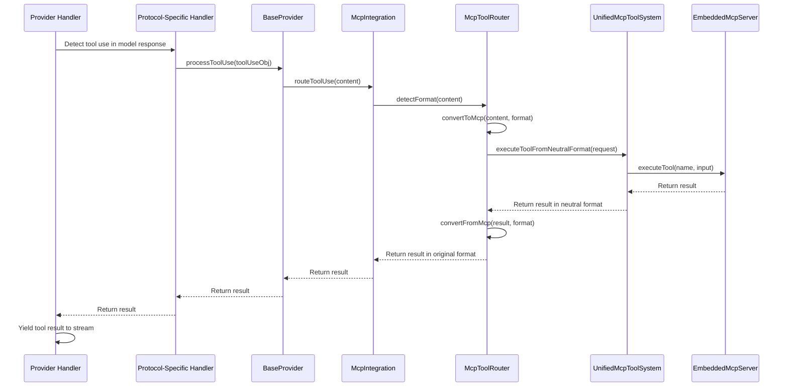

# Provider Handler MCP Integration

**Date:** 2025-05-04

## 1. Overview

This document details the integration of provider handlers with the MCP facade for tool use routing. It builds on the existing MCP integration architecture described in `unified_architecture.md` and `mcp_integration_implementation.md`.

## 2. Current Implementation Analysis

### 2.1 BaseProvider Class

The BaseProvider class already includes the MCP integration:

```typescript
// src/api/providers/base-provider.ts
export abstract class BaseProvider implements ApiHandler {
  protected mcpIntegration: McpIntegration;
  
  constructor() {
    // Get the MCP integration singleton instance
    this.mcpIntegration = McpIntegration.getInstance();
    
    // Initialize MCP integration
    this.mcpIntegration.initialize();

    // Register tools
    this.registerTools();
  }
  
  protected registerTools(): void {
    // Register common tools
    // Specific tools will be registered by individual providers
  }
  
  protected async processToolUse(content: string | Record<string, unknown>): Promise<string> {
    // Process tool use using MCP integration
    const result = await this.mcpIntegration.routeToolUse(content);
    // Ensure we return a string
    return typeof result === 'string' ? result : JSON.stringify(result);
  }
}
```

The `processToolUse` method routes tool use requests through the `McpIntegration.routeToolUse` method, which handles the detection of the format and routing to the appropriate handler.

### 2.2 Provider Handler Implementations

#### 2.2.1 Anthropic Handler

The Anthropic handler has partial implementation for tool use detection and processing:

```typescript
// src/api/providers/anthropic.ts
case "content_block_start":
  // Check if the content block is a tool use block
  if (chunk.content_block.type === "tool_use") {
    // Process tool use using MCP integration
    const toolUseBlock = chunk.content_block as Anthropic.ToolUseBlock;
    const toolResult = await this.processToolUse({
      id: toolUseBlock.id,
      name: toolUseBlock.name,
      input: toolUseBlock.input
    });
    
    // Yield tool result
    yield {
      type: 'tool_result',
      id: toolUseBlock.id,
      content: toolResult
    };
  }
  break;
```

#### 2.2.2 OpenAI Handler

The OpenAI handler has similar implementation for tool use detection and processing:

```typescript
// src/api/providers/openai.ts
// Handle tool use (function calls)
if (delta.tool_calls) {
  for (const toolCall of delta.tool_calls) {
    if (toolCall.function) {
      // Process tool use using MCP integration
      const toolResult = await this.processToolUse({
        id: toolCall.id,
        name: toolCall.function.name,
        input: JSON.parse(toolCall.function.arguments || '{}')
      });
      
      // Yield tool result
      yield {
        type: 'tool_result',
        id: toolCall.id,
        content: toolResult
      };
    }
  }
}
```

#### 2.2.3 Ollama Handler

The Ollama handler has a more complex implementation for detecting and processing tool use in both XML and JSON formats, serving as a test bed for the MCP integration:

```typescript
// src/api/providers/ollama.ts
// Check for XML tool use pattern
const xmlToolUseRegex = /<(\w+)>[\s\S]*?<\/\1>/g;
let match;
let processedToolUse = false;

while ((match = xmlToolUseRegex.exec(content)) !== null) {
  const tagName = match[1];
  // Skip known non-tool tags
  if (tagName !== 'think' && tagName !== 'tool_result' && tagName !== 'tool_use') {
    const toolUseXml = match[0];
    
    try {
      // Extract parameters
      const params: Record<string, any> = {};
      // ... parameter extraction logic ...
      
      // Create tool use object
      const toolUseObj = {
        id: `${tagName}-${Date.now()}`,
        name: tagName,
        input: params
      };
      
      // Process tool use using MCP integration
      const toolResult = await this.processToolUse(toolUseObj);
      
      // Yield tool result
      yield {
        type: 'tool_result',
        id: toolUseObj.id,
        content: toolResult
      };
      
      processedToolUse = true;
    } catch (error) {
      console.warn("Error processing XML tool use:", error);
    }
  }
}

// Check for JSON tool use pattern if no XML tool use was found
if (!processedToolUse && content.includes('"type":"tool_use"')) {
  try {
    // ... JSON parsing logic ...
    
    if (jsonObj.type === 'tool_use' && jsonObj.name) {
      // Process tool use using MCP integration
      const toolResult = await this.processToolUse(jsonObj);
      
      // Yield tool result
      yield {
        type: 'tool_result',
        id: jsonObj.id || `${jsonObj.name}-${Date.now()}`,
        content: toolResult
      };
      
      processedToolUse = true;
    }
  } catch (error) {
    console.warn("Error processing JSON tool use:", error);
  }
}
```

### 2.3 Neutral Format Converters

The neutral format converters currently don't fully handle tool use and tool result content blocks. For example, the Ollama converter:

```typescript
// src/api/transform/neutral-ollama-format.ts
export function convertToOllamaHistory(
  neutralHistory: NeutralConversationHistory
): OpenAI.Chat.ChatCompletionMessageParam[] {
  return neutralHistory.map(neutralMessage => {
    // ... existing code ...
    
    // Handle content based on its type
    if (typeof neutralMessage.content === 'string') {
      // If content is a simple string, use it directly
      ollamaMessage.content = neutralMessage.content;
    } else if (Array.isArray(neutralMessage.content)) {
      // For Ollama, we need to convert all content blocks to a single string
      // since it doesn't support complex content types
      const textBlocks = neutralMessage.content
        .filter(block => block.type === 'text')
        .map(block => (block as NeutralTextContentBlock).text);
      
      // Join all text blocks with newlines
      ollamaMessage.content = textBlocks.join('\n\n');
      
      // If there are non-text blocks, log a warning
      if (neutralMessage.content.some(block => block.type !== 'text')) {
        console.warn('Ollama does not support non-text content. Some content may be lost.');
      }
    }
    
    return ollamaMessage;
  });
}
```

## 3. Design Flaw and Solution

### 3.1 Identified Design Flaw

The current design has a critical flaw: **each provider handler is implementing its own tool use detection and processing logic**, even when they use the same underlying protocol. This violates the DRY (Don't Repeat Yourself) principle and creates unnecessary duplication.

Specifically, the Ollama handler uses the OpenAI client but has its own XML and JSON tool use detection and processing logic, duplicating code that already exists in the OpenAI handler.

### 3.2 Proposed Solution

The key insight is that **MCP should be invoked from the OpenAI handler, not from each individual provider that uses the OpenAI protocol**. This approach has several advantages:

1. **Eliminates code duplication** - We avoid writing the same tool use detection and processing logic for every provider that uses the OpenAI protocol
2. **Centralizes maintenance** - Changes to the OpenAI tool use format only need to be made in one place
3. **Ensures consistency** - All providers using the OpenAI protocol will handle tool use in the same way
4. **Simplifies testing** - We only need to test the tool use logic once in the OpenAI handler

### 3.3 Protocol-Specific Tool Use Handling

Providers that use the same underlying protocol (OpenAI, Anthropic, etc.) should leverage the corresponding handler's tool use detection and processing logic rather than implementing their own.

For example:
- Ollama uses the OpenAI protocol, so it should leverage the OpenAI handler's tool use logic
- Claude uses the Anthropic protocol, so it should leverage the Anthropic handler's tool use logic

This approach eliminates code duplication and ensures consistent behavior across providers using the same protocol.

## 4. Integration Requirements

To fully integrate provider handlers with the MCP facade, the following updates are needed:

### 4.1 BaseProvider Updates

The BaseProvider's `processToolUse` method should be enhanced to handle different input formats and return types:

```typescript
protected async processToolUse(content: string | Record<string, unknown>): Promise<string | Record<string, unknown>> {
  // Process tool use using MCP integration
  return this.mcpIntegration.routeToolUse(content);
}
```

### 4.2 Provider Handler Updates

Each provider handler should be updated to consistently use the MCP integration for tool use routing:

1. **Detect tool use** in the model's response based on the provider's specific format
2. **Extract tool use information** (name, parameters, ID) from the response
3. **Create a tool use object** in a format that can be processed by the MCP integration
4. **Route the tool use** through the `processToolUse` method
5. **Process the result** and format it appropriately for the handler's output stream

### 4.3 Protocol-Specific Adapter Pattern

Implement a protocol-specific adapter pattern where providers can inherit or compose with protocol-specific handlers (OpenAI, Anthropic, etc.) for common functionality like tool use detection and processing:

```typescript
// Example for Ollama handler
export class OllamaHandler extends BaseProvider implements SingleCompletionHandler {
  private openAiHandler: OpenAiHandler;
  
  constructor(options: ApiHandlerOptions) {
    super();
    this.options = options;
    
    // Create an OpenAI handler for tool use detection and processing
    this.openAiHandler = new OpenAiHandler({
      ...options,
      // Override any OpenAI-specific options as needed
    });
    
    // Initialize the client
    this.client = new OpenAI({
      baseURL: (this.options.ollamaBaseUrl || "http://localhost:10000") + "/v1",
      apiKey: "ollama", // Ollama uses a dummy key via OpenAI client
    });
  }
  
  override async *createMessage(systemPrompt: string, messages: NeutralConversationHistory): ApiStream {
    // ... existing code ...
    
    for await (const chunk of stream) {
      const delta = chunk.choices[0]?.delta ?? {};
      
      if (delta.content) {
        // Use the OpenAI handler's tool use detection logic
        const toolCalls = this.openAiHandler.extractToolCalls(delta);
        
        if (toolCalls.length > 0) {
          // Process tool calls using the OpenAI handler's logic
          for (const toolCall of toolCalls) {
            const toolResult = await this.processToolUse({
              id: toolCall.id,
              name: toolCall.function.name,
              input: JSON.parse(toolCall.function.arguments || '{}')
            });
            
            // Yield tool result
            yield {
              type: 'tool_result',
              id: toolCall.id,
              content: toolResult
            };
          }
        } else {
          // Regular content handling
          for (const chunk of matcher.update(delta.content)) {
            yield chunk;
          }
        }
      }
    }
  }
}
```

## 5. Implementation Flow

The flow for processing tool use through the MCP integration is as follows:



## 6. Testing Strategy

### 6.1 Unit Tests

Create unit tests for each provider handler to verify that tool use is correctly routed through the MCP integration:

```typescript
// src/api/providers/__tests__/mcp-integration.test.ts
describe('Provider Handlers with MCP Integration', () => {
  let anthropicHandler: AnthropicHandler;
  let openAiHandler: OpenAiHandler;
  let ollamaHandler: OllamaHandler;
  
  beforeEach(() => {
    // Initialize handlers
    anthropicHandler = new AnthropicHandler({...});
    openAiHandler = new OpenAiHandler({...});
    ollamaHandler = new OllamaHandler({...});
  });
  
  test('Ollama handler should use OpenAI handler for tool use detection', async () => {
    // Mock OpenAI handler's extractToolCalls method
    const extractToolCallsSpy = jest.spyOn(ollamaHandler['openAiHandler'], 'extractToolCalls');
    
    // Create a message with tool use
    // ...
    
    // Verify extractToolCalls was called
    expect(extractToolCallsSpy).toHaveBeenCalled();
  });
  
  // Similar tests for other handlers
});
```

### 6.2 Integration Tests

Create integration tests to verify the end-to-end flow of tool use processing:

```typescript
// src/services/mcp/__tests__/provider-integration.test.ts
describe('Provider Integration with MCP', () => {
  test('End-to-end tool use processing with Ollama', async () => {
    // Set up test environment
    // ...
    
    // Create a message with tool use
    // ...
    
    // Verify tool use is processed correctly
    // ...
  });
  
  // Similar tests for other providers
});
```

## 7. Benefits of Integration

The integration of provider handlers with the MCP facade provides several benefits:

1. **Unified Tool System**: All tool use is routed through a single system, regardless of the provider or format.
2. **Consistent Behavior**: Tool use is processed consistently across all providers.
3. **Simplified Maintenance**: Changes to tool handling only need to be made in one place.
4. **Improved Testability**: Each component can be tested in isolation.
5. **Format Agnostic**: The system can handle tool use in XML, JSON, or OpenAI formats without requiring changes to the underlying tool execution logic.
6. **Reduced Duplication**: Common logic is shared across handlers using the same protocol.

## 8. Conclusion

The integration of provider handlers with the MCP facade for tool use routing is a key step in the evolution of the architecture. By routing all tool use through the MCP integration and leveraging protocol-specific handlers for common functionality, we achieve a unified tool system that works consistently across all providers, regardless of the format they use for tool use requests.

This integration aligns with the architectural vision of having a centralized tool execution system based on the MCP protocol, providing a solid foundation for future enhancements and making it easier to support a wide range of AI models.