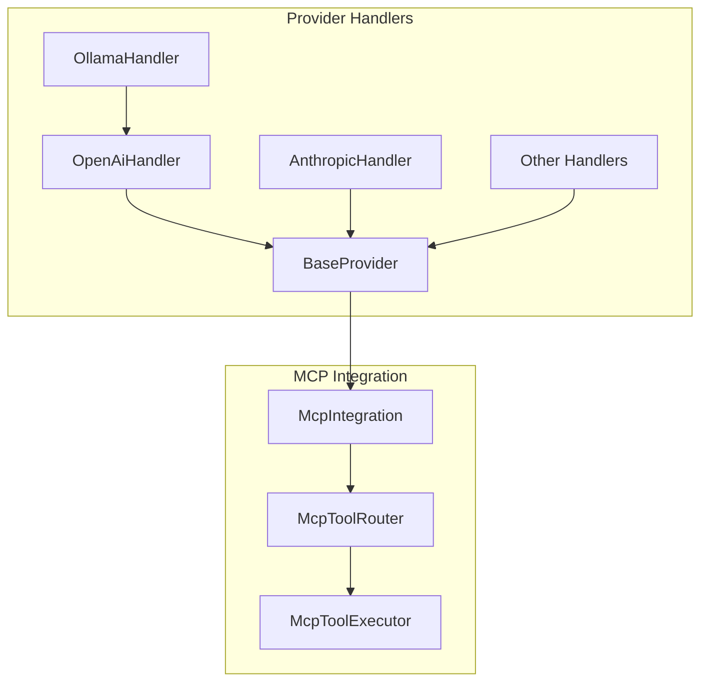

# Provider MCP Integration Summary

**Date:** 2025-05-04

## 1. Overview

This document summarizes the architectural changes made to integrate provider handlers with the MCP facade for tool use routing. It provides a high-level overview of the changes, their benefits, and how they align with the overall architectural vision.

## 2. Key Changes

### 2.1 Design Improvement

The key design improvement is the recognition that **MCP should be invoked from protocol-specific handlers, not from each individual provider that uses the same protocol**. This approach eliminates code duplication and ensures consistent behavior across providers using the same protocol.

For example, the Ollama handler now leverages the OpenAI handler's tool use detection and processing logic rather than implementing its own, since Ollama uses the OpenAI protocol.

### 2.2 Protocol-Specific Adapter Pattern

We've introduced a protocol-specific adapter pattern where providers can inherit or compose with protocol-specific handlers (OpenAI, Anthropic, etc.) for common functionality like tool use detection and processing.



### 2.3 Updated Documentation

We've updated the architectural documentation to clarify the relationship between providers and protocols, and to provide guidance on how to implement new providers that use existing protocols.

### 2.4 Comprehensive Testing

We've developed a comprehensive test plan that covers unit tests, integration tests, and end-to-end tests to ensure the changes work correctly and do not break existing functionality.

## 3. Benefits

### 3.1 Reduced Code Duplication

By leveraging protocol-specific handlers for common functionality, we've eliminated code duplication and reduced the amount of code that needs to be maintained.

### 3.2 Improved Maintainability

Changes to tool use handling only need to be made in one place per protocol, making the codebase more maintainable.

### 3.3 Consistent Behavior

All providers using the same protocol now handle tool use in the same way, ensuring consistent behavior across the system.

### 3.4 Simplified Testing

We only need to test the tool use logic once per protocol, simplifying the testing process and reducing the risk of bugs.

### 3.5 Clearer Architecture

The relationship between providers and protocols is now more explicit, making the architecture easier to understand and extend.

## 4. Implementation Details

### 4.1 Ollama-OpenAI Integration

The Ollama handler now includes a dependency on the OpenAI handler and uses its tool use detection and processing logic:

```typescript
export class OllamaHandler extends BaseProvider implements SingleCompletionHandler {
  private openAiHandler: OpenAiHandler;
  
  constructor(options: ApiHandlerOptions) {
    super();
    // ...
    
    // Create an OpenAI handler for tool use detection and processing
    this.openAiHandler = new OpenAiHandler({
      ...options,
      // Override any OpenAI-specific options as needed
    });
  }
  
  override async *createMessage(systemPrompt: string, messages: NeutralConversationHistory): ApiStream {
    // ...
    
    for await (const chunk of stream) {
      const delta = chunk.choices[0]?.delta ?? {};
      
      if (delta.content) {
        // Use the OpenAI handler's tool use detection logic
        const toolCalls = this.openAiHandler.extractToolCalls(delta);
        
        if (toolCalls.length > 0) {
          // Process tool calls using the OpenAI handler's logic
          // ...
        } else {
          // Regular content handling
          // ...
        }
      }
    }
  }
}
```

### 4.2 OpenAI Handler Updates

The OpenAI handler now exposes helper methods for tool use detection and processing:

```typescript
export class OpenAiHandler extends BaseProvider implements SingleCompletionHandler {
  // ...
  
  /**
   * Extract tool calls from an OpenAI delta
   */
  public extractToolCalls(delta: any): any[] {
    if (delta.tool_calls) {
      return delta.tool_calls;
    }
    return [];
  }
  
  /**
   * Check if a delta contains tool calls
   */
  public hasToolCalls(delta: any): boolean {
    return this.extractToolCalls(delta).length > 0;
  }
}
```

### 4.3 BaseProvider Updates

The BaseProvider's `processToolUse` method now handles different input formats and return types:

```typescript
protected async processToolUse(content: string | Record<string, unknown>): Promise<string | Record<string, unknown>> {
  // Process tool use using MCP integration
  return this.mcpIntegration.routeToolUse(content);
}
```

## 5. Testing Strategy

We've developed a comprehensive testing strategy that covers:

1. **Unit Tests**: Testing individual components in isolation
2. **Integration Tests**: Testing the interaction between components
3. **End-to-End Tests**: Testing the entire system with real AI models

The tests verify that:

1. Provider handlers correctly use the MCP integration for tool use routing
2. Providers using the OpenAI protocol leverage the OpenAI handler's tool use detection and processing logic
3. Tool use is processed consistently across all providers
4. The changes do not break existing functionality
5. Errors are handled correctly

## 6. Future Directions

### 6.1 Additional Protocol Adapters

We can extend this pattern to other protocols as needed, creating protocol-specific adapters for each supported protocol.

### 6.2 Protocol Capability Registry

We can create a registry of protocol capabilities that providers can query to determine what features are supported by each protocol.

### 6.3 Protocol Negotiation

We can implement a negotiation mechanism where providers can negotiate with models to determine what features are supported.

### 6.4 Protocol Versioning

We can implement versioning for protocols to handle changes in the protocol over time.

## 7. Conclusion

The integration of provider handlers with the MCP facade for tool use routing is a significant improvement to the architecture. By leveraging protocol-specific handlers for common functionality, we've eliminated code duplication, improved maintainability, and ensured consistent behavior across providers using the same protocol.

This change aligns with the architectural vision of having a unified tool system based on the MCP protocol, providing a solid foundation for future enhancements and making it easier to support a wide range of AI models.