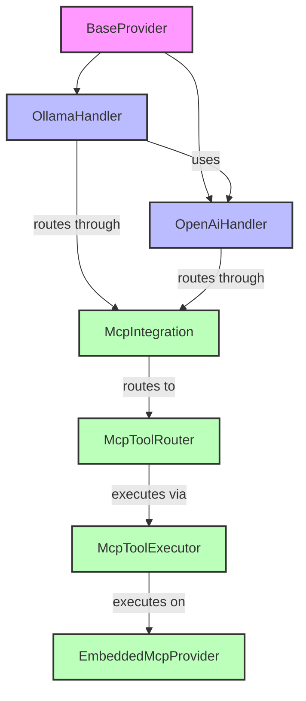
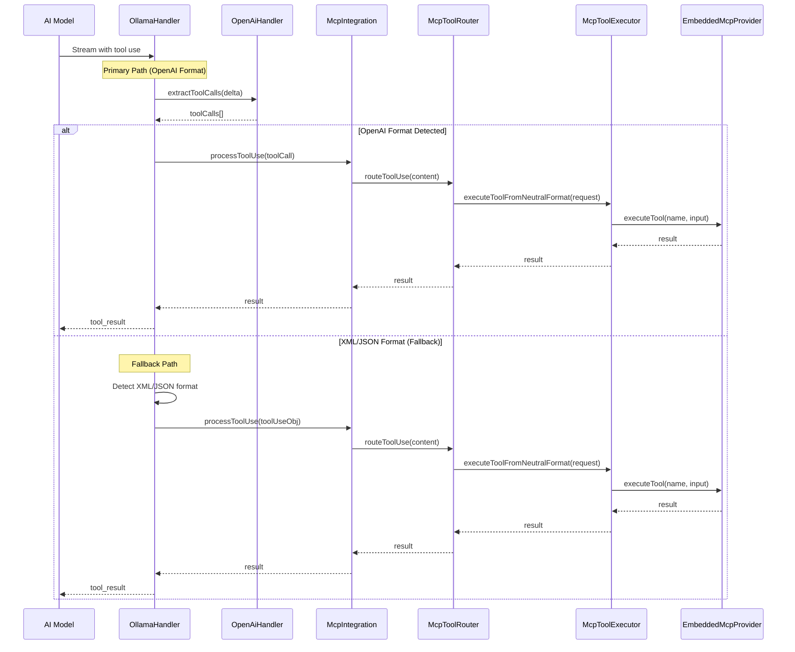
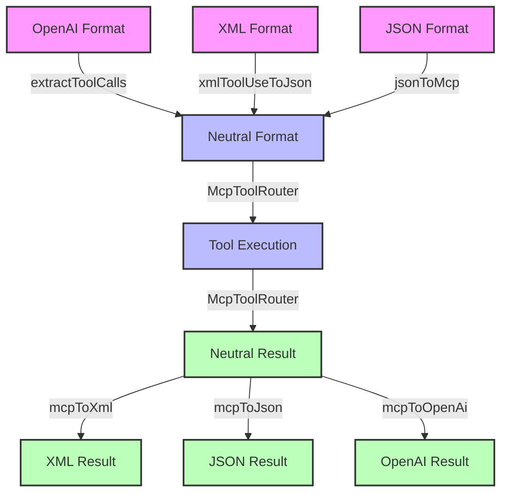
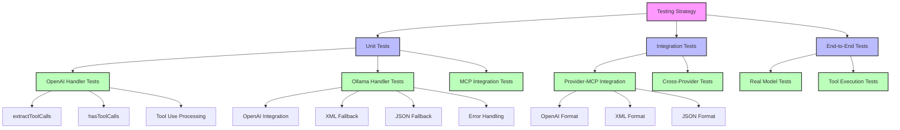
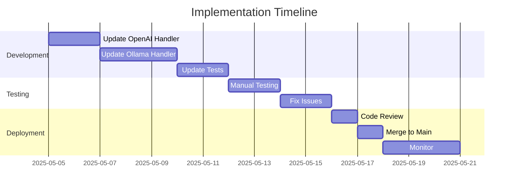

# Ollama-OpenAI Integration Implementation Plan

**Date:** 2025-05-04

## 1. Overview

This document provides a detailed implementation plan for updating the Ollama handler to use the OpenAI handler's tool use detection and processing logic. This change addresses the design flaw identified in the `provider_mcp_integration.md` document, where each provider handler is implementing its own tool use detection and processing logic, even when they use the same underlying protocol.

## 2. Architecture

### 2.1 Component Hierarchy



### 2.2 Tool Use Processing Flow



### 2.3 Format Conversion Flow



## 3. Implementation Steps

### 3.1 Update the Ollama Handler

#### 3.1.1 Add OpenAI Handler Dependency

Update the Ollama handler to include a dependency on the OpenAI handler:

```typescript
// src/api/providers/ollama.ts
import { OpenAiHandler } from './openai';

export class OllamaHandler extends BaseProvider implements SingleCompletionHandler {
  protected options: ApiHandlerOptions;
  private client: OpenAI;
  private openAiHandler: OpenAiHandler;

  constructor(options: ApiHandlerOptions) {
    super();
    this.options = options;
    this.client = new OpenAI({
      baseURL: (this.options.ollamaBaseUrl || "http://localhost:10000") + "/v1",
      apiKey: "ollama", // Ollama uses a dummy key via OpenAI client
    });
    
    // Create an OpenAI handler for tool use detection and processing
    this.openAiHandler = new OpenAiHandler({
      ...options,
      // Override any OpenAI-specific options as needed
      openAiApiKey: "ollama", // Use the same dummy key
      openAiBaseUrl: (this.options.ollamaBaseUrl || "http://localhost:10000") + "/v1",
      openAiModelId: this.options.ollamaModelId || ""
    });
  }
  
  // ... rest of the class
}
```

#### 3.1.2 Update the createMessage Method

Update the `createMessage` method to use the OpenAI handler's tool use detection and processing logic:

```typescript
override async *createMessage(systemPrompt: string, messages: NeutralConversationHistory): ApiStream {
  // Convert neutral history to Ollama format
  const openAiMessages = convertToOllamaHistory(messages);

  // Add system prompt if not already included
  const hasSystemMessage = openAiMessages.some(msg => msg.role === 'system');
  if (systemPrompt && systemPrompt.trim() !== "" && !hasSystemMessage) {
    openAiMessages.unshift({ role: "system", content: systemPrompt });
  }

  const stream = await this.client.chat.completions.create({
    model: this.getModel().id,
    messages: openAiMessages,
    temperature: this.options.modelTemperature ?? 0,
    stream: true,
  });

  // Hybrid matching logic for reasoning/thinking blocks only
  const matcher = new HybridMatcher(
    "think",  // XML tag name for reasoning
    "thinking", // JSON type for reasoning
    (chunk) => {
      // Regular reasoning/text handling
      return {
        type: chunk.matched ? "reasoning" : "text",
        text: typeof chunk.data === 'string' ? chunk.data : JSON.stringify(chunk.data),
      } as const;
    }
  );
  
  for await (const chunk of stream) {
    const delta = chunk.choices[0]?.delta ?? {};

    if (delta.content) {
      // Check for tool calls using OpenAI handler's logic
      const toolCalls = this.openAiHandler.extractToolCalls(delta);
      
      if (toolCalls.length > 0) {
        // Process tool calls using OpenAI handler's logic
        for (const toolCall of toolCalls) {
          if (toolCall.function) {
            // Process tool use using MCP integration
            const toolResult = await this.processToolUse({
              id: toolCall.id,
              name: toolCall.function.name,
              input: JSON.parse(toolCall.function.arguments || '{}')
            });
            
            // Yield tool result
            yield {
              type: 'tool_result',
              id: toolCall.id,
              content: toolResult
            };
          }
        }
      } else {
        // Fallback to XML/JSON detection if OpenAI format isn't detected
        const content = delta.content;
        let processedToolUse = false;
        
        // Check for XML tool use pattern
        const xmlToolUseRegex = /<(\w+)>[\s\S]*?<\/\1>/g;
        let match;
        
        while ((match = xmlToolUseRegex.exec(content)) !== null) {
          const tagName = match[1];
          // Skip known non-tool tags like 'think'
          if (tagName !== 'think' && tagName !== 'tool_result' && tagName !== 'tool_use') {
            const toolUseXml = match[0];
            
            try {
              // Extract parameters
              const params: Record<string, any> = {};
              const paramRegex = new RegExp(`<(\\w+)>(.*?)<\\/${tagName}>`, 'gs');
              let outerContent = toolUseXml;
              
              // First, remove the outer tool tag to simplify parsing
              outerContent = outerContent.replace(new RegExp(`<${tagName}>\\s*`), '');
              outerContent = outerContent.replace(new RegExp(`\\s*</${tagName}>`), '');
              
              // Now parse each parameter
              const paramRegex2 = /<(\w+)>([\s\S]*?)<\/\1>/g;
              let paramMatch;
              
              while ((paramMatch = paramRegex2.exec(outerContent)) !== null) {
                const paramName = paramMatch[1];
                const paramValue = paramMatch[2].trim();
                
                // Skip if the param name is the same as the tool name (outer tag)
                if (paramName !== tagName) {
                  // Try to parse as JSON if possible
                  try {
                    params[paramName] = JSON.parse(paramValue);
                  } catch (e) {
                    params[paramName] = paramValue;
                  }
                }
              }
              
              // Create tool use object
              const toolUseObj = {
                id: `${tagName}-${Date.now()}`,
                name: tagName,
                input: params
              };
              
              // Process tool use using MCP integration facade
              const toolResult = await this.processToolUse(toolUseObj);
              
              // Yield tool result
              yield {
                type: 'tool_result',
                id: toolUseObj.id,
                content: toolResult
              };
              
              processedToolUse = true;
            } catch (error) {
              console.warn("Error processing XML tool use:", error);
            }
          }
        }
        
        // Check for JSON tool use pattern if no XML tool use was found
        if (!processedToolUse && content.includes('"type":"tool_use"')) {
          try {
            // Try to find and parse JSON object
            const jsonStart = content.indexOf('{"type":"tool_use"');
            if (jsonStart !== -1) {
              // Find the end of the JSON object
              let braceCount = 0;
              let inString = false;
              let jsonEnd = -1;
              
              for (let i = jsonStart; i < content.length; i++) {
                const char = content[i];
                
                if (char === '"' && content[i-1] !== '\\') {
                  inString = !inString;
                } else if (!inString) {
                  if (char === '{') braceCount++;
                  else if (char === '}') {
                    braceCount--;
                    if (braceCount === 0) {
                      jsonEnd = i + 1;
                      break;
                    }
                  }
                }
              }
              
              if (jsonEnd !== -1) {
                const jsonStr = content.substring(jsonStart, jsonEnd);
                const jsonObj = JSON.parse(jsonStr);
                
                if (jsonObj.type === 'tool_use' && jsonObj.name) {
                  // Process tool use using MCP integration facade
                  const toolResult = await this.processToolUse(jsonObj);
                  
                  // Yield tool result
                  yield {
                    type: 'tool_result',
                    id: jsonObj.id || `${jsonObj.name}-${Date.now()}`,
                    content: toolResult
                  };
                  
                  processedToolUse = true;
                }
              }
            }
          } catch (error) {
            console.warn("Error processing JSON tool use:", error);
          }
        }
        
        // If no tool use was processed, use the matcher for regular content
        if (!processedToolUse) {
          for (const chunk of matcher.update(delta.content)) {
            yield chunk;
          }
        }
      }
    }
  }
  
  for (const chunk of matcher.final()) {
    yield chunk;
  }
}
```

### 3.2 Update the OpenAI Handler

#### 3.2.1 Add Helper Methods for Tool Use Detection

Add helper methods to the OpenAI handler to make its tool use detection logic available to other handlers:

```typescript
// src/api/providers/openai.ts

/**
 * Check if a delta contains tool calls
 * @param delta The OpenAI delta object
 * @returns True if the delta contains tool calls, false otherwise
 */
public hasToolCalls(delta: any): boolean {
  // Use extractToolCalls to maintain consistency and follow DRY principle
  return this.extractToolCalls(delta).length > 0;
}

/**
 * Extract tool calls from an OpenAI delta
 * @param delta The OpenAI delta object
 * @returns An array of tool calls
 */
public extractToolCalls(delta: any): any[] {
  // Extracts tool calls from a delta chunk.
  // Ensures it returns an array, even if tool_calls is null or undefined.
  return delta?.tool_calls ?? [];
}
```

#### 3.2.2 Refactor the createMessage Method

Refactor the `createMessage` method to use the new helper methods:

```typescript
override async *createMessage(systemPrompt: string, messages: NeutralConversationHistory): ApiStream {
  // ... existing code ...
  
  for await (const chunk of stream) {
    const delta = chunk.choices[0]?.delta ?? {};

    if (delta.content) {
      for (const chunk of matcher.update(delta.content)) {
        yield chunk;
      }
    }

    // Handle tool use (function calls)
    const toolCalls = this.extractToolCalls(delta);
    for (const toolCall of toolCalls) {
      if (toolCall.function) {
        // Process tool use using MCP integration
        const toolResult = await this.processToolUse({
          id: toolCall.id,
          name: toolCall.function.name,
          input: JSON.parse(toolCall.function.arguments || '{}')
        });
        
        // Yield tool result
        yield {
          type: 'tool_result',
          id: toolCall.id,
          content: toolResult
        };
      }
    }
    
    // ... rest of the method ...
  }
}
```

## 4. Testing Strategy

### 4.1 Test Categories



### 4.2 Unit Tests

1. **OpenAI Handler Tests**
   - Test the `extractToolCalls` method
   - Test the `hasToolCalls` method
   - Test tool use detection and processing

2. **Ollama Handler Tests**
   - Test integration with OpenAI handler
   - Test tool use detection and processing
   - Test handling of different tool use formats

3. **MCP Integration Tests**
   - Test the `routeToolUse` method
   - Test format detection
   - Test conversion between formats

### 4.3 Integration Tests

1. **Provider-MCP Integration Tests**
   - Test end-to-end flow from provider handler to MCP integration
   - Test with different tool use formats
   - Test with different tools

2. **Cross-Provider Tests**
   - Test consistency of tool use processing across providers
   - Test with the same tool use request in different formats

### 4.4 End-to-End Tests

1. **Real Model Tests**
   - Test with actual Ollama models

2. **Tool Execution Tests**
   - Test execution of various tools
   - Test handling of tool results
   - Test error handling

## 5. Implementation Timeline



| Task | Estimated Time | Dependencies |
|------|----------------|--------------|
| Update the OpenAI Handler | 2 days | None |
| Update the Ollama Handler | 3 days | OpenAI Handler Updates |
| Update the Tests | 2 days | Handler Updates |
| Manual Testing | 2 days | All Updates |
| Fix Issues | 2 days | Manual Testing |
| Code Review | 1 day | All Updates |
| Merge to Main | 1 day | Code Review |
| Monitor | 3 days | Merge to Main |
| **Total** | **16 days** | |

## 6. Risks and Mitigations

| Risk | Impact | Likelihood | Mitigation |
|------|--------|------------|------------|
| OpenAI handler changes break existing functionality | High | Medium | Comprehensive test coverage, careful refactoring |
| Ollama handler changes break existing functionality | High | Medium | Comprehensive test coverage, careful refactoring |
| Performance impact from additional handler dependency | Medium | Low | Performance testing, optimization if needed |
| Compatibility issues with different OpenAI/Ollama versions | Medium | Low | Version-specific tests, graceful degradation |

## 7. Rollout Plan

### 7.1 Phase 1: Development

1. Implement the OpenAI handler changes
2. Implement the Ollama handler changes
3. Update the tests
4. Run all tests to verify functionality

### 7.2 Phase 2: Testing

1. Conduct manual testing with a live Ollama instance
2. Test with different tools and scenarios
3. Fix any issues found during testing

### 7.3 Phase 3: Deployment

1. Merge the changes to the main branch
2. Monitor for any issues
3. Update documentation as needed

## 8. Conclusion

This implementation plan provides a detailed roadmap for updating the Ollama handler to use the OpenAI handler's tool use detection and processing logic. By following this plan, we can eliminate code duplication, improve maintainability, and ensure consistent behavior across providers using the OpenAI protocol.

The changes align with the architectural vision of having a unified tool system based on the MCP protocol, providing a solid foundation for future enhancements and making it easier to support a wide range of AI models.