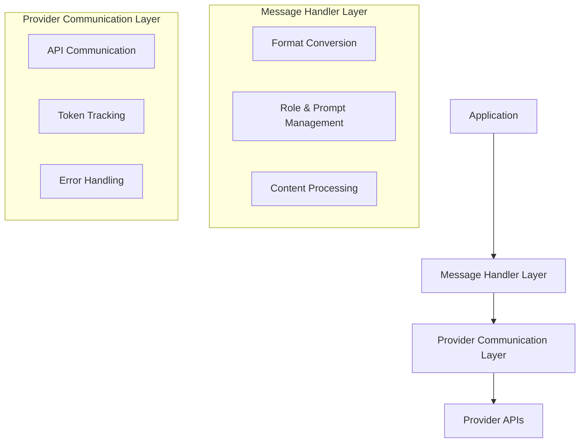

# Separation of Concerns in API Handler Architecture

**Date:** 2025-05-04

## Current Architecture

The current API handler architecture combines several responsibilities in each handler:

1. **Format Conversion**: Converting between application format and provider format
2. **API Communication**: Handling the actual API calls to the provider
3. **Token Counting**: Tracking token usage for billing and limits
4. **Error Handling**: Managing provider-specific errors
5. **Feature Management**: Handling provider-specific features

This leads to duplication, tight coupling, and maintenance challenges.

## Proposed Separation of Concerns

A cleaner architecture would separate these concerns into distinct layers:

### Key Separations

1. **Format Conversion vs. API Communication**
   - Format conversion is about transforming data structures
   - API communication is about HTTP requests, authentication, etc.

2. **Provider-Specific vs. Provider-Agnostic Logic**
   - Provider-specific logic should be isolated in dedicated modules
   - Provider-agnostic logic should be shared across handlers

3. **Message Content vs. Message Metadata**
   - Content (text, images, tools) should be handled separately from
   - Metadata (timestamps, usage metrics, etc.)

## Practical Implementation Steps

For the current task of updating local model handlers, we can take these steps:

1. **Create Transform Files**
   - Separate format conversion logic into dedicated files
   - Example: `neutral-ollama-format.ts`, `neutral-lmstudio-format.ts`

2. **Update Handlers to Use Transform Files**
   - Modify handlers to use the transform files for conversion
   - Keep API communication logic in the handlers for now

3. **Standardize Error Handling**
   - Implement consistent error handling across handlers
   - Map provider-specific errors to standard error types

## Benefits

This separation provides several benefits:

1. **Reduced Duplication**: Common logic is shared across handlers
2. **Improved Testability**: Each concern can be tested independently
3. **Easier Maintenance**: Changes to one concern don't affect others
4. **Better Extensibility**: New providers can reuse existing components

## Future Direction

This separation of concerns sets the foundation for the more comprehensive architecture described in the provider_handler_architecture.md document, which can be implemented incrementally as the codebase evolves.