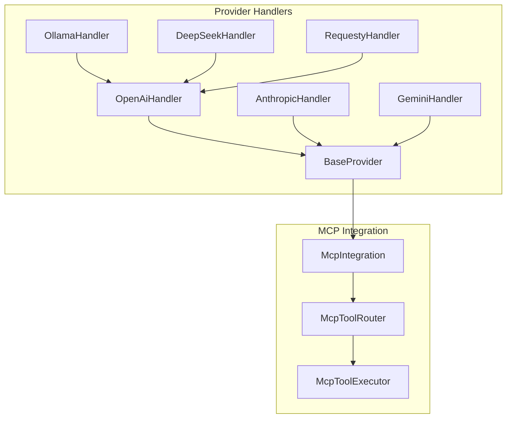
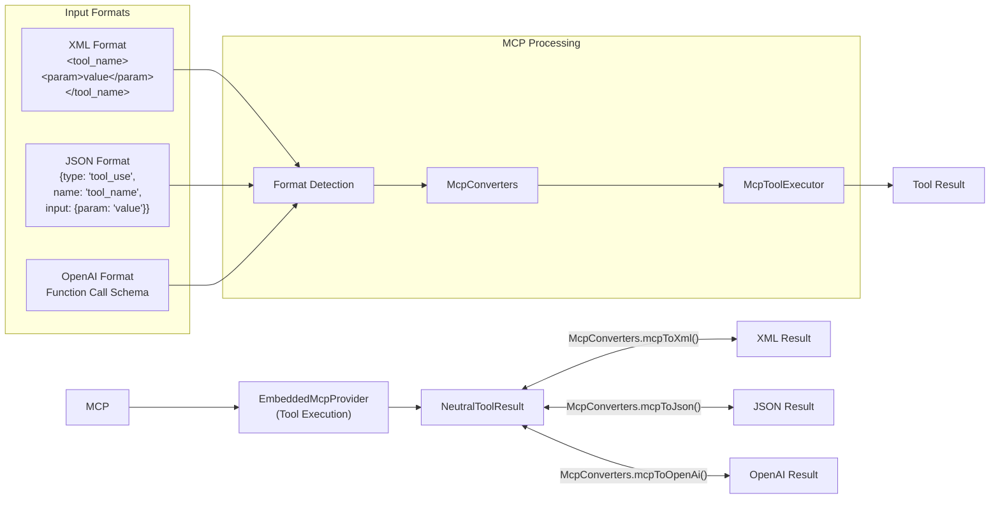
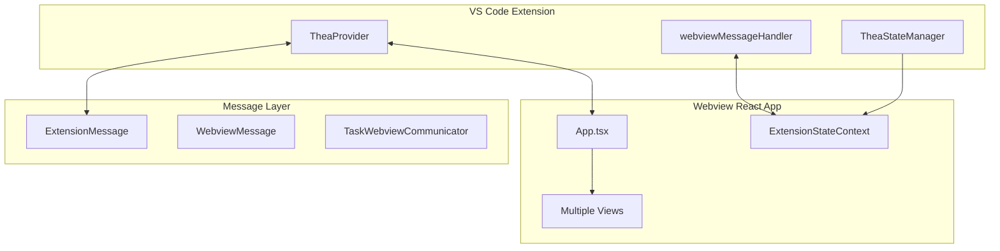

# Unified Architecture: Complete Thea-Code System Overview

**Date:** 2025-06-14

## Overview

This document provides a comprehensive overview of Thea-Code's unified architecture, covering the complete system from backend API handlers through frontend UI components to context management and settings storage. It represents the culmination of an architectural evolution from an Anthropic-centric design to a modern, provider-agnostic system with sophisticated state management, comprehensive context control, and robust data protection mechanisms.

**Key Architectural Achievements:**
- **Provider-Agnostic Backend**: Unified API handler system supporting any AI provider
- **Modern React Frontend**: Sophisticated UI with real-time state synchronization  
- **Intelligent Context Management**: Advanced token optimization and user control
- **Multi-Layer Settings Storage**: Secure, persistent configuration with rollback protection
- **Unified Tool System**: MCP-based tool execution across all formats and providers
- **Type-Safe Communication**: Strongly typed message protocols throughout the system

## Table of Contents

1. [API Handler Architecture Evolution](#1-api-handler-architecture-evolution)
2. [Final Unified Backend Architecture](#2-final-unified-backend-architecture)
3. [Frontend/UI Architecture](#3-frontendui-architecture)
4. [Context Management System](#4-context-management-system)
5. [Settings Storage and State Management](#5-settings-storage-and-state-management)
6. [MCP Integration Layer](#6-mcp-integration-layer)
7. [Communication and Message Flow](#7-communication-and-message-flow)
8. [Core System Services](#8-core-system-services)
9. [Integration Patterns](#9-integration-patterns)
10. [Benefits of the Unified Architecture](#10-benefits-of-the-unified-architecture)
11. [Future Directions](#11-future-directions)
12. [Conclusion](#12-conclusion)
13. [Related Documentation](#13-related-documentation)

## 1. API Handler Architecture Evolution

### 1.1 Initial Anthropic-Centric Design

The project initially used an Anthropic-centric design where:

- The `ApiHandler` interface in `src/api/index.ts` explicitly used Anthropic SDK types
- All non-Anthropic provider handlers had to conform to Anthropic's message structure
- Each provider handler implemented internal translation between Anthropic format and provider-specific formats

This design led to several challenges:

- Tight coupling to Anthropic's API structure
- Redundant conversion logic in each handler
- Inconsistent behavior across handlers
- Testing complexity

### 1.2 Neutral Format Transition

To address these challenges, the project transitioned to a neutral format approach:

- Created a provider-agnostic `NeutralConversationHistory` format
- Separated format conversion logic into dedicated transform files
- Updated handlers to use the neutral format
- Implemented bidirectional conversion between neutral format and provider-specific formats

This transition provided:

- Decoupling from Anthropic's specific message format
- Centralized conversion logic
- Consistent interface across handlers
- Better separation of concerns

### 1.3 JSON-XML Bridge

To support models that use JSON instead of XML for reasoning/thinking blocks and tool use:

- Implemented a JSON-XML bridge to convert between formats
- Created format detection mechanisms
- Supported streaming responses in both formats
- Added prompting options for both formats

### 1.4 MCP Integration - ✅ COMPLETED

The MCP (Model Context Protocol) integration has been successfully implemented:

- ✅ Created an embedded MCP server to host all tools
- ✅ Implemented converters from both XML and JSON formats to MCP protocol calls
- ✅ Developed a routing system for tool execution via `McpToolRouter`
- ✅ Provided a unified interface for tool use across all AI models
- ✅ Integrated MCP into `BaseProvider` for automatic tool support

## 2. Final Unified Backend Architecture

### 2.1 Implemented High-Level Architecture

```mermaid
flowchart TB
    subgraph "Application Layer"
        A[TheaTask] --> B[ApiHandler Interface]
    end

    subgraph "Provider Layer"
        B --> BP[BaseProvider]
        BP --> ANT[AnthropicHandler]
        BP --> OAI[OpenAiHandler]
        OAI --> OLL[OllamaHandler]
        OAI --> DS[DeepSeekHandler]
        BP --> GEM[GeminiHandler]
        BP --> OTH[Other Providers...]
    end

    subgraph "Format Layer"
        ANT --> NFA[Neutral→Anthropic]
        OAI --> NFO[Neutral→OpenAI]
        GEM --> NFG[Neutral→Gemini]
    end

    subgraph "MCP Integration"
        BP --> MI[McpIntegration]
        MI --> MTR[McpToolRouter]
        MTR --> MTE[McpToolExecutor]
        MTE --> TOOLS[Tool Implementations]
    end

    subgraph "External APIs"
        NFA --> AAPI[Anthropic API]
        NFO --> OAPI[OpenAI/Compatible APIs]
        NFG --> GAPI[Google Gemini API]
```

### 2.2 Protocol-Specific Adapter Pattern

A key architectural insight implemented during MCP integration is that **MCP should be invoked from protocol-specific handlers rather than from each individual provider**. This eliminates code duplication and ensures consistent behavior:



### 2.3 Key Components

#### 2.3.1 Provider Layer

- **BaseProvider**: Base class that all providers extend, providing MCP integration and common functionality
- **Protocol Handlers**: Core protocol implementations (AnthropicHandler, OpenAiHandler, GeminiHandler)
- **Provider Extensions**: Specific providers that extend protocol handlers (OllamaHandler extends OpenAiHandler)

#### 2.3.2 MCP Integration Layer

- **McpIntegration**: Singleton facade providing the main interface for MCP functionality
- **McpToolRouter**: Routes tool use requests and handles format detection (XML/JSON/OpenAI)
- **McpToolExecutor**: Core component that executes tools and manages the MCP server
- **McpToolRegistry**: Central registry for all available tools

#### 2.3.3 Format Conversion Layer

- **Neutral Format**: `NeutralConversationHistory` used as the common interface
- **Transform Files**: Dedicated conversion logic (neutral-anthropic-format.ts, neutral-openai-format.ts, etc.)
- **McpConverters**: Handle tool use format conversions between XML/JSON/OpenAI and MCP protocol

### 2.4 Tool Use Format Flow



## 3. Integration of Old and New Patterns

### 3.1 How MCP Builds on Neutral Format

The MCP integration builds on the neutral format approach by:

1. **Extending the Neutral Format**: The neutral format now serves as an intermediate representation for tool use across different models.

2. **Leveraging Transform Files**: The existing transform files are used by the MCP converters to convert between formats.

3. **Maintaining Separation of Concerns**: The MCP integration maintains the separation of concerns established in the neutral format approach.

4. **Enhancing Provider Agnosticism**: The MCP integration further decouples the application from specific provider formats.

### 3.2 How JSON-XML Bridge Fits into MCP Architecture

The JSON-XML bridge is now integrated into the MCP architecture:

1. **Format Detection**: The `FormatDetector` from the JSON-XML bridge is used by the `McpToolRouter` to determine the format of tool use requests.

2. **Matchers**: The `XmlMatcher` and `JsonMatcher` are used to extract tool use blocks from streaming responses.

3. **Conversion Functions**: The conversion functions from the JSON-XML bridge are incorporated into the `McpConverters`.

4. **Hybrid Matcher**: The `HybridMatcher` is extended to support tool use in both XML and JSON formats.

### 3.3 Provider Handler Integration

Provider handlers now integrate with the MCP system:

1. **Using McpIntegration**: Handlers use the `McpIntegration` facade to interact with the MCP system.

2. **Tool Registration**: Handlers register their tools with the `McpToolRegistry`.

3. **Format Conversion**: Handlers use the `McpConverters` to convert between formats.

4. **Tool Execution**: Handlers route tool execution through the `McpToolExecutor`.

## 4. Implementation Plan

### 4.1 Phase 1: Complete Provider Handler Updates

1. **Update Remaining Handlers**:

    - Update LmStudioHandler and DeepSeekHandler to use the neutral format
    - Ensure proper system role handling in all handlers
    - Add comprehensive tests for all handlers

2. **Standardize Error Handling**:
    - Implement consistent error handling across handlers
    - Map provider-specific errors to standard error types

### 4.2 Phase 2: MCP Integration

1. **Implement MCP Components**:

    - Create the `EmbeddedMcpProvider` and `McpToolRegistry`
    - Implement the `McpToolExecutor` and `McpConverters`
    - Create the `McpToolRouter` and `McpIntegration` facade

2. **Update Handlers to Use MCP**:
    - Modify handlers to use the `McpIntegration` facade
    - Register tools with the `McpToolRegistry`
    - Update tool use processing to use the MCP system

### 4.3 Phase 3: Testing and Optimization

1. **Comprehensive Testing**:

    - Create unit tests for all MCP components
    - Create integration tests for the entire stack
    - Test with different model outputs (XML, JSON, OpenAI format)

2. **Performance Optimization**:
    - Profile the implementation to identify bottlenecks
    - Optimize critical paths for better performance
    - Ensure efficient handling of streaming responses

### 4.4 Phase 4: Documentation and Training

1. **Update Documentation**:

    - Create comprehensive documentation for the MCP architecture
    - Document the integration of old and new patterns
    - Provide examples of how to use the MCP system

2. **Developer Training**:
    - Train developers on the new architecture
    - Provide examples of how to use the MCP system
    - Create tutorials for common tasks

## 3. Frontend/UI Architecture

### 3.1 React-Based Webview System

Thea-Code uses a sophisticated React-based webview UI that provides a multi-view interface for AI interaction, settings management, task history, and MCP server configuration.

#### Core UI Components

```typescript
// Main application structure
App.tsx                    // Root application component
├── ChatView              // Primary AI interaction interface
├── SettingsView          // Configuration management
├── HistoryView           // Task history and conversation management
├── McpView               // MCP server configuration
└── PromptsView           // Custom prompt management
```

#### Communication Architecture



### 3.2 State Management

The UI implements a context-based state management system:

- **ExtensionStateContext**: Central state management for all UI components
- **Real-time Synchronization**: Bidirectional state sync between extension and webview
- **Type-safe Communication**: Strongly typed message protocols for all interactions
- **Optimistic Updates**: UI updates immediately with rollback on failure

### 3.3 Component Architecture

- **Modern React Patterns**: Hooks, context, and functional components
- **TypeScript Integration**: Full type safety across all components
- **VSCode UI Components**: Integration with VSCode's native UI system
- **Responsive Design**: Adaptive layouts for different panel sizes

## 4. Context Management System

### 4.1 Context Management Architecture

Thea-Code implements a sophisticated context management system that optimizes AI model performance while respecting token limits and user preferences.

```
┌─────────────────────────────────────────────────────────────────┐
│                      Context Management Flow                     │
├─────────────────────────────────────────────────────────────────┤
│                                                                 │
│  User Settings    →    Context Gathering    →    Token Limits   │
│                                                                 │
│  ┌─────────────┐       ┌─────────────────┐     ┌─────────────┐  │
│  │ • Max Tabs  │  ──→  │ • Open Tabs     │ ──→ │ • Sliding   │  │
│  │ • Max Files │       │ • Workspace     │     │   Window    │  │
│  │ • Ignore    │       │ • File Reading  │     │ • Token     │  │
│  │   Settings  │       │ • Terminal      │     │   Counting  │  │
│  └─────────────┘       └─────────────────┘     └─────────────┘  │
│                                  │                              │
│                                  ▼                              │
│                        ┌─────────────────┐                     │
│                        │ TheaIgnore      │                     │
│                        │ Filtering       │                     │
│                        └─────────────────┘                     │
│                                  │                              │
│                                  ▼                              │
│                        ┌─────────────────┐                     │
│                        │ AI Request      │                     │
│                        │ Construction    │                     │
│                        └─────────────────┘                     │
└─────────────────────────────────────────────────────────────────┘
```

### 4.2 User-Facing Context Controls

- **Max Open Tabs Context**: 0-500 tabs (default: 20)
- **Max Workspace Files**: 0-500 files (default: 200)
- **Show TheaIgnored Files**: Toggle visibility with lock symbol indicators
- **File Read Auto-Truncate**: Configurable line limits with special modes

### 4.3 Token Management

- **Sliding Window Algorithm**: Automatic conversation truncation with 10% safety buffer
- **Provider-Specific Token Counting**: Anthropic native API, others use Tiktoken
- **Dynamic Context Window Visualization**: Real-time usage tracking
- **Intelligent Buffer Management**: Reserved space for model output

### 4.4 TheaIgnore System

- **Pattern Matching**: Supports standard .gitignore syntax
- **Real-time Monitoring**: File watcher for pattern updates
- **Visual Indicators**: Lock symbols (🔒) for ignored files when visible
- **Complete Access Control**: File system access protection for AI models

## 5. Settings Storage and State Management

### 5.1 Multi-Layered Storage Architecture

Thea-Code employs a sophisticated three-layer storage system:

1. **Global State**: VS Code's globalState storage
2. **Secret State**: VS Code's secure secrets storage  
3. **Provider Profiles**: JSON-serialized provider configurations

### 5.2 Core Storage Components

#### ContextProxy
- **Purpose**: Central abstraction layer for all settings storage
- **Caching Strategy**: In-memory caches for performance optimization
- **Schema Validation**: Zod schemas for type-safe storage operations
- **Export/Import**: Settings backup and restore capabilities

#### TheaStateManager
- **State Aggregation**: Combines settings from multiple sources
- **Default Values**: Sensible defaults for all configuration options
- **Type Safety**: Strongly typed state access throughout the system
- **Real-time Updates**: Immediate propagation of state changes

#### ProviderSettingsManager
- **Provider Profiles**: Isolated configuration per AI provider
- **Credential Management**: Secure API key storage and retrieval
- **Profile Switching**: Dynamic provider configuration changes
- **Validation**: Provider-specific configuration validation

### 5.3 Rollback and Protection System

#### ShadowCheckpointService
- **Git-Based Versioning**: Workspace file rollback protection
- **Automatic Checkpointing**: Snapshots before potentially destructive operations
- **Granular Rollback**: File-level and conversation-level restoration
- **State Consistency**: Synchronized file and conversation history restoration

#### Protection Mechanisms
- **Proactive Checkpointing**: Pre-task execution snapshots
- **Error Recovery**: One-click restoration to last known good state
- **User Control**: Manual checkpoint triggers and selective restoration
- **Data Integrity**: Comprehensive validation of all restore operations

### 6.1 MCP Architecture Overview

The Model Context Protocol integration provides a unified tool execution system across all AI providers:

```typescript
// MCP Component Structure
src/services/mcp/
├── core/                    # Core MCP functionality
│   ├── McpConverters.ts     # Format conversion utilities
│   ├── McpToolExecutor.ts   # Tool execution engine
│   ├── McpToolRegistry.ts   # Tool registration and management
│   └── McpToolRouter.ts     # Request routing and format detection
├── integration/             # Integration layer
│   ├── McpIntegration.ts    # Main facade/singleton
│   ├── ProviderIntegration.ts # Provider-specific integration
│   └── WebviewIntegration.ts  # Webview integration utilities
├── management/              # Server and hub management
│   └── McpHub.ts           # MCP server management
├── providers/               # MCP provider implementations
└── transport/               # Transport layer (SSE, Stdio)
```

### 6.2 Tool Use Format Support

- **XML Format**: `<tool_name>` tags for Claude-style interactions
- **JSON Format**: `{"type":"tool_use"}` structured data
- **OpenAI Function Calls**: Native function calling format
- **Automatic Detection**: Smart format detection and conversion
- **Unified Execution**: All formats route through single MCP executor

### 6.3 Provider Integration

All providers extend `BaseProvider` for automatic MCP integration:

```typescript
export class BaseProvider {
    protected mcpIntegration: McpIntegration
    
    async processToolUse(toolCalls: any[]): Promise<any[]> {
        return this.mcpIntegration.executeTools(toolCalls)
    }
}
```

## 7. Communication and Message Flow

### 7.1 Message Protocol Architecture

Thea-Code implements a sophisticated bidirectional communication system between the extension and webview:

```typescript
// Extension → Webview Messages
interface ExtensionMessage {
    type: string
    // 100+ message types for different operations
    [key: string]: any
}

// Webview → Extension Messages  
interface WebviewMessage {
    type: string
    // Corresponding response/command messages
    [key: string]: any
}
```

### 7.2 Communication Patterns

#### State Synchronization
- **Real-time Updates**: Settings changes propagate immediately
- **Optimistic Updates**: UI updates before confirmation
- **Rollback on Failure**: Automatic reversion on sync errors
- **Batch Operations**: Multiple state changes grouped for efficiency

#### Task Communication
- **TaskWebviewCommunicator**: Specialized communication for AI tasks
- **Streaming Support**: Real-time AI response streaming
- **Progress Tracking**: Task execution status and progress
- **Error Handling**: Comprehensive error propagation and recovery

#### Event-Driven Architecture
- **Event Emitters**: Loosely coupled component communication
- **Observer Pattern**: State change notifications
- **Message Queuing**: Reliable message delivery
- **Priority Handling**: Critical message prioritization

### 7.3 Message Types and Routing

Over 100 message types covering:
- **Settings Management**: Configuration changes and synchronization
- **Task Execution**: AI task lifecycle management
- **File Operations**: Workspace file manipulation
- **MCP Operations**: Tool execution and server management
- **UI Updates**: Interface state changes and notifications

## 8. Core System Services

### 8.1 Extension Activation and Command Registration

Thea-Code's activation system provides a structured approach to initializing and registering all extension capabilities:

```typescript
// Core activation structure
src/activate/
├── index.ts                    # Main activation entry point
├── handleTask.ts              # Task processing registration
├── handleUri.ts               # URI scheme handling
├── registerCommands.ts        # Command palette registration
├── registerCodeActions.ts     # Code action provider registration
└── registerTerminalActions.ts # Terminal integration setup
```

#### Key Activation Features
- **Command Registration**: Comprehensive command palette integration
- **Code Action Providers**: Context-aware code actions for AI assistance
- **URI Handling**: Deep linking and external integration support
- **Terminal Integration**: Seamless terminal output capture and analysis

### 8.2 Intelligent File Processing Services

#### Tree-Sitter Integration
- **Multi-Language Parsing**: Support for 20+ programming languages
- **Syntax-Aware Analysis**: Intelligent code structure understanding
- **Query System**: Custom syntax queries for context extraction
- **Performance Optimization**: Efficient parsing for large codebases

#### File Search and Discovery
- **Ripgrep Integration**: High-performance text search across codebases
- **Fuzzy Search**: FZF-based intelligent file matching
- **Workspace Indexing**: Real-time file system monitoring
- **Context-Aware Filtering**: TheaIgnore integration for search refinement

#### Diff Strategy System
- **Multiple Strategies**: Unified diff and multi-search-replace approaches
- **Model-Specific Optimization**: Strategy selection based on AI provider capabilities
- **Experimental Framework**: A/B testing for diff strategy effectiveness
- **Fuzzy Matching**: Intelligent code change detection and application

### 8.3 Mention System and Context Extraction

The mention system provides intelligent context gathering from various sources:

```typescript
// Mention types and handlers
@mentions: {
  "/path/to/file"     // File content inclusion
  "problems"          // VS Code diagnostics
  "terminal"          // Terminal output
  "http://url"        // Web content
  "git:working"       // Git status
  "git:commit"        // Commit information
}
```

#### Context Sources
- **File System**: Intelligent file content extraction with binary detection
- **Diagnostics**: VS Code problems panel integration
- **Terminal Output**: Latest command results and history
- **Web Content**: URL content fetching for external resources
- **Git Integration**: Working state, commit history, and diff information

### 8.4 Sliding Window Token Management

Advanced token management system for optimal context utilization:

```typescript
// Token management strategy
interface SlidingWindowConfig {
  bufferPercentage: number      // Default: 10% safety buffer
  truncationStrategy: string   // Conversation-aware truncation
  tokenCounting: string        // Provider-specific counting
  contextPriority: string[]    // Content prioritization
}
```

#### Features
- **Provider-Specific Counting**: Anthropic native API, Tiktoken for others
- **Intelligent Truncation**: Conversation-aware message removal
- **Content Prioritization**: System messages and recent context preservation
- **Buffer Management**: Automatic safety margin for model responses

### 8.5 Telemetry and Analytics

Privacy-respecting telemetry system for usage analytics and improvement:

```typescript
// Telemetry event categories
EVENTS = {
  TASK: {
    CREATED, RESTARTED, COMPLETED,
    CONVERSATION_MESSAGE, MODE_SWITCH,
    TOOL_USED, CHECKPOINT_CREATED
  },
  ERRORS: {
    SCHEMA_VALIDATION_ERROR
  }
}
```

#### Privacy Features
- **User Consent**: Respects VS Code global telemetry settings
- **Anonymization**: Machine ID-based tracking without personal data
- **Event Categorization**: Structured analytics for feature improvement
- **Error Tracking**: Schema validation and system error monitoring

### 8.6 Internationalization (i18n) System

Comprehensive localization support for global accessibility:

```typescript
// Supported locales
locales/
├── ca/      # Catalan
├── de/      # German  
├── es/      # Spanish
├── fr/      # French
├── hi/      # Hindi
├── it/      # Italian
├── ja/      # Japanese
├── ko/      # Korean
├── pl/      # Polish
├── pt-BR/   # Brazilian Portuguese
├── tr/      # Turkish
├── vi/      # Vietnamese
├── zh-CN/   # Simplified Chinese
└── zh-TW/   # Traditional Chinese
```

#### Features
- **Dynamic Loading**: Lazy-loaded locale resources
- **Fallback System**: Graceful degradation to English
- **VS Code Integration**: Follows user's VS Code language preference
- **Real-time Switching**: Language changes without restart

### 8.7 Integration Layer Services

#### Editor Integration
- **Selection Management**: Intelligent text selection and manipulation
- **Document Modification**: Safe document editing with validation
- **Multi-Document Operations**: Coordinated changes across files
- **Undo/Redo Integration**: Native VS Code history integration

#### Workspace Integration
- **File System Monitoring**: Real-time workspace change detection
- **Project Discovery**: Automatic project type and structure detection
- **Configuration Management**: Project-specific settings and overrides
- **Git Integration**: Version control state and operation support

#### Terminal Integration
- **Output Capture**: Automatic terminal output monitoring
- **Command History**: Intelligent command result correlation
- **Process Management**: Background task monitoring and control
- **Shell Detection**: Cross-platform shell compatibility

## 9. Integration Patterns

### 9.1 Cross-Component Integration

The unified architecture demonstrates several key integration patterns:

#### Layered Architecture
```
┌─────────────────────────────────────────┐
│             Presentation Layer           │ ← React UI Components
├─────────────────────────────────────────┤
│            Application Layer             │ ← TheaProvider, StateManager
├─────────────────────────────────────────┤
│             Service Layer                │ ← MCP, Context, Storage
├─────────────────────────────────────────┤
│            Infrastructure Layer          │ ← VS Code APIs, File System
└─────────────────────────────────────────┘
```

#### Event-Driven Integration
- **Loose Coupling**: Components communicate through events
- **Scalable**: Easy to add new components without breaking existing ones
- **Testable**: Components can be tested in isolation
- **Maintainable**: Clear separation of concerns

#### Facade Pattern
- **McpIntegration**: Single interface for all MCP operations
- **TheaStateManager**: Unified state management interface
- **ContextProxy**: Single interface for all storage operations

### 9.2 Data Flow Patterns

#### Context Management Flow
1. **User Settings** → Context limits and preferences
2. **Context Gathering** → Workspace files, open tabs, terminal output
3. **TheaIgnore Filtering** → Access control and visibility
4. **Token Management** → Sliding window and optimization
5. **AI Request Construction** → Final context assembly

#### Settings Storage Flow
1. **UI Input** → User configuration changes
2. **Validation** → Schema and constraint checking
3. **Storage** → Multi-layer persistence (global, secrets, profiles)
4. **Synchronization** → Real-time propagation to all components
5. **Checkpoint** → Automatic backup for rollback protection

#### Task Execution Flow
1. **User Request** → AI task initiation
2. **Context Assembly** → Environment and file context gathering
3. **Provider Selection** → AI model and configuration
4. **MCP Tool Registration** → Available tools for AI model
5. **Streaming Execution** → Real-time AI interaction
6. **Result Processing** → Output formatting and file operations
7. **State Update** → UI refresh and history recording

### 9.3 Error Handling and Recovery

#### Multi-Level Error Handling
- **Component Level**: Local error handling and recovery
- **Service Level**: Cross-component error coordination
- **Application Level**: Global error management and user notification
- **Persistence Level**: Data corruption prevention and recovery

#### Recovery Mechanisms
- **Automatic Retry**: Transient failure recovery
- **Graceful Degradation**: Partial functionality on component failure
- **State Rollback**: Checkpoint restoration for critical failures
- **User Notification**: Clear error communication and action options

## 10. Benefits of the Unified Architecture

### 10.1 Backend Architecture Benefits

1. **Unified Tool System**: Single MCP-based tool system eliminates format-specific implementations
2. **Provider Agnostic**: Neutral format approach supports any AI provider without architectural changes
3. **Format Flexibility**: Automatic handling of XML, JSON, and OpenAI function call formats
4. **Extensible Design**: Easy addition of new providers and tool types
5. **Reduced Duplication**: Shared logic across handlers minimizes code duplication
6. **Improved Testability**: Component isolation enables comprehensive testing strategies

### 10.2 Frontend Architecture Benefits

1. **Modern React Patterns**: Hooks, context, and functional components for maintainable UI
2. **Type Safety**: Full TypeScript integration prevents runtime errors
3. **Real-time Synchronization**: Immediate UI updates with reliable state consistency
4. **Component Reusability**: Modular design enables component sharing across views
5. **VSCode Integration**: Native look and feel with optimal performance

### 10.3 Context Management Benefits

1. **Intelligent Token Management**: Automatic optimization prevents context window overflow
2. **User Control**: Granular settings for context size and content filtering
3. **Performance Optimization**: Caching and debouncing for responsive experience
4. **Access Control**: TheaIgnore system provides security and privacy protection
5. **Visual Feedback**: Real-time context window visualization for user awareness

### 10.4 Settings and State Management Benefits

1. **Multi-Layer Security**: Separate storage for different sensitivity levels
2. **Rollback Protection**: Comprehensive checkpoint system prevents data loss
3. **Cross-Session Persistence**: Reliable state restoration across VS Code sessions
4. **Type-Safe Operations**: Schema validation prevents configuration corruption
5. **Export/Import Capabilities**: User control over settings backup and migration

### 10.5 Core Services Benefits

1. **Intelligent File Processing**: Tree-sitter integration for syntax-aware operations
2. **Advanced Search Capabilities**: Ripgrep and FZF integration for high-performance search
3. **Multi-Language Support**: Comprehensive i18n system for global accessibility
4. **Privacy-Respecting Telemetry**: Anonymized analytics with user consent
5. **Comprehensive Integration**: Seamless VS Code editor, workspace, and terminal integration

### 10.6 Communication Benefits

1. **Strongly Typed Messages**: 100+ message types with full type safety
2. **Bidirectional Sync**: Real-time state synchronization between components
3. **Error Recovery**: Automatic rollback and retry mechanisms
4. **Event-Driven Design**: Loose coupling enables independent component evolution
5. **Streaming Support**: Real-time AI response handling with progress tracking

### 10.7 Overall System Benefits

- **Flexibility**: Easily supports new AI models and providers
- **Maintainability**: Reduced code duplication and improved separation of concerns
- **Testability**: Components can be tested in isolation with clear contracts
- **Performance**: Optimized data handling and context management
- **User Control**: Fine-grained control over settings and context
- **Robustness**: Comprehensive error handling and recovery mechanisms
- **Extensibility**: Easy to add new features, formats, and providers
- **Scalability**: Modular architecture supports feature growth without architectural changes

## 11. Future Directions

### 11.1 Further Separation of Concerns

The architecture can be further improved by:

1. **Provider Composition Over Inheritance**: Use composition instead of inheritance for handlers.

2. **Unified Handler Factory**: Create a more sophisticated factory for handler instantiation.

3. **Shared Transformation Layer**: Implement a shared transformation layer for all handlers.

### 11.2 Provider Capability Registry

Maintain a registry of provider capabilities that handlers can query:

```typescript
const providerCapabilities = {
	anthropic: {
		supportsImages: true,
		supportsTools: true,
		maxTokens: 200000,
	},
	openai: {
		supportsImages: true,
		supportsTools: true,
		maxTokens: 128000,
	},
	ollama: {
		supportsImages: false,
		supportsTools: false,
		maxTokens: 32000,
	},
}
```

### 11.3 Extension Mechanism

Implement an extension mechanism for provider-specific features:

```typescript
interface NeutralMessage {
	role: "user" | "assistant" | "system" | "tool"
	content: string | NeutralMessageContent
	extensions?: {
		// Provider-specific extensions
		ollama?: {
			mirostat?: number
			mirostatEta?: number
			// Other Ollama-specific parameters
		}
		lmstudio?: {
			draftModel?: string
			speculativeDecoding?: boolean
			// Other LM Studio-specific parameters
		}
		// Other provider extensions
	}
}
```

### 11.4 Feature Negotiation

Implement a negotiation mechanism where the core application can query what features are supported:

```typescript
interface FeatureNegotiation {
	supportsFeature(feature: string): boolean
	getFeatureOptions(feature: string): any
}
```

### 11.5 Enhanced Service Integration

#### Advanced Tree-Sitter Integration
- **Custom Grammar Development**: Support for domain-specific languages
- **Real-time Syntax Analysis**: Live code analysis during editing
- **Intelligent Code Generation**: Syntax-aware AI code suggestions

#### Extended Search Capabilities
- **Semantic Search**: AI-powered code similarity search
- **Cross-Reference Analysis**: Intelligent symbol usage tracking
- **Contextual Search**: Search results ranked by relevance to current task

#### Enhanced i18n System
- **Dynamic Translation**: Real-time translation for user-generated content
- **Contextual Localization**: Task-specific terminology translation
- **Community Contributions**: Crowdsourced translation improvements

## 12. Conclusion

The unified architecture represents a comprehensive evolution of Thea-Code from its initial Anthropic-centric design to a sophisticated, multi-layered system that seamlessly integrates:

**Backend Excellence:**
- Provider-agnostic API handlers with neutral format conversion
- Unified MCP-based tool system supporting all major formats
- Robust error handling and recovery mechanisms

**Frontend Innovation:**
- Modern React-based UI with real-time state synchronization
- Type-safe communication protocols throughout the system
- Responsive, VSCode-integrated user experience

**Context Intelligence:**
- Sophisticated token management with sliding window optimization
- User-controlled context filtering with TheaIgnore system
- Real-time context window visualization and management

**Settings Security:**
- Multi-layer storage architecture with proper data segregation
- Comprehensive rollback protection through checkpoint system
- Cross-session persistence with type-safe validation

**Core Services Excellence:**
- Intelligent file processing with Tree-sitter integration
- High-performance search with Ripgrep and FZF
- Comprehensive internationalization for global accessibility
- Privacy-respecting telemetry with user consent
- Seamless VS Code integration across all surfaces

**Communication Robustness:**
- Over 100 strongly-typed message types for reliable communication
- Event-driven architecture enabling loose coupling
- Streaming support for real-time AI interactions

This architecture provides a solid foundation for future enhancements while maintaining flexibility, security, and performance. The modular design ensures that new features can be added without disrupting existing functionality, and the comprehensive documentation enables both users and developers to understand and extend the system effectively.

## 13. Related Documentation

This unified architecture document provides a comprehensive overview that integrates concepts from all specialized architectural documents. For detailed implementation information, refer to:

### Backend Architecture
- [Provider Handler Architecture](./provider_handler_architecture.md) - Detailed provider implementation patterns
- [API Handler Analysis](./api_handler_analysis.md) - In-depth analysis of handler designs
- [MCP Integration Guide](../tool_use/mcp/mcp_comprehensive_guide.md) - Complete MCP implementation guide
- [MCP Component Guide](../MCP_COMPONENT_GUIDE.md) - MCP component structure and usage
- [Migration Guide](../MIGRATION_GUIDE.md) - Anthropic SDK migration patterns

### Frontend/UI Architecture
- [Webview UI Architecture](../ui/webview_architecture.md) - React webview implementation details
- [Component Hierarchy](../ui/component_hierarchy.md) - UI component organization and relationships
- [State Management](../ui/state_management.md) - Frontend state management patterns
- [Communication Protocols](../ui/communication_protocols.md) - Extension-webview communication
- [React Event Types and Data Flows](../ui/react_event_types_and_data_flows.md) - Comprehensive event system documentation
- [Message Types Reference](../ui/message_types_reference.md) - Complete message type documentation
- [Modern UI Components](../ui/modern_ui_components.md) - Modern React component patterns
- [Legacy Component Integration](../ui/legacy_component_integration.md) - Migration strategies
- [Advanced Patterns and Performance](../ui/advanced_patterns_performance.md) - Optimization techniques

### Context and Settings Management
- [Context Management Comprehensive Guide](../context_management_comprehensive.md) - Complete context management system
- [Settings Storage and Rollback](../settings_storage_and_rollback.md) - Settings persistence and protection

### Specialized Integration Guides
- [Tool Use Separation of Concerns](../tool_use/separation_of_concerns.md) - Tool system architecture
- [OpenAI Function Format Integration](../tool_use/mcp/openai_function_format_integration.md) - Function calling integration
- [SSE Transport Implementation](../tool_use/mcp/sse_transport_implementation_plan.md) - Transport layer details
- [Ollama-OpenAI Integration Plan](../tool_use/ollama_openai_integration_plan.md) - Provider integration patterns
- [Ollama-OpenAI-MCP Integration](../tool_use/mcp/ollama_openai_mcp_integration.md) - Detailed integration architecture
- [MCP Integration Architecture Diagram](../tool_use/mcp/mcp_integration_architecture_diagram.md) - Visual architecture overview
- [Provider MCP Integration](../tool_use/mcp/provider_mcp_integration.md) - Provider-specific MCP integration patterns

### Development and Configuration Guides
- [UI Documentation Index](../ui/README.md) - Complete UI architecture documentation index
- [VSCode Settings API Guide](../vscode_apis/settings.md) - VSCode-specific API integration patterns
- [MCP Documentation Index](../tool_use/mcp/README.md) - Complete MCP documentation index

### Migration and Status Documentation
- [Anthropic SDK Migration](../../ANTHROPIC_SDK_MIGRATION.md) - SDK migration strategies and patterns
- [Documentation Refresh Summary](../../DOCUMENTATION_REFRESH_SUMMARY.md) - Recent documentation updates
- [ESLint Disable Checklist](../../eslint-disable-checklist.md) - Code quality improvement tracking
- [Async vs Sync Operations Analysis](../async_sync_operations_analysis.md) - Performance optimization and async migration strategy

### Research and Comparative Analysis
While not directly part of the system architecture, these documents provide valuable context for understanding AI model architectures:
- [Transformer Architecture](../../../transformer_architecture.md) - Detailed transformer model visualization
- [xLSTM vs Transformers Comparison](../../../xlstm_vs_transformers_comparison.md) - Comparative analysis of AI architectures

---

*This unified architecture serves as the central reference for understanding how all components of Thea-Code work together to provide a cohesive AI-powered development experience.*
