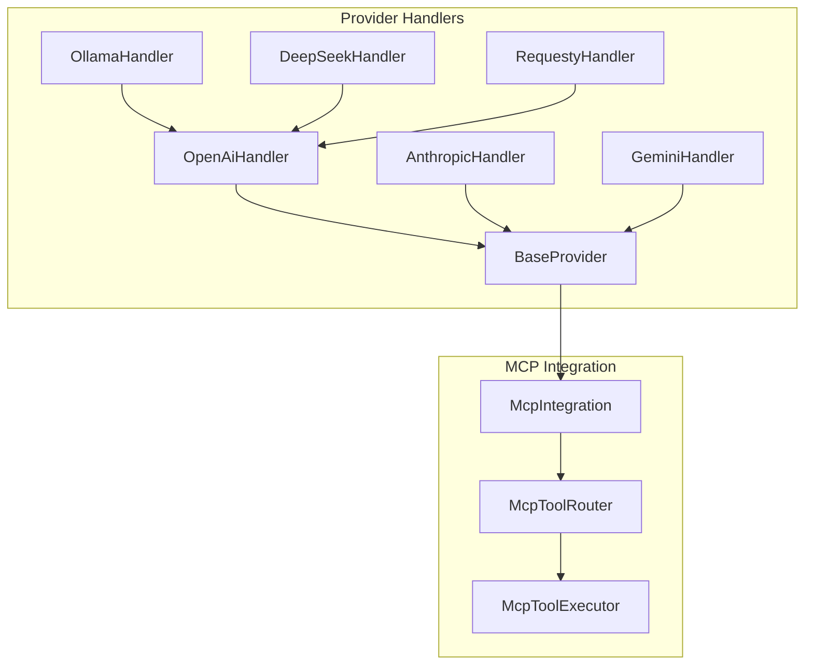
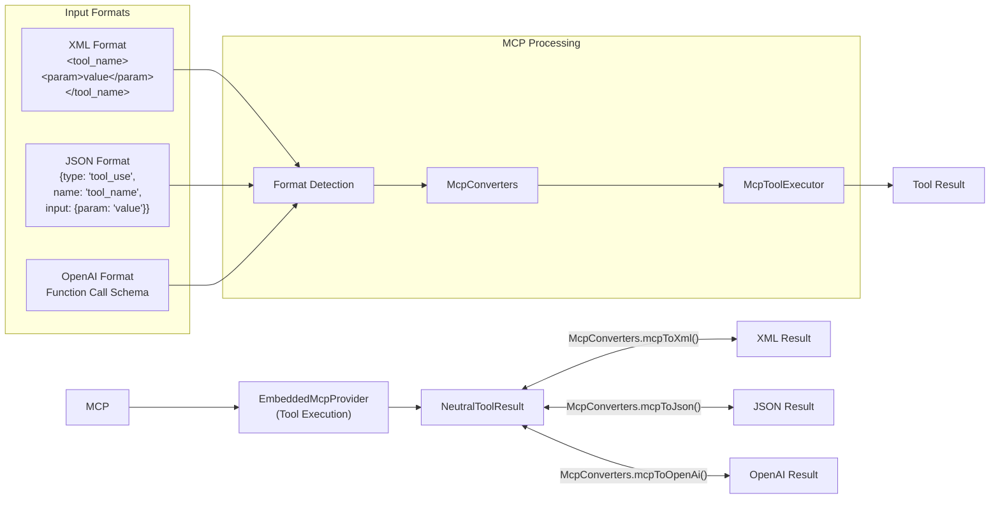

# Unified Architecture: From Anthropic-Centric to MCP Integration

**Date:** 2025-05-04

## 1. Architectural Evolution

### 1.1 Initial Anthropic-Centric Design

The project initially used an Anthropic-centric design where:

- The `ApiHandler` interface in `src/api/index.ts` explicitly used Anthropic SDK types
- All non-Anthropic provider handlers had to conform to Anthropic's message structure
- Each provider handler implemented internal translation between Anthropic format and provider-specific formats

This design led to several challenges:

- Tight coupling to Anthropic's API structure
- Redundant conversion logic in each handler
- Inconsistent behavior across handlers
- Testing complexity

### 1.2 Neutral Format Transition

To address these challenges, the project transitioned to a neutral format approach:

- Created a provider-agnostic `NeutralConversationHistory` format
- Separated format conversion logic into dedicated transform files
- Updated handlers to use the neutral format
- Implemented bidirectional conversion between neutral format and provider-specific formats

This transition provided:

- Decoupling from Anthropic's specific message format
- Centralized conversion logic
- Consistent interface across handlers
- Better separation of concerns

### 1.3 JSON-XML Bridge

To support models that use JSON instead of XML for reasoning/thinking blocks and tool use:

- Implemented a JSON-XML bridge to convert between formats
- Created format detection mechanisms
- Supported streaming responses in both formats
- Added prompting options for both formats

### 1.4 MCP Integration - ✅ COMPLETED

The MCP (Model Context Protocol) integration has been successfully implemented:

- ✅ Created an embedded MCP server to host all tools
- ✅ Implemented converters from both XML and JSON formats to MCP protocol calls
- ✅ Developed a routing system for tool execution via `McpToolRouter`
- ✅ Provided a unified interface for tool use across all AI models
- ✅ Integrated MCP into `BaseProvider` for automatic tool support

## 2. Final Unified Architecture

### 2.1 Implemented High-Level Architecture

```mermaid
flowchart TB
    subgraph "Application Layer"
        A[TheaTask] --> B[ApiHandler Interface]
    end

    subgraph "Provider Layer"
        B --> BP[BaseProvider]
        BP --> ANT[AnthropicHandler]
        BP --> OAI[OpenAiHandler]
        OAI --> OLL[OllamaHandler]
        OAI --> DS[DeepSeekHandler]
        BP --> GEM[GeminiHandler]
        BP --> OTH[Other Providers...]
    end

    subgraph "Format Layer"
        ANT --> NFA[Neutral→Anthropic]
        OAI --> NFO[Neutral→OpenAI]
        GEM --> NFG[Neutral→Gemini]
    end

    subgraph "MCP Integration"
        BP --> MI[McpIntegration]
        MI --> MTR[McpToolRouter]
        MTR --> MTE[McpToolExecutor]
        MTE --> TOOLS[Tool Implementations]
    end

    subgraph "External APIs"
        NFA --> AAPI[Anthropic API]
        NFO --> OAPI[OpenAI/Compatible APIs]
        NFG --> GAPI[Google Gemini API]
```

### 2.2 Protocol-Specific Adapter Pattern

A key architectural insight implemented during MCP integration is that **MCP should be invoked from protocol-specific handlers rather than from each individual provider**. This eliminates code duplication and ensures consistent behavior:



### 2.3 Key Components

#### 2.3.1 Provider Layer

- **BaseProvider**: Base class that all providers extend, providing MCP integration and common functionality
- **Protocol Handlers**: Core protocol implementations (AnthropicHandler, OpenAiHandler, GeminiHandler)
- **Provider Extensions**: Specific providers that extend protocol handlers (OllamaHandler extends OpenAiHandler)

#### 2.3.2 MCP Integration Layer

- **McpIntegration**: Singleton facade providing the main interface for MCP functionality
- **McpToolRouter**: Routes tool use requests and handles format detection (XML/JSON/OpenAI)
- **McpToolExecutor**: Core component that executes tools and manages the MCP server
- **McpToolRegistry**: Central registry for all available tools

#### 2.3.3 Format Conversion Layer

- **Neutral Format**: `NeutralConversationHistory` used as the common interface
- **Transform Files**: Dedicated conversion logic (neutral-anthropic-format.ts, neutral-openai-format.ts, etc.)
- **McpConverters**: Handle tool use format conversions between XML/JSON/OpenAI and MCP protocol

### 2.4 Tool Use Format Flow



## 3. Integration of Old and New Patterns

### 3.1 How MCP Builds on Neutral Format

The MCP integration builds on the neutral format approach by:

1. **Extending the Neutral Format**: The neutral format now serves as an intermediate representation for tool use across different models.

2. **Leveraging Transform Files**: The existing transform files are used by the MCP converters to convert between formats.

3. **Maintaining Separation of Concerns**: The MCP integration maintains the separation of concerns established in the neutral format approach.

4. **Enhancing Provider Agnosticism**: The MCP integration further decouples the application from specific provider formats.

### 3.2 How JSON-XML Bridge Fits into MCP Architecture

The JSON-XML bridge is now integrated into the MCP architecture:

1. **Format Detection**: The `FormatDetector` from the JSON-XML bridge is used by the `McpToolRouter` to determine the format of tool use requests.

2. **Matchers**: The `XmlMatcher` and `JsonMatcher` are used to extract tool use blocks from streaming responses.

3. **Conversion Functions**: The conversion functions from the JSON-XML bridge are incorporated into the `McpConverters`.

4. **Hybrid Matcher**: The `HybridMatcher` is extended to support tool use in both XML and JSON formats.

### 3.3 Provider Handler Integration

Provider handlers now integrate with the MCP system:

1. **Using McpIntegration**: Handlers use the `McpIntegration` facade to interact with the MCP system.

2. **Tool Registration**: Handlers register their tools with the `McpToolRegistry`.

3. **Format Conversion**: Handlers use the `McpConverters` to convert between formats.

4. **Tool Execution**: Handlers route tool execution through the `McpToolExecutor`.

## 4. Implementation Plan

### 4.1 Phase 1: Complete Provider Handler Updates

1. **Update Remaining Handlers**:

    - Update LmStudioHandler and DeepSeekHandler to use the neutral format
    - Ensure proper system role handling in all handlers
    - Add comprehensive tests for all handlers

2. **Standardize Error Handling**:
    - Implement consistent error handling across handlers
    - Map provider-specific errors to standard error types

### 4.2 Phase 2: MCP Integration

1. **Implement MCP Components**:

    - Create the `EmbeddedMcpProvider` and `McpToolRegistry`
    - Implement the `McpToolExecutor` and `McpConverters`
    - Create the `McpToolRouter` and `McpIntegration` facade

2. **Update Handlers to Use MCP**:
    - Modify handlers to use the `McpIntegration` facade
    - Register tools with the `McpToolRegistry`
    - Update tool use processing to use the MCP system

### 4.3 Phase 3: Testing and Optimization

1. **Comprehensive Testing**:

    - Create unit tests for all MCP components
    - Create integration tests for the entire stack
    - Test with different model outputs (XML, JSON, OpenAI format)

2. **Performance Optimization**:
    - Profile the implementation to identify bottlenecks
    - Optimize critical paths for better performance
    - Ensure efficient handling of streaming responses

### 4.4 Phase 4: Documentation and Training

1. **Update Documentation**:

    - Create comprehensive documentation for the MCP architecture
    - Document the integration of old and new patterns
    - Provide examples of how to use the MCP system

2. **Developer Training**:
    - Train developers on the new architecture
    - Provide examples of how to use the MCP system
    - Create tutorials for common tasks

## 5. Benefits of the Unified Architecture

1. **Unified Tool System**: Instead of having separate XML and JSON formats with a bridge between them, we now have a single unified tool system based on the MCP protocol.

2. **Cleaner Architecture**: The new architecture provides a cleaner separation of concerns, with each component having a well-defined responsibility.

3. **Single Source of Truth**: The MCP server serves as the single source of truth for tool definitions and execution, eliminating the need for duplicate tool definitions.

4. **Format Agnostic**: The system is now format agnostic, able to handle tool use requests in XML, JSON, or OpenAI formats without requiring changes to the underlying tool execution logic.

5. **Extensible**: The architecture is designed to be extensible, making it easy to add support for new formats or tool types in the future.

6. **Improved Testability**: Each component can be tested in isolation, making it easier to ensure the system works correctly.

7. **Reduced Duplication**: Common logic is shared across handlers, reducing duplication and making the codebase more maintainable.

## 6. Future Directions

### 6.1 Further Separation of Concerns

The architecture can be further improved by:

1. **Provider Composition Over Inheritance**: Use composition instead of inheritance for handlers.

2. **Unified Handler Factory**: Create a more sophisticated factory for handler instantiation.

3. **Shared Transformation Layer**: Implement a shared transformation layer for all handlers.

### 6.2 Provider Capability Registry

Maintain a registry of provider capabilities that handlers can query:

```typescript
const providerCapabilities = {
	anthropic: {
		supportsImages: true,
		supportsTools: true,
		maxTokens: 200000,
	},
	openai: {
		supportsImages: true,
		supportsTools: true,
		maxTokens: 128000,
	},
	ollama: {
		supportsImages: false,
		supportsTools: false,
		maxTokens: 32000,
	},
}
```

### 6.3 Extension Mechanism

Implement an extension mechanism for provider-specific features:

```typescript
interface NeutralMessage {
	role: "user" | "assistant" | "system" | "tool"
	content: string | NeutralMessageContent
	extensions?: {
		// Provider-specific extensions
		ollama?: {
			mirostat?: number
			mirostatEta?: number
			// Other Ollama-specific parameters
		}
		lmstudio?: {
			draftModel?: string
			speculativeDecoding?: boolean
			// Other LM Studio-specific parameters
		}
		// Other provider extensions
	}
}
```

### 6.4 Feature Negotiation

Implement a negotiation mechanism where the core application can query what features are supported:

```typescript
interface FeatureNegotiation {
	supportsFeature(feature: string): boolean
	getFeatureOptions(feature: string): any
}
```

## 7. Conclusion

The unified architecture represents a significant evolution from the initial Anthropic-centric design to a more flexible, provider-agnostic approach with a unified tool system based on the MCP protocol. This architecture provides a solid foundation for future enhancements and makes it easier to support a wide range of AI models.

By integrating the neutral format approach, the JSON-XML bridge, and the MCP integration, we've created a cohesive architecture that addresses the challenges of the initial design while providing a clear path forward for future improvements.
