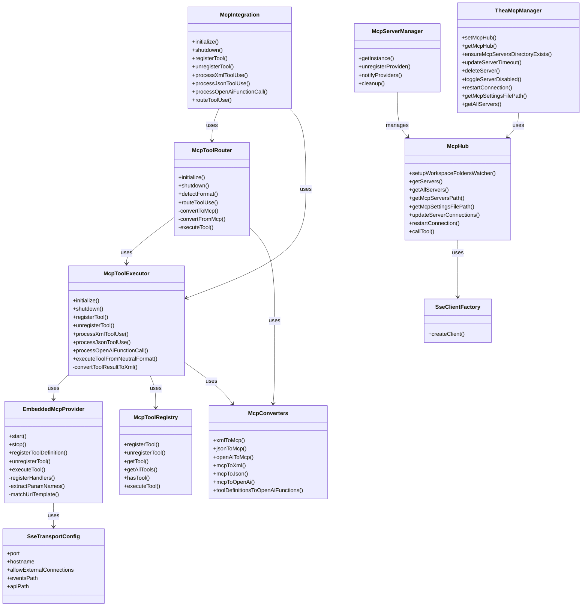
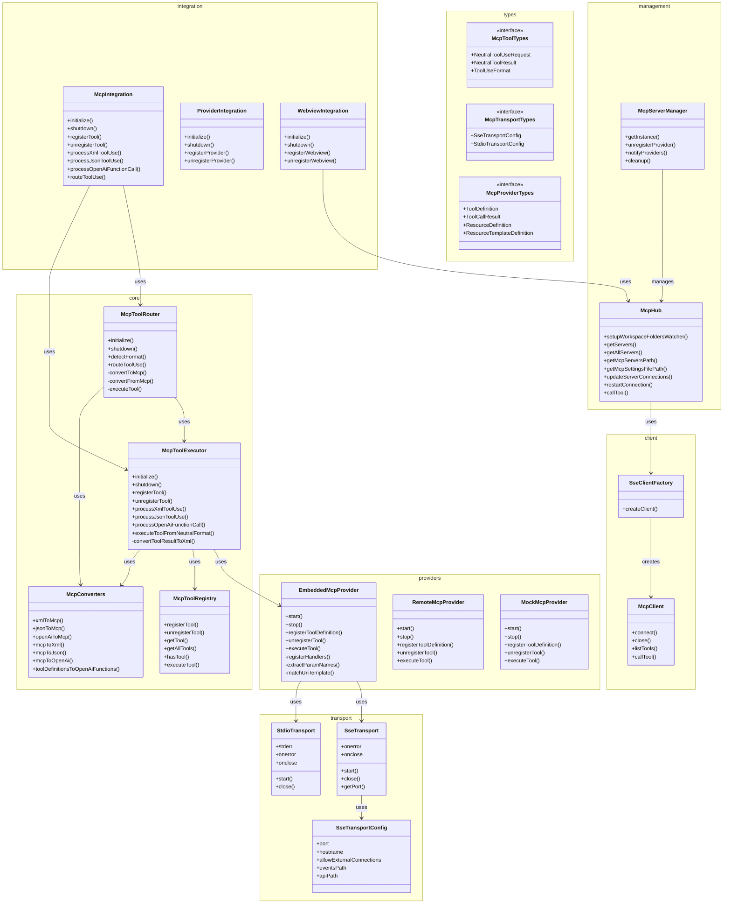
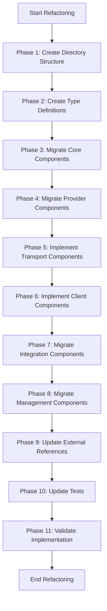
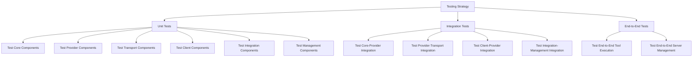
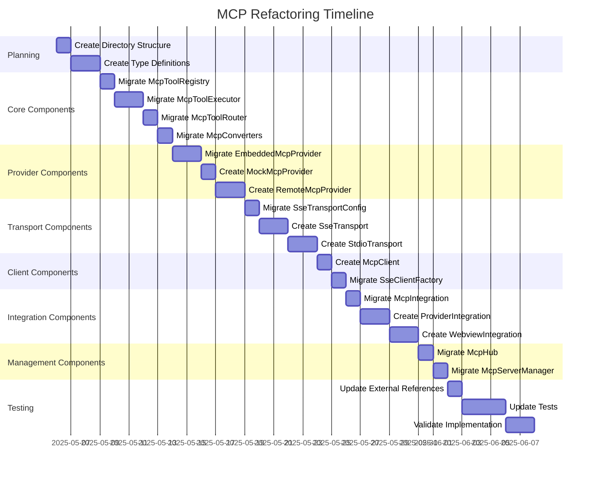

# MCP Architecture Refactoring Plan

This document outlines a comprehensive plan for refactoring the Model Context Protocol (MCP) implementation to improve modularity, maintainability, and scalability.

## Table of Contents

1. [Current Architecture](#current-architecture)
2. [Proposed Architecture](#proposed-architecture)
3. [Component Migration Plan](#component-migration-plan)
4. [Implementation Strategy](#implementation-strategy)
5. [Testing Strategy](#testing-strategy)
6. [Timeline](#timeline)
7. [Risk Assessment](#risk-assessment)

## Current Architecture

The current MCP implementation has a relatively flat structure with most components in the same directory. This makes it difficult to understand the relationships between components and their responsibilities.



### Current Directory Structure

```
src/services/mcp/
├── __tests__/                 # Test files
├── client/                    # Client implementations
│   └── SseClientFactory.ts    # Factory for SSE clients
├── config/                    # Configuration
│   └── SseTransportConfig.ts  # SSE transport configuration
├── EmbeddedMcpProvider.ts       # MCP server implementation
├── McpConverters.ts           # Format conversion utilities
├── McpHub.ts                  # Central hub for MCP instances
├── McpIntegration.ts          # Facade for the MCP system
├── McpServerManager.ts        # Server lifecycle management
├── McpToolRegistry.ts         # Tool registry
├── McpToolRouter.ts           # Request routing
└── McpToolExecutor.ts    # Tool system management
```

## Proposed Architecture

The proposed architecture organizes components into logical groups based on their responsibilities, making the system more modular and easier to understand.



### Proposed Directory Structure

```
src/services/mcp/
├── core/                           # Core MCP functionality
│   ├── McpToolRegistry.ts          # Tool registration and management
│   ├── McpToolExecutor.ts          # (renamed from McpToolExecutor)
│   ├── McpToolRouter.ts            # Format detection and routing
│   └── McpConverters.ts            # Format conversion utilities
│
├── providers/                      # MCP server implementations
│   ├── EmbeddedMcpProvider.ts      # (renamed from EmbeddedMcpProvider)
│   ├── RemoteMcpProvider.ts        # For connecting to external MCP servers
│   └── MockMcpProvider.ts          # For testing
│
├── transport/                      # Communication layer
│   ├── config/
│   │   └── SseTransportConfig.ts   # SSE configuration
│   ├── SseTransport.ts             # SSE implementation
│   └── StdioTransport.ts           # Legacy transport (if needed)
│
├── client/                         # Client implementations
│   ├── McpClient.ts                # Base client class
│   └── SseClientFactory.ts         # Factory for SSE clients
│
├── integration/                    # Integration with other systems
│   ├── McpIntegration.ts           # Main integration facade
│   ├── ProviderIntegration.ts      # Integration with providers
│   └── WebviewIntegration.ts       # Integration with webview
│
├── management/                     # Management components
│   ├── McpHub.ts                   # Central hub for MCP instances
│   └── McpServerManager.ts         # Server lifecycle management
│
└── types/                          # Type definitions
    ├── McpToolTypes.ts             # Tool-related types
    ├── McpTransportTypes.ts        # Transport-related types
    └── McpProviderTypes.ts         # Provider-related types
```

## Component Migration Plan

### Core Components

#### 1. McpToolRegistry.ts

- **Source**: `src/services/mcp/McpToolRegistry.ts`
- **Destination**: `src/services/mcp/core/McpToolRegistry.ts`
- **Changes**:
    - Update imports to reflect new file structure
    - Import types from new types directory
    - No functional changes needed

#### 2. McpToolExecutor.ts (renamed from McpToolExecutor.ts)

- **Source**: `src/services/mcp/McpToolExecutor.ts`
- **Destination**: `src/services/mcp/core/McpToolExecutor.ts`
- **Changes**:
    - Rename class from `McpToolExecutor` to `McpToolExecutor`
    - Update imports to reflect new file structure
    - Update references to `EmbeddedMcpProvider` to use `EmbeddedMcpProvider`
    - Move type definitions to `types/McpToolTypes.ts`
    - Update all references to this class in other files

#### 3. McpToolRouter.ts

- **Source**: `src/services/mcp/McpToolRouter.ts`
- **Destination**: `src/services/mcp/core/McpToolRouter.ts`
- **Changes**:
    - Update imports to reflect new file structure
    - Update references to `McpToolExecutor` to use `McpToolExecutor`
    - Move type definitions to `types/McpToolTypes.ts`

#### 4. McpConverters.ts

- **Source**: `src/services/mcp/McpConverters.ts`
- **Destination**: `src/services/mcp/core/McpConverters.ts`
- **Changes**:
    - Update imports to reflect new file structure
    - Import types from new types directory
    - No functional changes needed

### Provider Components

#### 5. EmbeddedMcpProvider.ts (renamed from EmbeddedMcpProvider.ts)

- **Source**: `src/services/mcp/EmbeddedMcpProvider.ts`
- **Destination**: `src/services/mcp/providers/EmbeddedMcpProvider.ts`
- **Changes**:
    - Rename class from `EmbeddedMcpProvider` to `EmbeddedMcpProvider`
    - Update imports to reflect new file structure
    - Move type definitions to `types/McpProviderTypes.ts`
    - Extract transport-specific code to `transport/SseTransport.ts` and `transport/StdioTransport.ts`
    - Update all references to this class in other files

#### 6. MockMcpProvider.ts

- **Source**: New file
- **Destination**: `src/services/mcp/providers/MockMcpProvider.ts`
- **Implementation**:
    - Extract mock implementations from `EmbeddedMcpProvider.ts`
    - Create a proper mock provider for testing
    - Implement the same interface as `EmbeddedMcpProvider`

#### 7. RemoteMcpProvider.ts

- **Source**: New file
- **Destination**: `src/services/mcp/providers/RemoteMcpProvider.ts`
- **Implementation**:
    - Create a provider for connecting to external MCP servers
    - Implement the same interface as `EmbeddedMcpProvider`
    - Use `SseClientFactory` to create clients

### Transport Components

#### 8. SseTransportConfig.ts

- **Source**: `src/services/mcp/config/SseTransportConfig.ts`
- **Destination**: `src/services/mcp/transport/config/SseTransportConfig.ts`
- **Changes**:
    - No functional changes needed

#### 9. SseTransport.ts

- **Source**: New file
- **Destination**: `src/services/mcp/transport/SseTransport.ts`
- **Implementation**:
    - Extract SSE transport logic from `EmbeddedMcpProvider.ts`
    - Create a proper transport class
    - Use `SseTransportConfig` for configuration

#### 10. StdioTransport.ts

- **Source**: New file
- **Destination**: `src/services/mcp/transport/StdioTransport.ts`
- **Implementation**:
    - Extract StdIO transport logic from `EmbeddedMcpProvider.ts`
    - Create a proper transport class

### Client Components

#### 11. McpClient.ts

- **Source**: New file
- **Destination**: `src/services/mcp/client/McpClient.ts`
- **Implementation**:
    - Create a base client class for MCP
    - Extract client logic from `SseClientFactory.ts`
    - Define a common interface for all clients

#### 12. SseClientFactory.ts

- **Source**: `src/services/mcp/client/SseClientFactory.ts`
- **Destination**: `src/services/mcp/client/SseClientFactory.ts`
- **Changes**:
    - Update imports to reflect new file structure
    - Refactor to use `McpClient` as base class

### Integration Components

#### 13. McpIntegration.ts

- **Source**: `src/services/mcp/McpIntegration.ts`
- **Destination**: `src/services/mcp/integration/McpIntegration.ts`
- **Changes**:
    - Update imports to reflect new file structure
    - Update references to `McpToolExecutor` to use `McpToolExecutor`
    - Update references to `EmbeddedMcpProvider` to use `EmbeddedMcpProvider`

#### 14. ProviderIntegration.ts

- **Source**: New file
- **Destination**: `src/services/mcp/integration/ProviderIntegration.ts`
- **Implementation**:
    - Create integration layer for providers
    - Extract provider-specific logic from `McpIntegration.ts`
    - Define interfaces for provider integration

#### 15. WebviewIntegration.ts

- **Source**: New file
- **Destination**: `src/services/mcp/integration/WebviewIntegration.ts`
- **Implementation**:
    - Create integration layer for webview
    - Extract webview-specific logic from `TheaMcpManager.ts`
    - Define interfaces for webview integration

### Management Components

#### 16. McpHub.ts

- **Source**: `src/services/mcp/McpHub.ts`
- **Destination**: `src/services/mcp/management/McpHub.ts`
- **Changes**:
    - Update imports to reflect new file structure
    - No functional changes needed

#### 17. McpServerManager.ts

- **Source**: `src/services/mcp/McpServerManager.ts`
- **Destination**: `src/services/mcp/management/McpServerManager.ts`
- **Changes**:
    - Update imports to reflect new file structure
    - No functional changes needed

### Type Definitions

#### 18. McpToolTypes.ts

- **Source**: New file
- **Destination**: `src/services/mcp/types/McpToolTypes.ts`
- **Implementation**:
    - Extract tool-related types from `McpToolExecutor.ts` and `McpToolRouter.ts`
    - Define interfaces for tool-related operations

#### 19. McpTransportTypes.ts

- **Source**: New file
- **Destination**: `src/services/mcp/types/McpTransportTypes.ts`
- **Implementation**:
    - Extract transport-related types from `SseTransportConfig.ts`
    - Define interfaces for transport-related operations

#### 20. McpProviderTypes.ts

- **Source**: New file
- **Destination**: `src/services/mcp/types/McpProviderTypes.ts`
- **Implementation**:
    - Extract provider-related types from `EmbeddedMcpProvider.ts`
    - Define interfaces for provider-related operations

## Implementation Strategy

The implementation will follow a phased approach to minimize disruption to the existing codebase.



### Phase 1: Create Directory Structure

1. Create the new directory structure
2. Set up placeholder files to ensure the structure is correct

### Phase 2: Create Type Definitions

1. Create `McpToolTypes.ts`
2. Create `McpTransportTypes.ts`
3. Create `McpProviderTypes.ts`

### Phase 3: Migrate Core Components

1. Migrate `McpToolRegistry.ts` to the core directory
2. Rename and migrate `McpToolExecutor.ts` to `McpToolExecutor.ts`
3. Migrate `McpToolRouter.ts` to the core directory
4. Migrate `McpConverters.ts` to the core directory

### Phase 4: Migrate Provider Components

1. Rename and migrate `EmbeddedMcpProvider.ts` to `EmbeddedMcpProvider.ts`
2. Create `MockMcpProvider.ts`
3. Create `RemoteMcpProvider.ts`

### Phase 5: Implement Transport Components

1. Migrate `SseTransportConfig.ts` to the transport directory
2. Create `SseTransport.ts`
3. Create `StdioTransport.ts`

### Phase 6: Implement Client Components

1. Create `McpClient.ts`
2. Migrate `SseClientFactory.ts` to the client directory

### Phase 7: Migrate Integration Components

1. Migrate `McpIntegration.ts` to the integration directory
2. Create `ProviderIntegration.ts`
3. Create `WebviewIntegration.ts`

### Phase 8: Migrate Management Components

1. Migrate `McpHub.ts` to the management directory
2. Migrate `McpServerManager.ts` to the management directory

### Phase 9: Update External References

1. Update imports in `src/api/providers/`
2. Update imports in `src/core/webview/mcp/TheaMcpManager.ts`

### Phase 10: Update Tests

1. Update test imports to reflect the new file structure
2. Update test mocks to use the new class names
3. Add new tests for new components

### Phase 11: Validate Implementation

1. Run all tests to ensure the refactored implementation works correctly
2. Manually test the implementation to ensure it works as expected

## Testing Strategy

The testing strategy will focus on ensuring that the refactored implementation maintains the same behavior as the original implementation.



### Unit Tests

1. Test each component in isolation
2. Ensure each component behaves as expected
3. Use mocks for dependencies

### Integration Tests

1. Test interactions between components
2. Ensure components work together correctly
3. Use real dependencies where possible

### End-to-End Tests

1. Test the entire system
2. Ensure the system behaves as expected
3. Use real dependencies

## Timeline

The refactoring will be implemented over a period of 4 weeks.



## Risk Assessment


### High Priority Risks

1. **Breaking Changes**: The refactoring could introduce breaking changes to the API.

    - **Mitigation**: Maintain the same public API and ensure backward compatibility.
    - **Contingency**: Roll back changes if breaking changes are detected.

2. **Test Failures**: The refactoring could cause tests to fail.

    - **Mitigation**: Update tests as part of the refactoring process.
    - **Contingency**: Fix failing tests before proceeding.

3. **Integration Issues**: The refactoring could cause integration issues with other components.
    - **Mitigation**: Test integration points thoroughly.
    - **Contingency**: Fix integration issues before proceeding.

### Medium Priority Risks

1. **Missing Dependencies**: The refactoring could miss dependencies between components.

    - **Mitigation**: Carefully analyze dependencies before refactoring.
    - **Contingency**: Add missing dependencies as they are discovered.

2. **Incomplete Refactoring**: The refactoring could be incomplete, leaving some components in the old structure.

    - **Mitigation**: Use a checklist to ensure all components are refactored.
    - **Contingency**: Complete the refactoring as issues are discovered.

3. **Performance Regression**: The refactoring could cause performance regressions.

    - **Mitigation**: Benchmark performance before and after refactoring.
    - **Contingency**: Optimize performance if regressions are detected.

4. **Deployment Issues**: The refactoring could cause deployment issues.
    - **Mitigation**: Test deployment before releasing.
    - **Contingency**: Fix deployment issues before releasing.

### Low Priority Risks

1. **Documentation Gaps**: The refactoring could leave gaps in the documentation.
    - **Mitigation**: Update documentation as part of the refactoring process.
    - **Contingency**: Fill documentation gaps as they are discovered.
