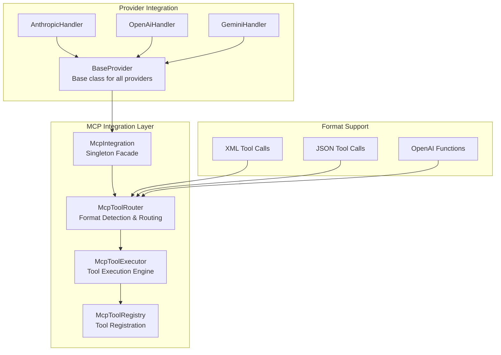
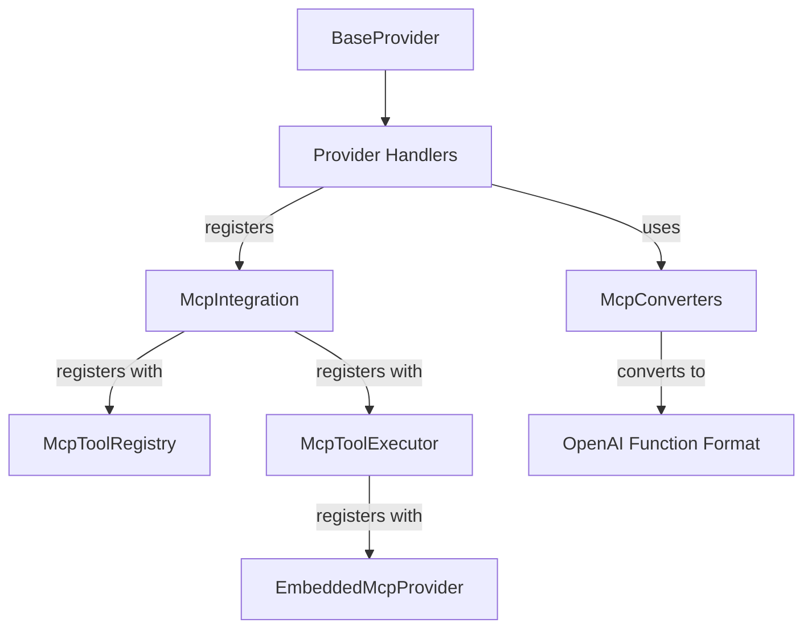
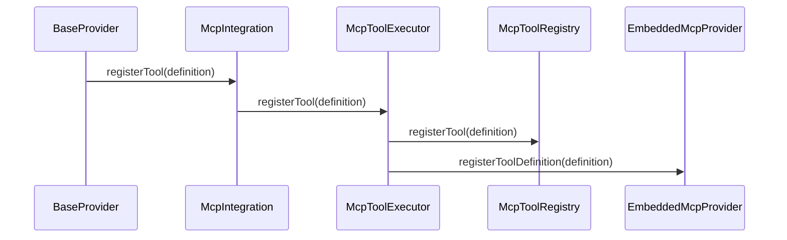
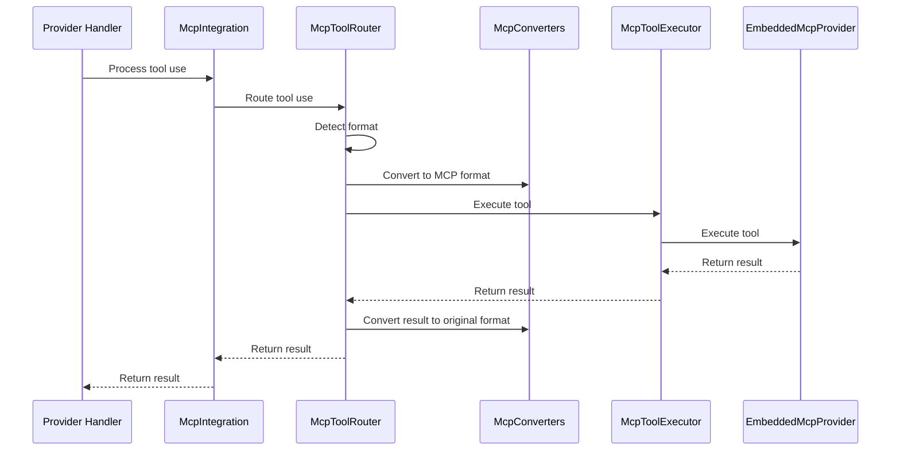
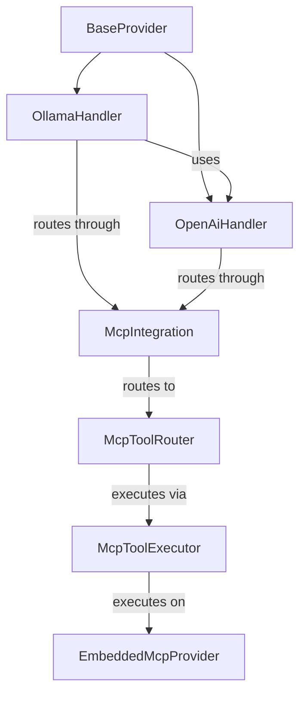
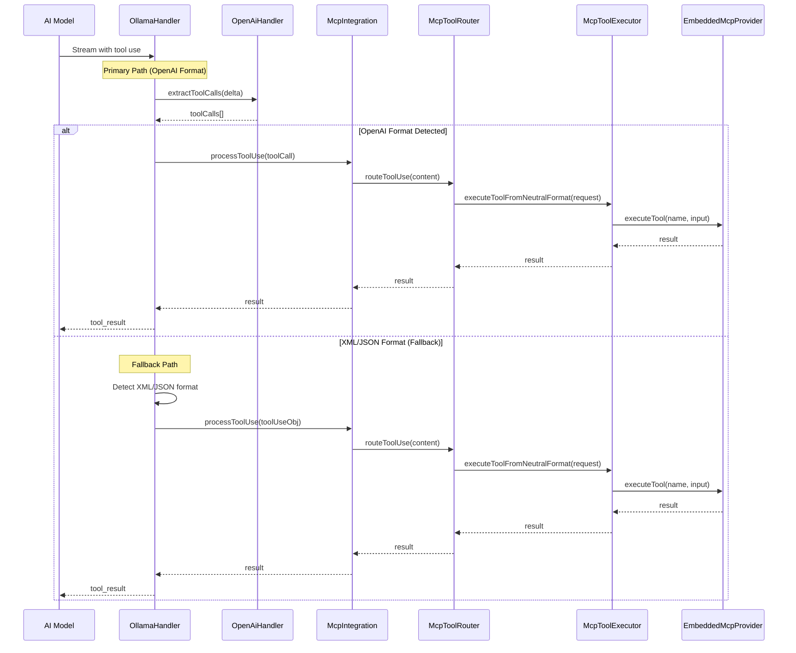

# Model Context Protocol (MCP) Implementation Guide

**Date:** 2025-06-11  
**Status:** ✅ FULLY IMPLEMENTED

## 1. Introduction

The Model Context Protocol (MCP) integration in Thea Code provides a unified system for tool execution across all AI providers. This guide documents the **completed implementation** and provides examples for using and extending the MCP system.

**Key Achievements:**

- ✅ Full MCP integration in all 16 active providers
- ✅ Unified tool registration and execution
- ✅ Support for XML, JSON, and OpenAI function call formats
- ✅ Embedded MCP server with SSE and Stdio transports
- ✅ Automatic tool discovery and routing

## 2. Quick Start Guide

### 2.1 Using MCP Tools in Providers

All providers automatically have access to MCP tools through the `BaseProvider` class:

```typescript
// Example: Any provider can use tools seamlessly
const handler = new OllamaHandler(options)
// Tools are automatically registered and available
// AI models can call read_file, write_file, execute_command, etc.
```

### 2.2 Tool Registration API

Register custom tools using the `McpIntegration` interface:

```typescript
import { McpIntegration } from "../services/mcp/integration/McpIntegration"

const mcpIntegration = McpIntegration.getInstance()

// Register a custom tool
mcpIntegration.registerTool({
	name: "custom_analyzer",
	description: "Analyze code for patterns",
	paramSchema: {
		type: "object",
		properties: {
			file_path: { type: "string", description: "Path to analyze" },
			pattern: { type: "string", description: "Pattern to search for" },
		},
		required: ["file_path"],
	},
})
```

### 2.3 Tool Usage in AI Conversations

Tools work automatically across all supported formats:

**XML Format (used by Claude):**

```xml
<read_file>
<path>src/example.ts</path>
</read_file>
```

**JSON Format (used by some models):**

```json
{
	"type": "tool_use",
	"id": "abc123",
	"name": "read_file",
	"input": { "path": "src/example.ts" }
}
```

**OpenAI Function Format (used by OpenAI/compatible models):**

```json
{
	"tool_calls": [
		{
			"id": "call_abc123",
			"type": "function",
			"function": {
				"name": "read_file",
				"arguments": "{\"path\":\"src/example.ts\"}"
			}
		}
	]
}
```

## 3. Implementation Architecture

### 3.1 Core Components

The Thea Code MCP implementation consists of these key components:



### 3.2 Key Classes and Interfaces

#### McpIntegration (Singleton Facade)

```typescript
// Primary interface for MCP functionality
export class McpIntegration extends EventEmitter {
	// Get singleton instance
	static getInstance(config?: SseTransportConfig): McpIntegration

	// Tool registration
	registerTool(tool: ToolDefinition): void

	// Tool execution
	routeToolUse(request: ToolUseRequest): Promise<ToolUseResult>

	// Server management
	initialize(): Promise<void>
	getServerUrl(): URL | undefined
}
```

#### ToolDefinition Interface

```typescript
interface ToolDefinition {
	name: string
	description: string
	paramSchema: {
		type: "object"
		properties: Record<string, any>
		required?: string[]
	}
}
```

## 4. Protocol Support

MCP is built on JSON-RPC 2.0, a lightweight remote procedure call protocol using JSON for data encoding. The protocol defines a set of standardized methods for:

- Tool registration and execution
- Resource access and management
- Prompt templates and execution
- Completion suggestions
- Progress notifications
- Logging

The protocol supports two primary transport mechanisms:

1. **StdioTransport**: Communication via standard input/output streams
2. **SSETransport**: Communication via HTTP with Server-Sent Events

## 3. Core Components

### 3.1 Protocol Structure

The MCP protocol is structured around these key components:

- **Requests**: Messages sent from client to server (or vice versa) that expect a response
- **Notifications**: One-way messages that don't expect a response
- **Results**: Responses to requests
- **Errors**: Standardized error responses

All messages follow the JSON-RPC 2.0 format:

```typescript
// Request
{
  jsonrpc: "2.0",
  id: <number or string>,
  method: <string>,
  params: <object> // optional
}

// Notification
{
  jsonrpc: "2.0",
  method: <string>,
  params: <object> // optional
}

// Result
{
  jsonrpc: "2.0",
  id: <number or string>,
  result: <object>
}

// Error
{
  jsonrpc: "2.0",
  id: <number or string>,
  error: {
    code: <number>,
    message: <string>,
    data: <any> // optional
  }
}
```

### 3.2 Transport Layer

#### 3.2.1 StdioTransport

The `StdioTransport` enables communication between processes using standard input/output streams:

- **Server**: `StdioServerTransport` reads from stdin and writes to stdout
- **Client**: `StdioClientTransport` spawns a child process and communicates with it via its stdin/stdout

Messages are serialized as JSON strings with a newline delimiter:

```javascript
function serializeMessage(message) {
	return JSON.stringify(message) + "\n"
}
```

The `ReadBuffer` class buffers incoming data and extracts complete messages by looking for newline characters.

#### 3.2.2 SSETransport

The `SSETransport` enables communication over HTTP:

- **Server**: `SSEServerTransport` uses Server-Sent Events for sending messages to the client and receives messages via HTTP POST requests
- **Client**: `SSEClientTransport` connects to an SSE endpoint for receiving messages and sends messages via HTTP POST requests

This transport supports authentication via OAuth 2.0 and can handle reconnection scenarios.

### 3.3 Client Implementation

The `Client` class provides a high-level API for interacting with an MCP server:

1. **Initialization**: The client initializes with client info and capabilities
2. **Connection**: The client connects to a transport and performs the initialization handshake
3. **Tool Calling**: The client can call tools on the server via the `callTool` method
4. **Resource Access**: The client can list and read resources via the `listResources` and `readResource` methods
5. **Prompt Execution**: The client can list and execute prompts via the `listPrompts` and `getPrompt` methods

### 3.4 Server Implementation

The `McpServer` class provides a high-level API for implementing an MCP server:

1. **Tool Registration**: The server registers tools via the `tool` method
2. **Resource Registration**: The server registers resources via the `resource` method
3. **Prompt Registration**: The server registers prompts via the `prompt` method
4. **Request Handling**: The server automatically sets up handlers for standard MCP requests
5. **Tool Execution**: When a tool is called, the server validates the arguments and executes the tool's callback

## 4. Tool Registration and Execution

### 4.1 Tool Definition

Tools are defined with the following structure:

```typescript
interface ToolDefinition {
	name: string
	description?: string
	paramSchema?: Record<string, any>
	handler: (args: Record<string, unknown>) => Promise<ToolCallResult>
}
```

### 4.2 Tool Registration

Tools are registered with the server using the `tool` method:

```typescript
server.tool(
	"tool_name",
	"Tool description",
	{
		param1: { type: "string", description: "Parameter description" },
		param2: { type: "number", description: "Parameter description" },
	},
	async (args) => {
		// Tool implementation
		return {
			content: [{ type: "text", text: "Tool result" }],
		}
	},
)
```

The server automatically sets up handlers for the `tools/list` and `tools/call` methods.

### 4.3 Tool Execution

When a client calls a tool, the following sequence occurs:

1. Client sends a `tools/call` request with the tool name and arguments
2. Server validates the arguments against the tool's parameter schema
3. Server executes the tool's handler function with the validated arguments
4. Server returns the result to the client

## 5. Implementation in Thea Code

In the Thea Code project, MCP is implemented as follows:

1. **EmbeddedMcpProvider**: A provider implementation that runs in the same process as the client
2. **McpToolRegistry**: A registry of tools that can be called by the server
3. **McpToolExecutor**: A system that manages tools from multiple sources
4. **McpIntegration**: A class that integrates MCP with the rest of the system
5. **McpConverters**: A class that converts between different tool formats
6. **McpToolRouter**: A class that routes tool use requests to the appropriate handler

### 5.1 Component Relationships



### 5.2 Tool Registration Flow



### 5.3 Tool Use Processing Flow



## 6. Switching from StdioTransport to SSETransport

### 6.1 Benefits of SSETransport

Switching from StdioTransport to SSETransport provides several benefits:

- **Thread Safety**: The SSE transport uses proper HTTP request handling, ensuring thread-safe operations
- **Resource Management**: Connections are properly managed with clear lifecycle events
- **Multiple Simultaneous Connections**: The server can now handle multiple clients connecting at once
- **Improved Observability**: HTTP-based communication provides better logging and monitoring options

### 6.2 SSE Transport Configuration

To support SSE transport, we need to create a configuration class:

```typescript
/**
 * Configuration options for the SSE transport
 */
export interface SseTransportConfig {
	/**
	 * The port to listen on (default: 0 for random available port)
	 */
	port?: number

	/**
	 * The hostname to bind to (default: localhost)
	 */
	hostname?: string

	/**
	 * Whether to allow connections from other hosts (default: false)
	 */
	allowExternalConnections?: boolean

	/**
	 * The path to serve the SSE endpoint on (default: /mcp/events)
	 */
	eventsPath?: string

	/**
	 * The path to accept POST requests on (default: /mcp/api)
	 */
	apiPath?: string
}

/**
 * Default configuration for the SSE transport
 */
export const DEFAULT_SSE_CONFIG: SseTransportConfig = {
	port: 0, // Use a random available port
	hostname: "localhost",
	allowExternalConnections: false,
	eventsPath: "/mcp/events",
	apiPath: "/mcp/api",
}
```

### 6.3 Updating EmbeddedMcpProvider

The `EmbeddedMcpProvider` class needs to be updated to use SSETransport:

```typescript
/**
 * Start the embedded MCP server
 */
async start(): Promise<void> {
  if (this.isStarted) {
    return;
  }

  // Register all handlers
  this.registerHandlers();

  try {
    // Try to import the MCP SDK dynamically
    const { SSEServerTransport } = require("@modelcontextprotocol/sdk/server/sse.js");

    // Create the SSE transport
    this.transport = new SSEServerTransport({
      port: this.sseConfig.port,
      hostname: this.sseConfig.hostname,
      cors: !this.sseConfig.allowExternalConnections ? { origin: 'localhost' } : undefined,
      eventsPath: this.sseConfig.eventsPath,
      apiPath: this.sseConfig.apiPath
    });

    // Connect the server to the transport
    await this.server.connect(this.transport);

    // Store the server URL for clients to connect to
    const port = this.transport.getPort();
    this.serverUrl = new URL(`http://${this.sseConfig.hostname}:${port}`);

    this.isStarted = true;
    this.emit('started', { url: this.serverUrl.toString() });
    console.log(`MCP server started at ${this.serverUrl.toString()}`);
  } catch (error) {
    console.error("Failed to start MCP server:", error);
    // Fall back to mock transport in case of error
    this.transport = new MockSseServerTransport();
    this.isStarted = true;
    this.emit('started');
  }
}
```

### 6.4 Creating an SSE Client Factory

To simplify client creation, we can create an SSE client factory:

```typescript
/**
 * Factory for creating MCP clients that connect to an SSE server
 */
export class SseClientFactory {
	/**
	 * Create a new MCP client that connects to the specified server URL
	 * @param serverUrl The URL of the MCP server to connect to
	 * @returns A new MCP client
	 */
	public static async createClient(serverUrl: URL): Promise<Client> {
		// Create the client
		const client = new Client({
			name: "TheaCodeMcpClient",
			version: "1.0.0",
		})

		// Create the transport
		const transport = new SSEClientTransport(serverUrl)

		// Connect the client to the transport
		await client.connect(transport)

		return client
	}
}
```

## 7. OpenAI Function Format Integration

### 7.1 Converting Tool Definitions to OpenAI Functions

To expose MCP tools to OpenAI-compatible models like Ollama, we need to convert tool definitions to OpenAI function format:

```typescript
/**
 * Convert MCP tool definitions to OpenAI function definitions
 * @param tools Map of tool names to tool definitions
 * @returns Array of OpenAI function definitions
 */
public static toolDefinitionsToOpenAiFunctions(tools: Map<string, ToolDefinition>): any[] {
  const functions = [];

  for (const [name, definition] of tools.entries()) {
    functions.push({
      name: definition.name,
      description: definition.description || '',
      parameters: definition.paramSchema || {
        type: 'object',
        properties: {},
        required: []
      }
    });
  }

  return functions;
}
```

### 7.2 Updating OllamaHandler

The `OllamaHandler` class should be updated to include available tools in the prompt to the model:

```typescript
override async *createMessage(systemPrompt: string, messages: NeutralConversationHistory): ApiStream {
  // Get all available tools from the MCP registry
  const toolRegistry = this.mcpIntegration.getToolRegistry();
  const availableTools = toolRegistry.getAllTools();

  // Convert tool definitions to OpenAI function definitions
  const functions = McpConverters.toolDefinitionsToOpenAiFunctions(availableTools);

  // Convert neutral history to Ollama format
  const openAiMessages = convertToOllamaHistory(messages);

  // Add system prompt if not already included
  const hasSystemMessage = openAiMessages.some(msg => msg.role === 'system');
  if (systemPrompt && systemPrompt.trim() !== "" && !hasSystemMessage) {
    openAiMessages.unshift({ role: "system", content: systemPrompt });
  }

  // Create stream with functions included
  const stream = await this.client.chat.completions.create({
    model: this.getModel().id,
    messages: openAiMessages,
    temperature: this.options.modelTemperature ?? 0,
    stream: true,
    functions: functions,  // Include available functions
    function_call: 'auto'  // Allow the model to decide when to call functions
  });

  // Rest of the method remains the same...
}
```

### 7.3 Updating BaseProvider

The `BaseProvider` class should be updated to register common tools with the MCP integration:

```typescript
protected registerTools(): void {
  // Register common tools

  // Register read_file tool
  this.mcpIntegration.registerTool({
    name: 'read_file',
    description: 'Request to read the contents of a file at the specified path',
    paramSchema: {
      type: 'object',
      properties: {
        path: {
          type: 'string',
          description: 'The path of the file to read (relative to the current workspace directory)'
        },
        start_line: {
          type: 'integer',
          description: 'The starting line number to read from (1-based)'
        },
        end_line: {
          type: 'integer',
          description: 'The ending line number to read to (1-based, inclusive)'
        }
      },
      required: ['path']
    },
    handler: async (args: Record<string, unknown>) => {
      // Implementation will be handled by the MCP server
      // This is just a registration of the tool definition
      return {
        content: [{ type: 'text', text: 'File content will be returned here' }]
      };
    }
  });

  // Register write_to_file tool
  this.mcpIntegration.registerTool({
    name: 'write_to_file',
    description: 'Request to write full content to a file at the specified path',
    paramSchema: {
      type: 'object',
      properties: {
        path: {
          type: 'string',
          description: 'The path of the file to write to (relative to the current workspace directory)'
        },
        content: {
          type: 'string',
          description: 'The content to write to the file'
        },
        line_count: {
          type: 'integer',
          description: 'The number of lines in the file'
        }
      },
      required: ['path', 'content', 'line_count']
    },
    handler: async (args: Record<string, unknown>) => {
      // Implementation will be handled by the MCP server
      return {
        content: [{ type: 'text', text: 'File written successfully' }]
      };
    }
  });

  // Register other common tools...
}
```

## 8. Ollama-OpenAI Integration

### 8.1 Component Hierarchy



### 8.2 Tool Use Processing Flow



### 8.3 Ollama Handler Implementation

The Ollama handler has been updated to use the OpenAI handler's tool use detection logic:

```typescript
// src/api/providers/ollama.ts
import { OpenAiHandler } from "./openai"

export class OllamaHandler extends BaseProvider implements SingleCompletionHandler {
	protected options: ApiHandlerOptions
	private client: OpenAI
	private openAiHandler: OpenAiHandler

	constructor(options: ApiHandlerOptions) {
		super()
		this.options = options
		this.client = new OpenAI({
			baseURL: (this.options.ollamaBaseUrl || "http://localhost:10000") + "/v1",
			apiKey: "ollama", // Ollama uses a dummy key via OpenAI client
		})

		// Create an OpenAI handler for tool use detection and processing
		this.openAiHandler = new OpenAiHandler({
			...options,
			// Override any OpenAI-specific options as needed
			openAiApiKey: "ollama", // Use the same dummy key
			openAiBaseUrl: (this.options.ollamaBaseUrl || "http://localhost:10000") + "/v1",
			openAiModelId: this.options.ollamaModelId || "",
		})
	}

	override async *createMessage(systemPrompt: string, messages: NeutralConversationHistory): ApiStream {
		// ... existing code ...

		for await (const chunk of stream) {
			const delta = chunk.choices[0]?.delta ?? {}

			if (delta.content) {
				// First, check for OpenAI-style tool calls using the OpenAI handler
				const toolCalls = this.openAiHandler.extractToolCalls(delta)

				if (toolCalls.length > 0) {
					// Process tool calls using OpenAI handler's logic
					for (const toolCall of toolCalls) {
						if (toolCall.function) {
							// Process tool use using MCP integration
							const toolResult = await this.processToolUse({
								id: toolCall.id,
								name: toolCall.function.name,
								input: JSON.parse(toolCall.function.arguments || "{}"),
							})

							// Yield tool result
							yield {
								type: "tool_result",
								id: toolCall.id,
								content: toolResult,
							}
						}
					}
				} else {
					// Fallback to XML/JSON detection if OpenAI format isn't detected
					// ... existing fallback code ...
				}
			}
		}
	}
}
```

## 9. Testing Strategy

### 9.1 Unit Tests for Tool Registration

```typescript
// src/services/mcp/__tests__/McpToolRegistry.test.ts

test("should register a tool with the registry", () => {
	const registry = new McpToolRegistry()

	const toolDefinition = {
		name: "test_tool",
		description: "A test tool",
		paramSchema: {
			type: "object",
			properties: {
				param: {
					type: "string",
					description: "A test parameter",
				},
			},
			required: ["param"],
		},
		handler: async (args: Record<string, unknown>) => {
			return {
				content: [{ type: "text", text: `Executed test_tool with param: ${args.param}` }],
			}
		},
	}

	registry.registerTool(toolDefinition)

	expect(registry.hasTool("test_tool")).toBe(true)
	expect(registry.getTool("test_tool")).toEqual(toolDefinition)
})
```

### 9.2 Unit Tests for OpenAI Function Format Conversion

```typescript
// src/services/mcp/__tests__/McpConverters.test.ts

test("should convert tool definitions to OpenAI function definitions", () => {
	const tools = new Map()

	tools.set("test_tool", {
		name: "test_tool",
		description: "A test tool",
		paramSchema: {
			type: "object",
			properties: {
				param: {
					type: "string",
					description: "A test parameter",
				},
			},
			required: ["param"],
		},
		handler: async () => ({ content: [] }),
	})

	const functions = McpConverters.toolDefinitionsToOpenAiFunctions(tools)

	expect(functions).toHaveLength(1)
	expect(functions[0]).toEqual({
		name: "test_tool",
		description: "A test tool",
		parameters: {
			type: "object",
			properties: {
				param: {
					type: "string",
					description: "A test parameter",
				},
			},
			required: ["param"],
		},
	})
})
```

### 9.3 Integration Tests for SSE Transport

```typescript
// src/services/mcp/__tests__/SseTransport.test.ts

test("should connect client to server", async () => {
	await server.start()

	const url = server.getServerUrl()
	expect(url).toBeDefined()

	// Register a test tool
	server.registerTool(
		"test_tool",
		"A test tool",
		{
			message: { type: "string" },
		},
		async (args) => ({
			content: [{ type: "text", text: `Received: ${args.message}` }],
		}),
	)

	// Create a client and connect to the server
	const client = await SseClientFactory.createClient(url!)

	// List available tools
	const toolsResult = await client.listTools()
	expect(toolsResult.tools).toHaveLength(1)
	expect(toolsResult.tools[0].name).toBe("test_tool")

	// Call the tool
	const result = await client.callTool({
		name: "test_tool",
		arguments: { message: "Hello, world!" },
	})

	expect(result.content).toHaveLength(1)
	expect(result.content[0].type).toBe("text")
	expect(result.content[0].text).toBe("Received: Hello, world!")

	// Close the client
	await client.close()
})
```

### 9.4 Integration Tests for Ollama Handler

```typescript
// src/api/providers/__tests__/ollama-mcp-integration.test.ts

test("should include available tools in the prompt", async () => {
	// Mock the tool registry
	const mockTools = new Map()
	mockTools.set("test_tool", {
		name: "test_tool",
		description: "A test tool",
		paramSchema: {
			type: "object",
			properties: {
				param: {
					type: "string",
					description: "A test parameter",
				},
			},
			required: ["param"],
		},
		handler: async () => ({ content: [] }),
	})

	// Mock the McpIntegration to return the mock tool registry
	handler["mcpIntegration"].getToolRegistry = jest.fn().mockReturnValue({
		getAllTools: jest.fn().mockReturnValue(mockTools),
	})

	// Create a spy on the client.chat.completions.create method
	const createSpy = jest.spyOn(handler["client"].chat.completions, "create")

	// Create neutral history
	const neutralHistory: NeutralConversationHistory = [
		{ role: "user", content: [{ type: "text", text: "Use a tool" }] },
	]

	// Call createMessage
	const stream = handler.createMessage("You are helpful.", neutralHistory)

	// Collect stream chunks
	const chunks = []
	for await (const chunk of stream) {
		chunks.push(chunk)
	}

	// Verify that the client.chat.completions.create method was called with functions
	expect(createSpy).toHaveBeenCalledWith(
		expect.objectContaining({
			functions: expect.arrayContaining([
				expect.objectContaining({
					name: "test_tool",
					description: "A test tool",
					parameters: expect.objectContaining({
						type: "object",
						properties: expect.objectContaining({
							param: expect.objectContaining({
								type: "string",
								description: "A test parameter",
							}),
						}),
						required: ["param"],
					}),
				}),
			]),
			function_call: "auto",
		}),
	)
})
```

## 10. Implementation Considerations

### 10.1 Tool Registration Timing

Tools should be registered during the initialization of the provider handlers, which happens in the constructor of the `BaseProvider` class. This ensures that all tools are available before any messages are processed.

### 10.2 Tool Schema Compatibility

The parameter schema for tools should be compatible with both the MCP protocol and the OpenAI function calling format. The OpenAI function calling format uses JSON Schema, which is also used by the MCP protocol.

### 10.3 Error Handling

Error handling should be implemented at multiple levels:

1. **Tool Registration**: Errors during tool registration should be caught and logged, but should not prevent the provider handler from initializing.
2. **Tool Execution**: Errors during tool execution should be caught and returned as error results, rather than throwing exceptions.
3. **OpenAI Function Format Conversion**: Errors during conversion should be caught and logged, with fallback to an empty array of functions.

### 10.4 Security Considerations

Since we're exposing an HTTP server with the SSE transport:

1. By default, only allow connections from localhost
2. Provide configuration options for more restrictive security
3. Consider adding authentication for production use cases

## 11. Migration Strategy

### 11.1 Phased Approach

Implement the MCP integration in phases:

1. **Phase 1: Core MCP Components**

    - Implement the core MCP components
    - Create unit tests for each component
    - Create integration tests for the entire stack

2. **Phase 2: Update Base Provider**

    - Update the `BaseProvider` class to include MCP integration
    - Create a common tool registration mechanism
    - Implement the `processToolUse` method

3. **Phase 3: Update Provider Handlers**

    - Update each provider handler to use the MCP integration
    - Start with the most commonly used handlers (Anthropic, OpenAI)
    - Then update the remaining handlers

4. **Phase 4: Testing and Validation**
    - Create tests for each updated handler
    - Validate the integration with real models
    - Fix any issues that arise

### 11.2 Backward Compatibility

Ensure backward compatibility during the migration:

1. **Maintain Existing Interfaces**

    - Keep the existing `ApiHandler` interface unchanged
    - Ensure the updated handlers still implement the interface correctly

2. **Gradual Rollout**

    - Roll out the MCP integration gradually, one handler at a time
    - Monitor for any issues and roll back if necessary

3. **Feature Flags**
    - Use feature flags to enable/disable the MCP integration
    - Allow users to opt-in to the new functionality

## 12. Conclusion

The Model Context Protocol provides a standardized way for AI models to interact with external tools, resources, and prompts. The protocol is designed to be flexible, extensible, and transport-agnostic, allowing it to be used in a variety of contexts.

The Thea Code implementation of MCP demonstrates how the protocol can be integrated into a larger system, providing a unified interface for tools from multiple sources and exposing them to different AI models.

By switching from StdioTransport to SSETransport, we gain significant benefits in terms of thread safety, resource management, and connection handling. The integration with OpenAI-compatible models like Ollama allows us to leverage the function calling capabilities of these models.

This comprehensive guide provides a clear path to implementing MCP integration in provider handlers, switching to SSETransport, and exposing tools to OpenAI-compatible models.
