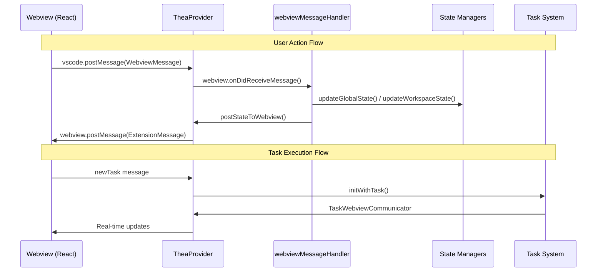

# Communication Protocols Documentation

**Date:** 2025-06-14  
**Status:** Current Implementation Analysis  
**Purpose:** Document message passing and communication patterns between extension and webview

## Overview

Thea-Code uses a sophisticated bidirectional message-passing system to communicate between the VS Code extension (Node.js) and the React webview. The communication is type-safe, event-driven, and supports both synchronous and asynchronous patterns.

## Communication Architecture



## Message Type Systems

### 1. WebviewMessage (Webview → Extension)
**Location**: `src/shared/WebviewMessage.ts`
**Purpose**: Messages sent from React webview to VS Code extension

```typescript
interface WebviewMessage {
    type: string
    action?: string
    
    // Data payloads (various types based on message type)
    text?: string
    bool?: boolean
    value?: any
    images?: string[]
    apiConfiguration?: ApiConfiguration
    values?: Record<string, any>
    
    // Response data
    askResponse?: TheaAskResponse
}
```

**Common Message Types**:

#### User Actions
```typescript
// Start new AI task
{
    type: "newTask",
    text: "Create a todo app",
    images: ["data:image/png;base64,...]
}

// Update settings
{
    type: "alwaysAllowWrite", 
    bool: true
}

// API configuration
{
    type: "apiConfiguration",
    apiConfiguration: {
        apiProvider: "anthropic",
        anthropicApiKey: "sk-...",
        modelId: "claude-3-5-sonnet-20241022"
    }
}
```

#### Task Interaction
```typescript
// Respond to AI questions
{
    type: "askResponse",
    askResponse: "yesButtonTapped",
    text: "Yes, proceed with the changes"
}

// Task control
{
    type: "clearTask"
}

// History management
{
    type: "showTaskWithId",
    text: "task-123"
}
```

### 2. ExtensionMessage (Extension → Webview)
**Location**: `src/shared/ExtensionMessage.ts`
**Purpose**: Messages sent from VS Code extension to React webview

```typescript
interface ExtensionMessage {
    type: string
    action?: string
    
    // State synchronization
    state?: ExtensionState
    
    // Task updates
    clineMessage?: TheaMessage
    
    // UI updates
    invoke?: string
    text?: string
    images?: string[]
    
    // Results and responses
    success?: boolean
    values?: Record<string, any>
}
```

**Common Message Types**:

#### State Updates
```typescript
// Full state synchronization
{
    type: "state",
    state: {
        apiConfiguration: {...},
        taskHistory: [...],
        currentTaskItem: {...},
        // ... complete extension state
    }
}

// Real-time task message
{
    type: "clineMessage", 
    clineMessage: {
        ts: Date.now(),
        type: "say",
        say: "tool",
        text: "Reading file: package.json",
        tool: "readFile"
    }
}
```

#### UI Actions
```typescript
// Invoke webview actions
{
    type: "invoke",
    invoke: "setChatBoxMessage",
    text: "Add this text to input"
}

// Navigation
{
    type: "action", 
    action: "settingsButtonClicked"
}
```

## Message Handler Architecture

### 1. Extension-Side Handler
**Location**: `src/core/webview/webviewMessageHandler.ts`
**Purpose**: Central message processing for the extension

```typescript
export async function webviewMessageHandler(
    provider: TheaProvider, 
    message: WebviewMessage
): Promise<void> {
    try {
        switch (message.type) {
            case "newTask":
                await provider.initWithTask(message.text, message.images)
                break
                
            case "apiConfiguration":
                if (message.apiConfiguration) {
                    await provider.updateApiConfiguration(message.apiConfiguration)
                    await provider.postStateToWebview()
                }
                break
                
            case "alwaysAllowWrite":
                await provider.updateGlobalState("alwaysAllowWrite", message.bool)
                await provider.postStateToWebview()
                break
                
            // ... 100+ message types handled
        }
    } catch (error) {
        provider.outputChannel.appendLine(
            `Error handling message ${message.type}: ${error}`
        )
    }
}
```

**Handler Patterns**:

#### State Update Pattern
```typescript
case "settingName":
    await provider.updateGlobalState("settingName", message.value)
    await provider.postStateToWebview() // Sync back to webview
    break
```

#### Task Control Pattern
```typescript
case "clearTask":
    await provider.finishSubTask("Task canceled")
    await provider.postStateToWebview()
    break
```

#### Async Action Pattern
```typescript
case "selectImages":
    const images = await selectImages()
    await provider.postMessageToWebview({ 
        type: "selectedImages", 
        images 
    })
    break
```

### 2. Webview-Side Handler
**Location**: `webview-ui/src/App.tsx` and components
**Purpose**: React-side message processing

```typescript
// Global message listener in App.tsx
useEvent("message", (event: MessageEvent) => {
    const message: ExtensionMessage = event.data
    
    switch (message.type) {
        case "state":
            // Handled by ExtensionStateContext
            setState(message.state)
            break
            
        case "action":
            // Navigation actions
            const newTab = tabsByMessageAction[message.action]
            if (newTab) setTab(newTab)
            break
            
        case "invoke":
            // UI actions
            handleInvokeAction(message.invoke, message)
            break
            
        case "clineMessage":
            // Real-time task updates - handled by ChatView
            break
    }
})

// Send messages to extension
const sendMessage = (message: WebviewMessage) => {
    vscode.postMessage(message)
}
```

## Real-Time Communication Patterns

### 1. Task Execution Communication
**Component**: TaskWebviewCommunicator
**Purpose**: Real-time task updates during AI execution

```typescript
class TaskWebviewCommunicator {
    // Send information to user
    async say(type: TheaSay, text?: string): Promise<void> {
        const message: TheaMessage = {
            ts: Date.now(),
            type: "say",
            say: type,
            text
        }
        
        await this.addMessage(message)
        await this.postMessageToWebview({
            type: "clineMessage",
            clineMessage: message
        })
    }
    
    // Ask user for input/approval
    async ask(type: TheaAsk, text?: string): Promise<TheaAskResponse> {
        const message: TheaMessage = {
            ts: Date.now(),
            type: "ask", 
            ask: type,
            text
        }
        
        await this.addMessage(message)
        await this.postMessageToWebview({
            type: "clineMessage",
            clineMessage: message
        })
        
        // Wait for user response
        return this.waitForAskResponse()
    }
}
```

### 2. Streaming Updates
**Pattern**: Incremental message updates for real-time AI responses

```typescript
// Extension side - during AI streaming
const updateStreamingMessage = async (messageId: string, partialContent: string) => {
    await provider.postMessageToWebview({
        type: "clineMessage",
        clineMessage: {
            id: messageId,
            type: "say",
            say: "text",
            text: partialContent,
            isStreaming: true
        }
    })
}

// Webview side - ChatView updates UI
useEffect(() => {
    const handleMessage = (event: MessageEvent) => {
        const message: ExtensionMessage = event.data
        
        if (message.type === "clineMessage") {
            if (message.clineMessage.isStreaming) {
                // Update existing message
                updateMessageInPlace(message.clineMessage)
            } else {
                // Add new message
                addMessage(message.clineMessage)
            }
        }
    }
    
    window.addEventListener("message", handleMessage)
    return () => window.removeEventListener("message", handleMessage)
}, [])
```

## Error Handling and Validation

### 1. Message Validation
```typescript
const validateWebviewMessage = (message: any): WebviewMessage => {
    if (!message.type || typeof message.type !== "string") {
        throw new Error("Invalid message: missing or invalid type")
    }
    
    // Type-specific validation
    switch (message.type) {
        case "apiConfiguration":
            if (!message.apiConfiguration) {
                throw new Error("Missing apiConfiguration")
            }
            break
    }
    
    return message as WebviewMessage
}
```

### 2. Error Recovery
```typescript
// Extension side error handling
const handleMessageError = async (error: Error, message: WebviewMessage) => {
    provider.outputChannel.appendLine(
        `Message handler error: ${error.message}`
    )
    
    // Send error back to webview
    await provider.postMessageToWebview({
        type: "error",
        text: `Failed to process ${message.type}: ${error.message}`
    })
}

// Webview side error handling
const handleCommunicationError = (error: Error) => {
    console.error("Communication error:", error)
    
    // Show user notification
    vscode.window.showErrorMessage(
        "Communication error with extension. Please reload."
    )
}
```

## Security Considerations

### 1. Content Security Policy
```html
<!-- Webview CSP in TheaProvider.getHtmlContent() -->
<meta http-equiv="Content-Security-Policy" 
      content="default-src 'none'; 
               font-src ${webview.cspSource}; 
               style-src ${webview.cspSource} 'unsafe-inline'; 
               img-src ${webview.cspSource} data:; 
               script-src 'nonce-${nonce}'; 
               connect-src https://openrouter.ai;">
```

### 2. Message Sanitization
```typescript
const sanitizeMessage = (message: WebviewMessage): WebviewMessage => {
    // Remove potentially dangerous properties
    const sanitized = { ...message }
    
    // Sanitize text content
    if (sanitized.text) {
        sanitized.text = sanitized.text.replace(/<script[^>]*>.*?<\/script>/gi, "")
    }
    
    return sanitized
}
```

## Performance Optimization

### 1. Message Batching
```typescript
class MessageBatcher {
    private queue: ExtensionMessage[] = []
    private timeout?: NodeJS.Timeout
    
    queueMessage(message: ExtensionMessage) {
        this.queue.push(message)
        
        if (!this.timeout) {
            this.timeout = setTimeout(() => {
                this.flushQueue()
            }, 16) // ~60fps
        }
    }
    
    private flushQueue() {
        if (this.queue.length > 0) {
            provider.postMessageToWebview({
                type: "batch",
                messages: this.queue
            })
            this.queue = []
        }
        this.timeout = undefined
    }
}
```

### 2. Large Data Handling
```typescript
// For large payloads (task history, file contents)
const sendLargeData = async (data: any) => {
    const chunks = chunkData(data, 1024 * 100) // 100KB chunks
    
    for (let i = 0; i < chunks.length; i++) {
        await provider.postMessageToWebview({
            type: "dataChunk",
            chunkIndex: i,
            totalChunks: chunks.length,
            data: chunks[i]
        })
    }
}
```

## Debugging and Monitoring

### 1. Message Logging
```typescript
const logMessage = (direction: "in" | "out", message: any) => {
    if (process.env.NODE_ENV === "development") {
        console.log(`[${direction.toUpperCase()}] ${message.type}:`, message)
    }
}

// In message handlers
webview.onDidReceiveMessage((message) => {
    logMessage("in", message)
    return webviewMessageHandler(provider, message)
})
```

### 2. Communication Health Monitoring
```typescript
class CommunicationMonitor {
    private lastHeartbeat = Date.now()
    
    startMonitoring() {
        setInterval(() => {
            if (Date.now() - this.lastHeartbeat > 10000) {
                console.warn("Communication heartbeat lost")
                this.attemptReconnection()
            }
        }, 5000)
    }
    
    recordHeartbeat() {
        this.lastHeartbeat = Date.now()
    }
}
```

## Message Type Reference

### Critical Message Types

#### Task Management
- `newTask` - Start new AI task
- `clearTask` - Cancel current task  
- `showTaskWithId` - Resume from history
- `askResponse` - User response to AI questions

#### Configuration
- `apiConfiguration` - Update API settings
- `alwaysAllowWrite/Read/Execute` - Auto-approval settings
- `mode` - Switch AI mode/model

#### Real-time Updates
- `clineMessage` - AI task updates
- `state` - Full state synchronization  
- `invoke` - UI action commands

#### Tool Interaction
- `selectImages` - File picker for images
- `browserConnection` - Browser tool setup
- `mcpServers` - MCP management

## Related Documentation

- [Webview Architecture](./webview_architecture.md)
- [State Management](./state_management.md)
- [Component Hierarchy](./component_hierarchy.md)
- [Message Types Reference](./message_types_reference.md)
