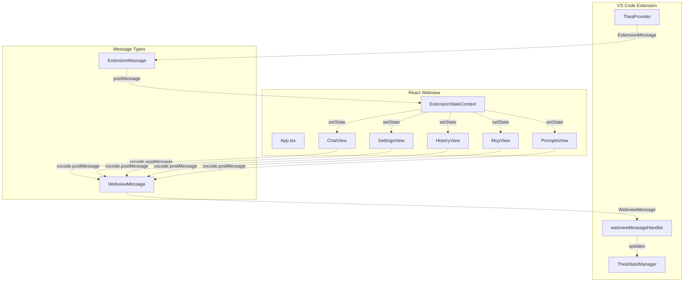
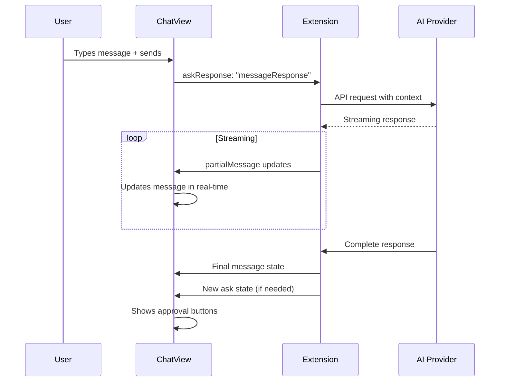
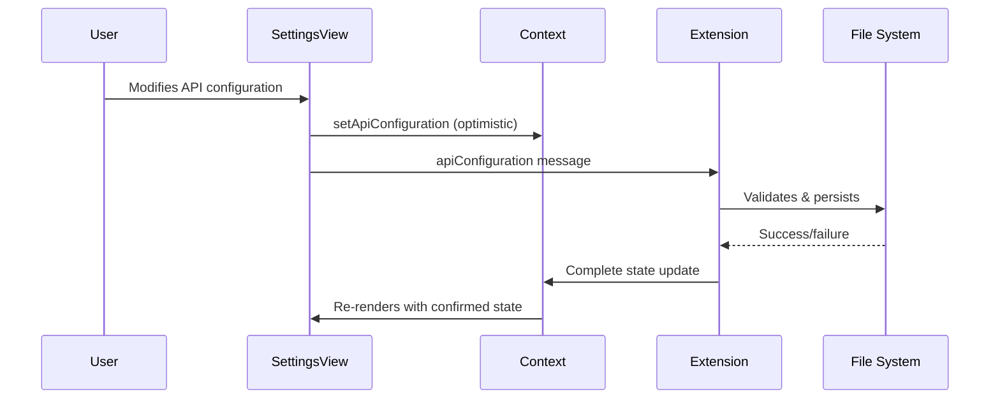
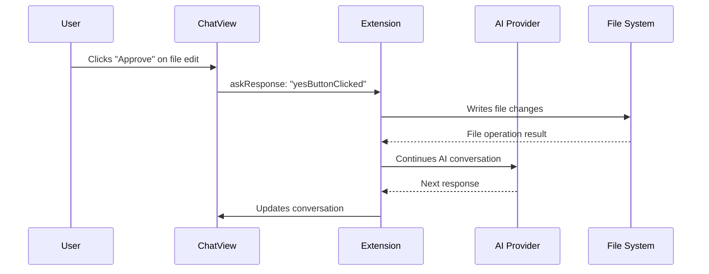

# React Event Types and Data Flow Documentation

**Date:** 2025-06-14  
**Purpose:** Comprehensive documentation of React event types and data flows in Thea-Code's webview UI system

## Overview

Thea-Code's React-based webview UI implements a sophisticated event-driven architecture with bidirectional communication between the VS Code extension and the React application. This document provides a complete reference for all event types, their data payloads, and how data flows through the system.

## Table of Contents

1. [Message Architecture Overview](#1-message-architecture-overview)
2. [Extension → Webview Messages (ExtensionMessage)](#2-extension--webview-messages-extensionmessage)
3. [Webview → Extension Messages (WebviewMessage)](#3-webview--extension-messages-webviewmessage)
4. [React Component Event Handlers](#4-react-component-event-handlers)
5. [State Management Events](#5-state-management-events)
6. [Real-time Data Flows](#6-real-time-data-flows)
7. [Event Lifecycle Patterns](#7-event-lifecycle-patterns)
8. [Error Handling and Recovery](#8-error-handling-and-recovery)

## 1. Message Architecture Overview

### 1.1 Communication Pattern



### 1.2 Event Flow Architecture

1. **Extension → Webview**: State updates, commands, real-time data
2. **Webview → Extension**: User actions, configuration changes, task requests
3. **Internal React Events**: Component interactions, UI state changes
4. **State Synchronization**: Bidirectional state consistency maintenance

## 2. Extension → Webview Messages (ExtensionMessage)

### 2.1 Core Message Types

#### State Management Messages
```typescript
interface ExtensionMessage {
  type: "state"
  state?: ExtensionState
}
```

**Data Flow:**
- **Trigger**: Extension state changes, initial hydration
- **Payload**: Complete application state
- **Handler**: `ExtensionStateContext.handleMessage()`
- **Effect**: Triggers React re-renders across all components

#### Theme Updates
```typescript
interface ExtensionMessage {
  type: "theme"
  text?: string // JSON-serialized theme object
}
```

**Data Flow:**
- **Trigger**: VS Code theme change
- **Payload**: TextMate theme converted to highlight.js format
- **Handler**: `ExtensionStateContext.handleMessage()`
- **Effect**: Updates syntax highlighting across chat messages

#### Workspace Updates
```typescript
interface ExtensionMessage {
  type: "workspaceUpdated"
  filePaths?: string[]
  openedTabs?: Array<{
    label: string
    isActive: boolean
    path?: string
  }>
}
```

**Data Flow:**
- **Trigger**: File system changes, tab switches
- **Payload**: Current workspace file list and open tabs
- **Handler**: `ExtensionStateContext.handleMessage()`
- **Effect**: Updates context information in chat interface

### 2.2 Real-time Communication Messages

#### Partial Message Updates
```typescript
interface ExtensionMessage {
  type: "partialMessage"
  partialMessage?: TheaMessage
}
```

**Data Flow:**
- **Trigger**: AI streaming responses
- **Payload**: Incremental message content
- **Handler**: `ExtensionStateContext.handleMessage()`
- **Effect**: Real-time message updates in ChatView

#### Action Navigation
```typescript
interface ExtensionMessage {
  type: "action"
  action?: "chatButtonClicked" | "settingsButtonClicked" | 
          "historyButtonClicked" | "mcpButtonClicked" | 
          "promptsButtonClicked" | "didBecomeVisible"
}
```

**Data Flow:**
- **Trigger**: Extension toolbar button clicks
- **Payload**: Target view identifier
- **Handler**: `App.onMessage()`
- **Effect**: Triggers tab switching with unsaved changes validation

### 2.3 Data Provider Messages

#### Model Information
```typescript
interface ExtensionMessage {
  type: "ollamaModels" | "lmStudioModels" | "openAiModels" | 
        "openRouterModels" | "glamaModels" | "unboundModels" | 
        "requestyModels" | "vsCodeLmModels"
  [modelType]?: string[] | Record<string, ModelInfo> | LanguageModelChatSelector[]
}
```

**Data Flow:**
- **Trigger**: Provider model refresh requests
- **Payload**: Available models for each provider
- **Handler**: Provider-specific setters in ExtensionStateContext
- **Effect**: Updates model selection dropdowns in SettingsView

#### MCP Server Updates
```typescript
interface ExtensionMessage {
  type: "mcpServers"
  mcpServers?: McpServer[]
}
```

**Data Flow:**
- **Trigger**: MCP server configuration changes
- **Payload**: Current MCP server list with status
- **Handler**: `ExtensionStateContext.handleMessage()`
- **Effect**: Updates McpView server management interface

### 2.4 Special Purpose Messages

#### Human Relay Dialog
```typescript
interface ExtensionMessage {
  type: "showHumanRelayDialog"
  requestId?: string
  promptText?: string
}
```

**Data Flow:**
- **Trigger**: AI requires human intervention
- **Payload**: Request ID and prompt for user
- **Handler**: `App.onMessage()`
- **Effect**: Shows modal dialog for human input

#### Enhanced Prompts
```typescript
interface ExtensionMessage {
  type: "enhancedPrompt"
  text?: string
  promptText?: string
}
```

**Data Flow:**
- **Trigger**: AI prompt enhancement completion
- **Payload**: Enhanced prompt text
- **Handler**: Component-specific handlers
- **Effect**: Updates chat input with enhanced content

## 3. Webview → Extension Messages (WebviewMessage)

### 3.1 User Action Messages

#### Task Management
```typescript
interface WebviewMessage {
  type: "newTask" | "clearTask" | "cancelTask"
  text?: string
  images?: string[]
}
```

**Data Flow:**
- **Trigger**: User chat input, task controls
- **Payload**: User message and optional images
- **Handler**: Extension task management system
- **Effect**: Initiates new AI conversation or task operations

#### User Responses
```typescript
interface WebviewMessage {
  type: "askResponse"
  askResponse?: "yesButtonClicked" | "noButtonClicked" | "messageResponse"
  text?: string
  images?: string[]
}
```

**Data Flow:**
- **Trigger**: User approval/rejection buttons, chat input during asks
- **Payload**: Response type and optional user feedback
- **Handler**: Extension task continuation logic
- **Effect**: Continues or modifies AI task execution

### 3.2 Configuration Messages

#### API Configuration
```typescript
interface WebviewMessage {
  type: "apiConfiguration" | "saveApiConfiguration" | 
        "upsertApiConfiguration" | "deleteApiConfiguration"
  apiConfiguration?: ApiConfiguration
  text?: string // config name
}
```

**Data Flow:**
- **Trigger**: Settings form submissions
- **Payload**: Complete API configuration object
- **Handler**: Extension settings persistence system
- **Effect**: Updates provider settings and triggers state sync

#### Permission Settings
```typescript
interface WebviewMessage {
  type: "alwaysAllowReadOnly" | "alwaysAllowWrite" | 
        "alwaysAllowExecute" | "alwaysAllowBrowser" | 
        "alwaysAllowMcp" | "alwaysAllowModeSwitch"
  bool?: boolean
}
```

**Data Flow:**
- **Trigger**: Checkbox toggles in SettingsView
- **Payload**: Boolean permission state
- **Handler**: Extension permission system
- **Effect**: Updates global permission policies

### 3.3 Media and File Operations

#### Image Selection
```typescript
interface WebviewMessage {
  type: "selectImages" | "draggedImages"
  images?: string[]
  dataUrls?: string[]
}
```

**Data Flow:**
- **Trigger**: Image picker button, drag-and-drop events
- **Payload**: Base64 image data or file paths
- **Handler**: Extension file system operations
- **Effect**: Adds images to current conversation context

#### File Operations
```typescript
interface WebviewMessage {
  type: "openFile" | "openImage" | "openMention"
  text?: string
}
```

**Data Flow:**
- **Trigger**: File/mention links in chat messages
- **Payload**: File path or mention identifier
- **Handler**: Extension editor operations
- **Effect**: Opens files/URLs in appropriate applications

### 3.4 Advanced Features

#### Audio Operations
```typescript
interface WebviewMessage {
  type: "playSound" | "playTts" | "stopTts"
  audioType?: "notification" | "celebration" | "progress_loop"
  text?: string
}
```

**Data Flow:**
- **Trigger**: System events, user TTS requests
- **Payload**: Audio type or text content
- **Handler**: Extension audio service
- **Effect**: Plays system sounds or text-to-speech

#### Search Operations
```typescript
interface WebviewMessage {
  type: "searchFiles" | "searchCommits"
  query?: string
}
```

**Data Flow:**
- **Trigger**: Search input in various components
- **Payload**: Search query string
- **Handler**: Extension search services
- **Effect**: Returns search results via ExtensionMessage

## 4. React Component Event Handlers

### 4.1 ChatView Event Handlers

#### Message Submission
```typescript
const handleSendMessage = useCallback((text: string, images: string[]) => {
  switch (theaAsk) {
    case "followup":
    case "tool":
    case "browser_action_launch":
    case "command":
    case "command_output":
    case "use_mcp_server":
    case "completion_result":
    case "resume_task":
    case "resume_completed_task":
    case "mistake_limit_reached":
      vscode.postMessage({ 
        type: "askResponse", 
        askResponse: "messageResponse", 
        text, 
        images 
      })
      break
  }
  handleChatReset()
}, [theaAsk, handleChatReset])
```

**Event Flow:**
1. User types message or clicks send
2. Validates current ask state
3. Sends appropriate askResponse message
4. Resets chat input state
5. Disables input until next response

#### Button Actions
```typescript
const handlePrimaryButtonClick = useCallback((text?: string, images?: string[]) => {
  switch (theaAsk) {
    case "api_req_failed":
    case "command":
    case "tool":
    case "browser_action_launch":
      vscode.postMessage({
        type: "askResponse",
        askResponse: "yesButtonClicked",
        text: text?.trim(),
        images: images
      })
      break
    case "completion_result":
    case "resume_completed_task":
      startNewTask()
      break
  }
  setTextAreaDisabled(true)
  setTheaAsk(undefined)
  setEnableButtons(false)
}, [theaAsk, startNewTask])
```

**Event Flow:**
1. User clicks primary action button
2. Determines action based on current ask type
3. Sends approval or starts new task
4. Disables UI until next state change

### 4.2 SettingsView Event Handlers

#### Configuration Changes
```typescript
const handleApiConfigurationChange = useCallback((config: ApiConfiguration) => {
  setApiConfiguration(config)
  vscode.postMessage({ 
    type: "apiConfiguration", 
    apiConfiguration: config 
  })
}, [setApiConfiguration])
```

**Event Flow:**
1. User modifies form fields
2. Updates local React state immediately (optimistic update)
3. Sends configuration to extension
4. Extension validates and persists
5. Confirmation via state message

#### Model Refresh Operations
```typescript
const handleRefreshModels = useCallback((provider: string) => {
  setLoadingModels(true)
  vscode.postMessage({ type: `refresh${provider}Models` })
}, [])
```

**Event Flow:**
1. User clicks refresh button
2. Sets loading state in UI
3. Requests model refresh from extension
4. Extension fetches models from provider
5. Returns updated models via ExtensionMessage
6. Clears loading state

### 4.3 HistoryView Event Handlers

#### Task Management
```typescript
const handleDeleteTask = useCallback((taskId: string) => {
  vscode.postMessage({ 
    type: "deleteTaskWithId", 
    text: taskId 
  })
}, [])

const handleExportTask = useCallback((taskId: string) => {
  vscode.postMessage({ 
    type: "exportTaskWithId", 
    text: taskId 
  })
}, [])
```

**Event Flow:**
1. User clicks delete/export buttons
2. Sends task operation message with ID
3. Extension performs file system operation
4. Updates task history state
5. UI reflects changes automatically

### 4.4 McpView Event Handlers

#### Server Management
```typescript
const handleToggleMcpServer = useCallback((serverName: string, enabled: boolean) => {
  vscode.postMessage({ 
    type: "toggleMcpServer", 
    serverName, 
    bool: enabled 
  })
}, [])

const handleRestartMcpServer = useCallback((serverName: string) => {
  vscode.postMessage({ 
    type: "restartMcpServer", 
    serverName 
  })
}, [])
```

**Event Flow:**
1. User toggles server or clicks restart
2. Sends server management command
3. Extension updates MCP server state
4. Returns updated server list
5. UI reflects new server status

## 5. State Management Events

### 5.1 ExtensionStateContext Events

#### State Hydration
```typescript
const handleMessage = useCallback((event: MessageEvent) => {
  const message: ExtensionMessage = event.data
  switch (message.type) {
    case "state": {
      const newState = message.state!
      setState(prevState => mergeExtensionState(prevState, newState))
      setShowWelcome(!checkExistKey(newState.apiConfiguration))
      setDidHydrateState(true)
      break
    }
  }
}, [])
```

**Event Flow:**
1. Extension sends complete state
2. Context merges with existing state
3. Triggers welcome screen if needed
4. Sets hydration flag
5. All components re-render with new state

#### Partial State Updates
```typescript
const setApiConfiguration = useCallback((config: ApiConfiguration) => {
  setState(prevState => ({
    ...prevState,
    apiConfiguration: { ...prevState.apiConfiguration, ...config }
  }))
}, [])
```

**Event Flow:**
1. Component calls setter function
2. State updates locally (optimistic)
3. Component posts message to extension
4. Extension validates and persists
5. Extension sends state confirmation

### 5.2 Real-time State Synchronization

#### Message Streaming
```typescript
case "partialMessage": {
  const partialMessage = message.partialMessage!
  setState(prevState => {
    const lastIndex = findLastIndex(
      prevState.clineMessages, 
      msg => msg.ts === partialMessage.ts
    )
    if (lastIndex !== -1) {
      const newClineMessages = [...prevState.clineMessages]
      newClineMessages[lastIndex] = partialMessage
      return { ...prevState, clineMessages: newClineMessages }
    }
    return prevState
  })
  break
}
```

**Event Flow:**
1. Extension streams partial message content
2. Context finds existing message by timestamp
3. Updates specific message in array
4. React re-renders affected ChatRow components
5. User sees real-time typing effect

## 6. Real-time Data Flows

### 6.1 AI Conversation Flow



### 6.2 Settings Configuration Flow



### 6.3 File Operation Flow



## 7. Event Lifecycle Patterns

### 7.1 Ask-Response Cycle

```typescript
// Pattern used throughout ChatView for AI interactions
enum AskState {
  "followup" | "tool" | "browser_action_launch" | "command" | 
  "command_output" | "use_mcp_server" | "completion_result" | 
  "resume_task" | "resume_completed_task" | "mistake_limit_reached" |
  "api_req_failed"
}

// Lifecycle:
// 1. Extension sends ask message
// 2. ChatView sets ask state and shows UI
// 3. User interacts (button/text input)
// 4. ChatView sends askResponse
// 5. Extension processes response
// 6. Cycle repeats or conversation ends
```

### 7.2 Configuration Persistence Pattern

```typescript
// Pattern for settings that need persistence
const settingPattern = {
  // 1. Optimistic update
  localUpdate: () => setState(newValue),
  
  // 2. Send to extension
  sendMessage: () => vscode.postMessage({ type: "settingName", value }),
  
  // 3. Extension validates and persists
  // 4. Extension sends state confirmation
  
  // 5. Context receives and merges state
  stateSync: () => setState(prevState => ({ ...prevState, ...newState }))
}
```

### 7.3 Resource Loading Pattern

```typescript
// Pattern for loading external resources (models, files, etc.)
const resourcePattern = {
  // 1. Set loading state
  startLoading: () => setLoading(true),
  
  // 2. Request resource
  requestResource: () => vscode.postMessage({ type: "requestResource" }),
  
  // 3. Extension fetches resource
  // 4. Extension sends resource data
  
  // 5. Update UI with resource
  updateResource: (data) => {
    setResource(data)
    setLoading(false)
  }
}
```

## 8. Error Handling and Recovery

### 8.1 Message Error Handling

```typescript
// Error boundaries in message handling
const safeMessageHandler = useCallback((event: MessageEvent) => {
  try {
    const message: ExtensionMessage = event.data
    handleMessage(message)
  } catch (error) {
    console.error("Message handling error:", error)
    // Graceful degradation - UI remains functional
  }
}, [handleMessage])
```

### 8.2 State Recovery Patterns

```typescript
// State validation and recovery
const validateAndRecoverState = (newState: ExtensionState) => {
  // Validate critical state properties
  if (!newState.version || !newState.clineMessages) {
    console.warn("Invalid state received, requesting fresh state")
    vscode.postMessage({ type: "requestFreshState" })
    return currentState
  }
  
  // Merge with previous state safely
  return mergeExtensionState(currentState, newState)
}
```

### 8.3 Communication Failure Recovery

```typescript
// Retry mechanism for critical operations
const withRetry = async (operation: () => Promise<void>, maxRetries = 3) => {
  for (let i = 0; i < maxRetries; i++) {
    try {
      await operation()
      return
    } catch (error) {
      if (i === maxRetries - 1) throw error
      await new Promise(resolve => setTimeout(resolve, 1000 * Math.pow(2, i)))
    }
  }
}
```

## Summary

Thea-Code's React event system implements a sophisticated bidirectional communication pattern with:

- **59 Extension → Webview message types** for state, data, and command delivery
- **89 Webview → Extension message types** for user actions and configuration
- **Type-safe message protocols** with full TypeScript integration
- **Real-time streaming support** for AI conversations
- **Optimistic updates** with automatic rollback on failure
- **Comprehensive error handling** with graceful degradation
- **State synchronization** across multiple UI components
- **Resource loading patterns** for external data sources

This architecture enables a responsive, reliable user interface that maintains consistency even during complex AI interactions and streaming operations.

---

*This document serves as the definitive reference for understanding event flows and data communication patterns in Thea-Code's React webview system.*
