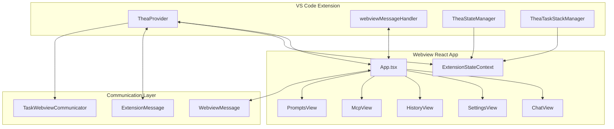

# Webview UI Architecture

**Date:** 2025-06-14  
**Status:** Current Implementation Analysis  
**Purpose:** Document the existing React-based webview UI architecture

## Overview

Thea-Code uses a sophisticated React-based webview UI that communicates with the VS Code extension through a message-passing system. The UI is built with modern React patterns, TypeScript, and provides a multi-view interface for AI interaction, settings management, task history, and MCP server configuration.

## High-Level Architecture



## Core Components Structure

### 1. **Application Shell** (`App.tsx`)

The main application component that manages:
- **Tab-based navigation** between different views
- **Global state hydration** from extension
- **Message routing** between extension and UI components
- **View lifecycle management**

```typescript
type Tab = "settings" | "history" | "mcp" | "prompts" | "chat"

const tabsByMessageAction: Record<string, Tab> = {
    chatButtonClicked: "chat",
    settingsButtonClicked: "settings",
    mcpButtonClicked: "mcp",
    historyButtonClicked: "history",
    promptsButtonClicked: "prompts"
}
```

### 2. **State Management Layer**

#### ExtensionStateContext
- **Purpose**: Provides global state synchronization between extension and webview
- **Location**: `webview-ui/src/context/ExtensionStateContext.tsx`
- **Responsibilities**:
  - Hydrates initial state from extension
  - Manages global settings and configuration
  - Provides state to all child components
  - Handles state updates from extension messages

### 3. **View Components**

#### ChatView (`components/chat/ChatView.tsx`)
- **Primary interface** for AI interaction
- **Real-time messaging** with streaming support
- **Tool execution visualization** (file operations, web browsing, etc.)
- **Task management** (start, pause, resume, cancel)
- **Auto-approval settings** for different action types

#### SettingsView (`components/settings/SettingsView.tsx`)
- **API provider configuration** (Anthropic, OpenAI, etc.)
- **Model selection and parameters**
- **Feature toggles** (browser tools, MCP, etc.)
- **Performance settings** (rate limiting, delays)
- **UI preferences** (theme, language, sound)

#### HistoryView (`components/history/HistoryView.tsx`)
- **Task history browsing** and management
- **Task resumption** from previous sessions
- **Export/import functionality**
- **Search and filtering** capabilities

#### McpView (`components/mcp/McpView.tsx`)
- **MCP server management** interface
- **Tool registration** and configuration
- **Server status monitoring**
- **Debug information** for MCP integration

#### PromptsView (`components/prompts/PromptsView.tsx`)
- **Custom prompt management**
- **Prompt templates** and variables
- **Sharing and importing** prompt collections

### 4. **Modern UI Component Library**

Located in `components/ui/`, provides reusable, clean components:

#### Chat Components (`components/ui/chat/`)
- **Chat**: Main chat container component
- **ChatInput**: Message input with autosize and submit handling
- **ChatMessage**: Individual message display with role-based styling
- **ChatMessages**: Scrollable message container

#### General UI Components (`components/ui/`)
- **VSCode Components**: Native VS Code UI component wrappers
- **Markdown**: Rich text rendering for AI responses
- **Forms**: Input components with validation
- **Layout**: Container and spacing components

## Communication Architecture

### Message Types

#### Extension → Webview (`ExtensionMessage`)
```typescript
interface ExtensionMessage {
    type: string
    action?: string
    // Various data payloads for different message types
}
```

Common message types:
- `"state"`: Full state synchronization
- `"invoke"`: Action invocation (setChatBoxMessage, sendMessage)
- `"action"`: UI state changes (didBecomeVisible)
- `"browserConnectionResult"`: Tool execution results

#### Webview → Extension (`WebviewMessage`) 
```typescript
interface WebviewMessage {
    type: string
    action?: string
    // Various data payloads for different message types
}
```

Common message types:
- `"newTask"`: Start new AI task
- `"apiConfiguration"`: Update API settings
- `"askResponse"`: User response to AI questions
- Settings updates: `"alwaysAllowWrite"`, `"mode"`, etc.

### Communication Flow

1. **Extension State Updates**:
   ```
   TheaStateManager → TheaProvider.postStateToWebview() → ExtensionStateContext
   ```

2. **User Actions**:
   ```
   UI Component → vscode.postMessage() → webviewMessageHandler → State Updates
   ```

3. **Real-time Updates**:
   ```
   TaskWebviewCommunicator → TheaProvider.postMessageToWebview() → UI Updates
   ```

## Key Architectural Patterns

### 1. **Provider Pattern**
- React Context providers for global state management
- ExtensionStateContext provides extension state
- TranslationProvider for internationalization
- QueryClientProvider for async state management

### 2. **Message-Driven Architecture**
- All communication through structured message passing
- Type-safe message interfaces
- Centralized message handling in webviewMessageHandler

### 3. **Component Composition**
- Reusable UI components in `/ui/` directory
- Feature-specific components in dedicated directories
- Clear separation between presentation and business logic

### 4. **Dual Component Systems**
- **Legacy Components**: Feature-rich, complex (ChatView, SettingsView)
- **Modern Components**: Clean, reusable (ui/chat/, ui/ components)
- Migration path from legacy to modern components

## State Synchronization

### Extension → Webview State Flow

1. **Initial Hydration**:
   ```typescript
   // Extension side
   await provider.postStateToWebview()
   
   // Webview side  
   const state = await provider.getStateToPostToWebview()
   ```

2. **Incremental Updates**:
   ```typescript
   // Settings changes
   await provider.updateGlobalState(key, value)
   await provider.postStateToWebview()
   ```

3. **Real-time Task Updates**:
   ```typescript
   // Through TaskWebviewCommunicator
   await communicator.say(type, text)
   await communicator.ask(type, text)
   ```

### Webview → Extension State Flow

```typescript
// User action in UI
vscode.postMessage({
    type: "alwaysAllowWrite", 
    bool: true
})

// Handled in webviewMessageHandler
case "alwaysAllowWrite":
    await provider.updateGlobalState("alwaysAllowWrite", message.bool)
    await provider.postStateToWebview()
```

## Development Patterns

### 1. **Hot Module Replacement (HMR)**
- Development mode uses Vite dev server on port 5173
- Production uses built static files
- Conditional HTML generation in TheaProvider

### 2. **TypeScript Integration**
- Strict typing for all message interfaces
- Shared types between extension and webview
- Component prop typing with interfaces

### 3. **Testing Strategy**
- Jest unit tests for components
- Storybook for component development
- Mock providers for isolated testing

### 4. **Internationalization**
- i18next integration for multi-language support
- Translation context provider
- Namespace-based translation keys

## Next Steps for Modernization

1. **Migrate from Legacy to Modern Components**
   - Replace ChatView with ui/chat/ components
   - Standardize on modern component patterns

2. **Improve State Management**
   - Consider React Query for server state
   - Implement optimistic updates
   - Add state persistence

3. **Enhance Type Safety**
   - Stronger typing for message payloads
   - Runtime validation for messages
   - Better error boundary handling

4. **Performance Optimization**
   - Lazy loading for non-critical views
   - Virtual scrolling for long message lists
   - Memory management for large task histories

## Related Documentation

- [Component Hierarchy](./component_hierarchy.md)
- [State Management](./state_management.md) 
- [Communication Protocols](./communication_protocols.md)
- [Message Types Reference](./message_types_reference.md)
