# Transformer Hidden Layer Architecture: Comprehensive Visualization

This document provides a detailed visualization and explanation of the architecture and information flow through a transformer model's hidden layers.

## Architectural Diagram

```mermaid
%%{
  init: {
    'theme': 'base',
    'themeVariables': {
      'primaryColor': '#5D8AA8',
      'primaryTextColor': '#fff',
      'primaryBorderColor': '#1F456E',
      'lineColor': '#5D8AA8',
      'secondaryColor': '#006400',
      'tertiaryColor': '#FFD700'
    }
  }
}%%

flowchart TB
    classDef inputClass fill:#FFD700,stroke:#FF8C00,stroke-width:2px,color:#000
    classDef embeddingClass fill:#98FB98,stroke:#006400,stroke-width:2px,color:#000
    classDef attentionClass fill:#ADD8E6,stroke:#0000CD,stroke-width:2px,color:#000
    classDef ffnClass fill:#FFA07A,stroke:#8B0000,stroke-width:2px,color:#000
    classDef normClass fill:#D8BFD8,stroke:#9400D3,stroke-width:2px,color:#000
    classDef outputClass fill:#F08080,stroke:#CD5C5C,stroke-width:2px,color:#000
    
    %% Input Processing
    subgraph InputProcessing["Input Processing Layer"]
        direction TB
        Input[/"Input Tokens"/]:::inputClass
        TokenEmbed["Token Embeddings<br/>(d_model)"]:::embeddingClass
        PosEncode["Positional Encoding<br/>(d_model)"]:::embeddingClass
        
        Input --> TokenEmbed
        TokenEmbed --> InputEmbed
        PosEncode --> InputEmbed
        
        InputEmbed["Input Embeddings<br/>(batch_size × seq_len × d_model)"]:::embeddingClass
    end
    
    %% Annotation for Input Processing
    InputAnnotation["<b>Input Processing</b><br/>- Tokens converted to embeddings<br/>- Position information added<br/>- Dimensions: batch_size × seq_len × d_model"]
    InputProcessing -.-> InputAnnotation
    
    %% First Transformer Layer
    subgraph Layer1["Transformer Layer 1"]
        direction TB
        
        %% Multi-Head Attention Block
        subgraph MHA1["Multi-Head Attention"]
            direction TB
            
            %% Attention Heads
            subgraph AttentionHeads1["Parallel Attention Heads"]
                direction LR
                Head1_1["Head 1<br/>(Q,K,V)"]:::attentionClass
                Head1_2["Head 2<br/>(Q,K,V)"]:::attentionClass
                Head1_3["..."]:::attentionClass
                Head1_n["Head h<br/>(Q,K,V)"]:::attentionClass
            end
            
            %% Attention Calculation
            QKV1["Linear Projections<br/>Q, K, V matrices"]:::attentionClass
            ScaledDot1["Scaled Dot-Product<br/>Attention"]:::attentionClass
            SoftMax1["Softmax<br/>Attention Weights"]:::attentionClass
            AttOutput1["Attention Output<br/>(per head)"]:::attentionClass
            
            %% Concatenation and Projection
            Concat1["Concatenate<br/>Attention Heads"]:::attentionClass
            LinearProj1["Linear Projection<br/>(d_model)"]:::attentionClass
            
            %% Attention Flow
            QKV1 --> AttentionHeads1
            AttentionHeads1 --> ScaledDot1
            ScaledDot1 --> SoftMax1
            SoftMax1 --> AttOutput1
            AttOutput1 --> Concat1
            Concat1 --> LinearProj1
        end
        
        %% Layer Norm 1
        LayerNorm1["Layer Normalization"]:::normClass
        
        %% Feed Forward Network
        subgraph FFN1["Feed-Forward Network"]
            direction TB
            Linear1_1["Linear Layer 1<br/>(d_model → d_ff)"]:::ffnClass
            Activation1["GELU Activation"]:::ffnClass
            Linear1_2["Linear Layer 2<br/>(d_ff → d_model)"]:::ffnClass
            
            Linear1_1 --> Activation1
            Activation1 --> Linear1_2
        end
        
        %% Layer Norm 2
        LayerNorm2["Layer Normalization"]:::normClass
        
        %% Residual Connections
        Add1(("+"))
        Add2(("+"))
    end
    
    %% Annotation for Attention
    AttentionAnnotation["<b>Multi-Head Attention</b><br/>- Parallel attention mechanisms<br/>- Each head focuses on different parts<br/>- Formula: Attention(Q,K,V) = softmax(QK^T/√d_k)V<br/>- Enables capturing diverse relationships"]
    MHA1 -.-> AttentionAnnotation
    
    %% Annotation for FFN
    FFNAnnotation["<b>Feed-Forward Network</b><br/>- Two linear transformations with GELU<br/>- Increases model capacity<br/>- Formula: FFN(x) = GELU(xW₁ + b₁)W₂ + b₂<br/>- Typically d_ff = 4 × d_model"]
    FFN1 -.-> FFNAnnotation
    
    %% Second Transformer Layer
    subgraph Layer2["Transformer Layer 2"]
        direction TB
        
        %% Multi-Head Attention Block
        subgraph MHA2["Multi-Head Attention"]
            direction TB
            
            %% Attention Heads
            subgraph AttentionHeads2["Parallel Attention Heads"]
                direction LR
                Head2_1["Head 1<br/>(Q,K,V)"]:::attentionClass
                Head2_2["Head 2<br/>(Q,K,V)"]:::attentionClass
                Head2_3["..."]:::attentionClass
                Head2_n["Head h<br/>(Q,K,V)"]:::attentionClass
            end
            
            %% Attention Calculation
            QKV2["Linear Projections<br/>Q, K, V matrices"]:::attentionClass
            ScaledDot2["Scaled Dot-Product<br/>Attention"]:::attentionClass
            SoftMax2["Softmax<br/>Attention Weights"]:::attentionClass
            AttOutput2["Attention Output<br/>(per head)"]:::attentionClass
            
            %% Concatenation and Projection
            Concat2["Concatenate<br/>Attention Heads"]:::attentionClass
            LinearProj2["Linear Projection<br/>(d_model)"]:::attentionClass
            
            %% Attention Flow
            QKV2 --> AttentionHeads2
            AttentionHeads2 --> ScaledDot2
            ScaledDot2 --> SoftMax2
            SoftMax2 --> AttOutput2
            AttOutput2 --> Concat2
            Concat2 --> LinearProj2
        end
        
        %% Layer Norm 3
        LayerNorm3["Layer Normalization"]:::normClass
        
        %% Feed Forward Network
        subgraph FFN2["Feed-Forward Network"]
            direction TB
            Linear2_1["Linear Layer 1<br/>(d_model → d_ff)"]:::ffnClass
            Activation2["GELU Activation"]:::ffnClass
            Linear2_2["Linear Layer 2<br/>(d_ff → d_model)"]:::ffnClass
            
            Linear2_1 --> Activation2
            Activation2 --> Linear2_2
        end
        
        %% Layer Norm 4
        LayerNorm4["Layer Normalization"]:::normClass
        
        %% Residual Connections
        Add3(("+"))
        Add4(("+"))
    end
    
    %% Nth Transformer Layer (Abbreviated)
    subgraph LayerN["Transformer Layer N"]
        direction TB
        
        %% Abbreviated components
        MHAN["Multi-Head<br/>Attention"]:::attentionClass
        LayerNormN1["Layer<br/>Normalization"]:::normClass
        FFNN["Feed-Forward<br/>Network"]:::ffnClass
        LayerNormN2["Layer<br/>Normalization"]:::normClass
        
        %% Residual Connections
        AddN1(("+"))
        AddN2(("+"))
        
        %% Connections
        MHAN --> AddN1
        AddN1 --> LayerNormN1
        LayerNormN1 --> FFNN
        FFNN --> AddN2
        AddN2 --> LayerNormN2
    end
    
    %% Output Processing
    subgraph OutputProcessing["Output Processing"]
        direction TB
        FinalLayerNorm["Final Layer Normalization"]:::normClass
        OutputProjection["Output Projection<br/>(task-specific)"]:::outputClass
        FinalOutput[/"Hidden State Output"/]:::outputClass
        
        FinalLayerNorm --> OutputProjection
        OutputProjection --> FinalOutput
    end
    
    %% Annotation for Layer Norm
    NormAnnotation["<b>Layer Normalization</b><br/>- Stabilizes hidden state distributions<br/>- Applied after residual connections<br/>- Formula: LN(x) = γ(x-μ)/σ + β<br/>- Critical for training deep networks"]
    LayerNorm1 -.-> NormAnnotation
    
    %% Annotation for Residual Connections
    ResidualAnnotation["<b>Residual Connections</b><br/>- Allow gradient flow through network<br/>- Mitigate vanishing gradient problem<br/>- Formula: x + Sublayer(x)<br/>- Enable training of very deep networks"]
    Add1 -.-> ResidualAnnotation
    
    %% Annotation for Overall Architecture
    ArchitectureAnnotation["<b>Transformer Architecture</b><br/>- Stacked identical layers<br/>- Each layer has two sub-layers<br/>- Pre-norm vs. Post-norm variants<br/>- Typical models: 6-24 layers<br/>- Hidden dimension: 512-1024<br/>- Attention heads: 8-16"]
    Layer2 -.-> ArchitectureAnnotation
    
    %% Main Flow Connections
    InputProcessing --> Layer1
    InputEmbed --> Add1
    
    %% Layer 1 Connections
    Add1 --> LayerNorm1
    LayerNorm1 --> MHA1
    LinearProj1 --> Add1
    Add1 --> Add2
    Add2 --> LayerNorm2
    LayerNorm2 --> FFN1
    Linear1_2 --> Add2
    
    %% Between Layer 1 and Layer 2
    Add2 --> Layer2
    Add2 --> Add3
    
    %% Layer 2 Connections
    Add3 --> LayerNorm3
    LayerNorm3 --> MHA2
    LinearProj2 --> Add3
    Add3 --> Add4
    Add4 --> LayerNorm4
    LayerNorm4 --> FFN2
    Linear2_2 --> Add4
    
    %% Between Layer 2 and Layer N
    Add4 --> LayerN
    Add4 --> AddN1
    
    %% Layer N Connections
    LayerNormN2 --> OutputProcessing
    LayerNormN2 --> FinalLayerNorm
    
    %% Information Flow Annotation
    InfoFlowStart(("•"))
    InfoFlowEnd(("•"))
    InfoFlowStart -..-> |"Forward Pass<br/>Information Flow"| InfoFlowEnd
    
    %% Gradient Flow Annotation
    GradFlowEnd(("•"))
    GradFlowStart(("•"))
    GradFlowEnd -..-> |"Backward Pass<br/>Gradient Flow"| GradFlowStart
    
    %% Hidden State Dimensions Annotation
    DimensionsAnnotation["<b>Hidden State Dimensions</b><br/>- Throughout network: batch_size × seq_len × d_model<br/>- Within attention: batch_size × heads × seq_len × (d_model/heads)<br/>- Within FFN: intermediate size is typically 4× larger<br/>- Constant seq_len maintains spatial information"]
    OutputProcessing -.-> DimensionsAnnotation
```

## Detailed Explanation of Transformer Hidden Layer Architecture

### 1. Input Processing
- **Token Embeddings**: Converts discrete tokens into continuous vector representations
- **Positional Encodings**: Adds positional information since transformers have no inherent sequence understanding
- **Combined Embeddings**: Forms the input to the first transformer layer (dimensions: batch_size × seq_len × d_model)

### 2. Transformer Layers (Core Hidden Layers)
Each transformer layer consists of:

#### a. Multi-Head Attention
- **Linear Projections**: Creates Query (Q), Key (K), and Value (V) matrices
- **Parallel Attention Heads**: Each head focuses on different aspects of the input
- **Scaled Dot-Product Attention**: Computes attention scores using formula: Attention(Q,K,V) = softmax(QK^T/√d_k)V
- **Concatenation and Projection**: Combines outputs from all heads and projects back to original dimension

#### b. Feed-Forward Network
- **Two Linear Transformations**: With a GELU activation function in between
- **Expanded Intermediate Representation**: Typically 4× larger than the model dimension
- **Formula**: FFN(x) = GELU(xW₁ + b₁)W₂ + b₂

#### c. Layer Normalization
- **Normalization Layers**: Applied after each sub-layer
- **Stabilizes Training**: Normalizes the mean and variance of each layer's outputs
- **Formula**: LN(x) = γ(x-μ)/σ + β

#### d. Residual Connections
- **Skip Connections**: Allow information to bypass attention and FFN blocks
- **Gradient Flow**: Enables training of very deep networks
- **Formula**: x + Sublayer(x)

### 3. Output Processing
- **Final Layer Normalization**: Stabilizes the output of the last transformer layer
- **Output Projection**: Task-specific transformation of the final hidden states

### Key Architectural Features
- **Stacked Identical Layers**: Typically 6-24 layers depending on model size
- **Consistent Hidden Dimensions**: Maintained throughout the network (d_model)
- **Information Flow**: Forward pass propagates through all layers with residual connections
- **Gradient Flow**: Backward pass during training, facilitated by residual connections

### Technical Implementation Details
- **Pre-Layer Normalization**: Some modern architectures apply normalization before each sub-layer instead of after
- **Parameter Sharing**: Some transformer variants share parameters across layers to reduce model size
- **Attention Masking**: Used in encoder-decoder architectures to prevent attending to future tokens
- **Dropout**: Applied to attention weights and FFN outputs to prevent overfitting
- **Layer Scaling**: Techniques like DeepNorm scale residual connections based on network depth

## Color Legend

The diagram uses color coding to distinguish different component types:
- **Gold/Yellow**: Input components
- **Green**: Embedding components
- **Blue**: Attention mechanisms
- **Light Red/Orange**: Feed-forward networks
- **Purple**: Normalization layers
- **Red**: Output components

## Mathematical Foundations

### Attention Mechanism
The core of the transformer architecture is the attention mechanism, which can be expressed as:

$$\text{Attention}(Q, K, V) = \text{softmax}\left(\frac{QK^T}{\sqrt{d_k}}\right)V$$

Where:
- Q, K, V are the query, key, and value matrices
- d_k is the dimension of the key vectors
- The scaling factor √d_k prevents the softmax function from having extremely small gradients

### Multi-Head Attention
Multi-head attention allows the model to jointly attend to information from different representation subspaces:

$$\text{MultiHead}(Q, K, V) = \text{Concat}(\text{head}_1, \ldots, \text{head}_h)W^O$$

Where:
$$\text{head}_i = \text{Attention}(QW_i^Q, KW_i^K, VW_i^V)$$

### Feed-Forward Networks
Each position in the sequence is processed by the same feed-forward network:

$$\text{FFN}(x) = \max(0, xW_1 + b_1)W_2 + b_2$$

Or with GELU activation:

$$\text{FFN}(x) = \text{GELU}(xW_1 + b_1)W_2 + b_2$$

### Layer Normalization
Layer normalization normalizes the inputs across the features:

$$\text{LN}(x) = \gamma \cdot \frac{x - \mu}{\sqrt{\sigma^2 + \epsilon}} + \beta$$

Where:
- μ and σ are the mean and standard deviation computed across the feature dimension
- γ and β are learnable parameters
- ε is a small constant for numerical stability