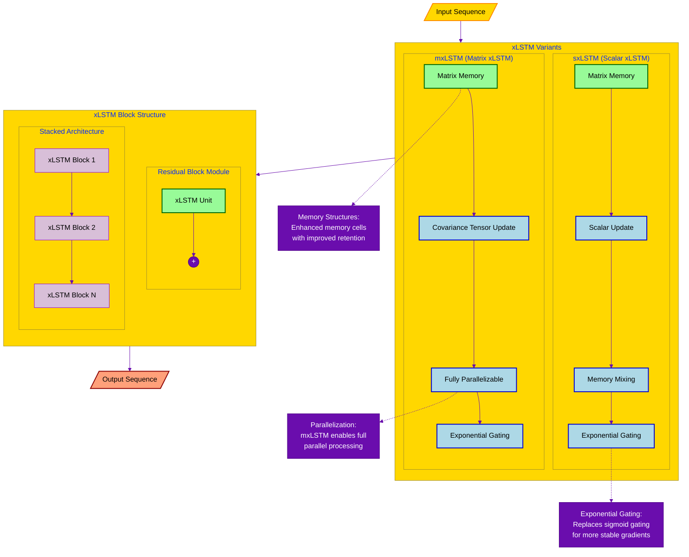
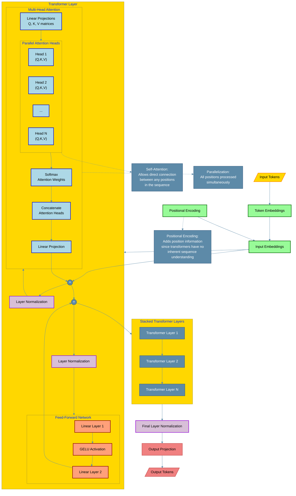
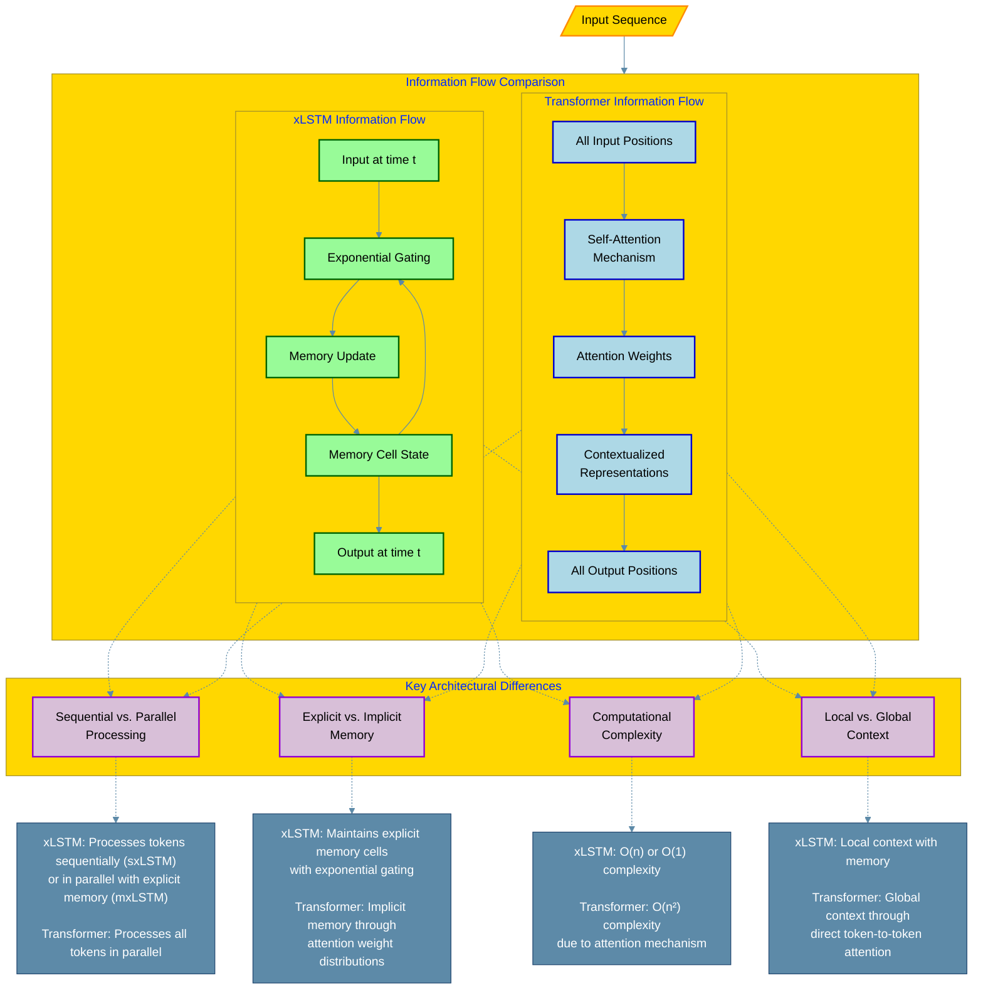

# xLSTM vs. Transformers: Architectural Comparison

This document provides a detailed comparison between xLSTM (Extended Long Short-Term Memory) and Transformer architectures, highlighting their key differences, strengths, and applications.

## 1. Architectural Overview

### xLSTM Architecture

xLSTM (Extended Long Short-Term Memory) introduces two key modifications to traditional LSTM:

1. **Exponential Gating**: Replaces traditional sigmoid gating with exponential functions
2. **Novel Memory Structures**: Introduces new memory handling mechanisms

These modifications create two main variants:
- **sxLSTM (scalar xLSTM)**: Uses matrix memory with scalar update and memory mixing
- **mxLSTM (matrix xLSTM)**: Uses matrix memory with covariance tensor update, which is fully parallelizable

xLSTM blocks are created by integrating these variants into residual block modules, which can then be stacked into complete xLSTM architectures.

#### xLSTM Architecture Visualization

### Transformer Architecture

Transformers are based on the self-attention mechanism and feature:

1. **Multi-Head Attention**: Allows the model to focus on different parts of the input sequence simultaneously
2. **Position Encodings**: Provide positional information since transformers have no inherent sequence understanding
3. **Feed-Forward Networks**: Process each position independently with the same feed-forward network
4. **Layer Normalization**: Stabilizes training by normalizing activations
5. **Residual Connections**: Allow information to bypass attention and feed-forward blocks

#### Transformer Architecture Visualization

## 2. Key Differences

| Feature | xLSTM | Transformers |
|---------|-------|-------------|
| **Core Mechanism** | Exponential gating and modified memory structures | Self-attention mechanism |
| **Parallelization** | mxLSTM variant is fully parallelizable | Fully parallelizable by design |
| **Memory Handling** | Explicit memory cells with exponential gating | Implicit memory through attention weights |
| **Positional Information** | Inherent sequential processing in sxLSTM | Requires explicit positional encodings |
| **Parameter Efficiency** | Generally more parameter-efficient | Often requires more parameters |
| **Long-Range Dependencies** | Enhanced ability to capture long-range dependencies compared to LSTM | Excellent at capturing long-range dependencies |
| **Computational Complexity** | O(n) for sequence length in sxLSTM, O(1) in mxLSTM | O(n²) for sequence length due to attention mechanism |

## 3. Strengths and Advantages

### xLSTM Strengths

1. **Memory Efficiency**: More efficient memory utilization compared to transformers
2. **Parameter Efficiency**: Typically requires fewer parameters for similar performance
3. **Computational Efficiency**: Linear or constant time complexity with respect to sequence length
4. **Stable Training**: Exponential gating provides more stable gradients
5. **Hybrid Approach**: Combines the strengths of RNNs (sequential processing) with modern architectural improvements

### Transformer Strengths

1. **Parallelization**: Highly parallelizable, enabling efficient training on modern hardware
2. **Global Context**: Direct access to all positions in the sequence through self-attention
3. **Flexibility**: Adaptable to various sequence modeling tasks
4. **Scalability**: Scales effectively to very large models (e.g., GPT, BERT)
5. **Multi-modal Capabilities**: Easily extended to handle multiple modalities

## 4. Performance Comparison

Based on empirical results:

1. **Sequence Modeling Tasks**:
   - xLSTM shows competitive or superior performance on many sequence modeling tasks
   - Particularly strong in tasks requiring memory efficiency and parameter efficiency

2. **Long-Range Dependencies**:
   - Both architectures handle long-range dependencies well
   - Transformers excel when global context is critical
   - xLSTM performs well when sequential processing with memory is important

3. **Computational Resources**:
   - xLSTM typically requires fewer computational resources
   - Transformers often need more memory and computation but can leverage parallel processing

## 5. Use Cases and Applications

### Ideal Use Cases for xLSTM

1. **Resource-Constrained Environments**: When memory or computational resources are limited
2. **Sequential Data with Clear Memory Requirements**: Time-series forecasting, certain NLP tasks
3. **Applications Requiring Parameter Efficiency**: Smaller models for edge devices
4. **Hybrid Architectures**: Combining with other architectural components

### Ideal Use Cases for Transformers

1. **Large-Scale Models**: When scaling to billions of parameters is desired
2. **Tasks Requiring Global Context**: Document-level understanding, complex relationships
3. **Highly Parallelizable Training**: When training efficiency on GPUs/TPUs is critical
4. **Multi-modal Applications**: Handling text, images, audio in unified models

## 6. Architectural Integration

Both architectures can be integrated in various ways:

1. **Hybrid Models**: Combining xLSTM blocks with transformer layers
2. **Specialized Components**: Using xLSTM for memory-intensive parts and transformers for context-heavy parts
3. **Hierarchical Structures**: Using different architectures at different levels of abstraction

## 7. Future Directions

The development of both architectures points to several future directions:

1. **Efficiency Improvements**: Further reducing computational and memory requirements
2. **Specialized Variants**: Domain-specific adaptations for particular applications
3. **Scaling Properties**: Understanding how each architecture scales with model size
4. **Hybrid Approaches**: More sophisticated combinations of the strengths of both architectures

## 8. Information Flow Comparison

The following diagram illustrates the fundamental differences in how information flows through xLSTM and Transformer architectures:

## Conclusion

xLSTM and transformers represent different approaches to sequence modeling, with distinct strengths and trade-offs. xLSTM builds on the LSTM foundation with exponential gating and novel memory structures, offering efficiency advantages. Transformers leverage self-attention for global context and parallelization. The choice between them depends on specific application requirements, computational constraints, and the nature of the sequential data being processed.